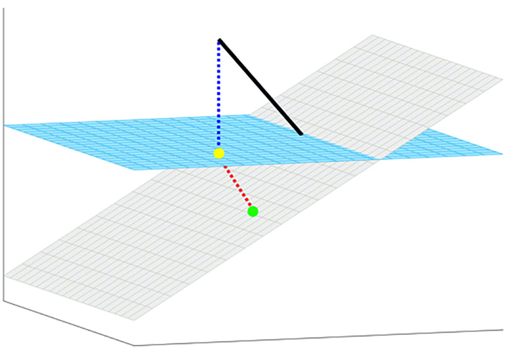
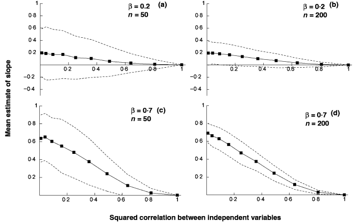
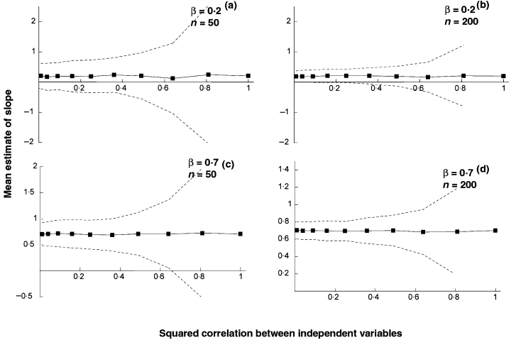
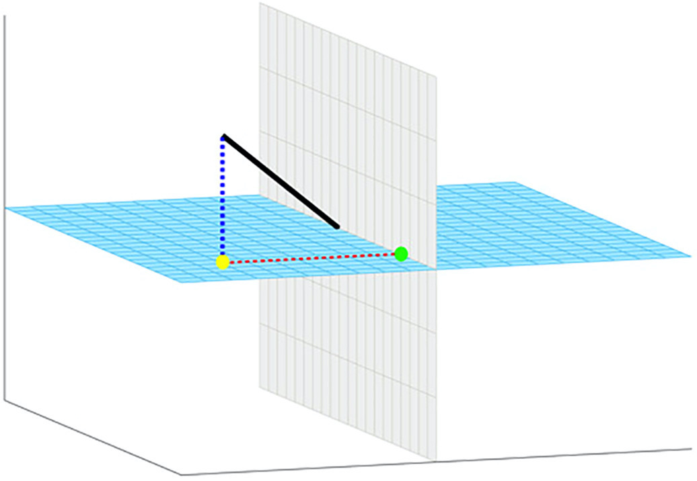

```{r setup, include=FALSE}
knitr::opts_chunk$set(echo = FALSE)

library(plotly)
library(mvtnorm)
```

```{css}
.remark-slide-content.img-caption {
  background-image: none;
  text-align: center;
  padding-top: 61.5%;
}
.remark-slide-content.img-caption > p:first-of-type {
  padding: 0px;
  margin: 0px;
}
.remark-slide-content.img-caption > p:first-of-type > img {
  position: absolute;
  top: 0px;
  left: 0px;
  width: 95%;
  height: 75%;
  margin: 2.5% 2.5% 2.5% 2.5%;
  object-fit: contain;
}

.remark-slide-content.just-img {
  background-image: none;
  text-align: center;
  padding-top: 0px;
}
```

### Reason 1: It can reintroduce unwanted effects
- Recent paper by Lindquist et al. showed that motion artifacts removed from one preprocessing step can be reintroduced by another preprocessing step<sup>1</sup>
- Let's dive into why this happens
.footnote[
<sup>1</sup> [Lindquist et al., 2019](https://onlinelibrary.wiley.com/doi/full/10.1002/hbm.24528)
]


---
class: img-caption

.footnote[
[Lindquist et al., 2019](https://onlinelibrary.wiley.com/doi/full/10.1002/hbm.24528)
]
---
class: img-caption

.footnote[
[Lindquist et al., 2019](https://onlinelibrary.wiley.com/doi/full/10.1002/hbm.24528)
]
---
### Reason 2: You are not properly controlling for confounders
- Suppose we have $n$ observations indexed by $i$ with
    - Dependent variable $y_i$
    - Covariate of interest $x_i$
    - Confounder $z_i$ that is correlated with $x_i$

$$y_i=\beta_0+\beta_1x_i+\beta_2z_i+\epsilon_i$$
- How can we get an estimate of $\beta_1$?
- What if we first regress out the confounder, then regress the residuals on the covariate of interest?
---
class: img-caption

Answer: We get very poor estimates, even with larger samples
.footnote[
[Freckleton, 2002](https://besjournals.onlinelibrary.wiley.com/doi/10.1046/j.1365-2656.2002.00618.x)
]
---
class: just-img
```{r freckleton_data}
N <- 200

x_mean <- rep(0, 2) # mean of covariates
corl <- 0.8
x_cov <- matrix(c(1, corl, corl, 1), 2, 2) # correlated covariates
x <- rmvnorm(N, x_mean, x_cov)

beta <- rep(0.7, 2) # x[,1] is confounder, x[,2] is covariate of interest
y <- x%*% beta + rnorm(1, 0, 1)
frdata <- data.frame(confound = x[,1], ind = x[,2], outcome = y)
frdata$res <- residuals(lm(outcome ~ confound, frdata))
```

```{r freckleton_plot, out.width = '100%', out.height = '100%'}
fig <- plot_ly(frdata, x = ~ind, y = ~confound, z = ~outcome, type = "scatter3d",
               mode = "markers")
fig <- fig %>% add_markers()
fig <- fig %>% layout(scene = list(xaxis = list(title = 'Covariate'),
                                   yaxis = list(title = 'Confounder'),
                                   zaxis = list(title = 'Outcome'),
                      camera= list(eye= list(x = 1.5, y = -1.5, z = 1.5))),
                      showlegend = FALSE)
fig
```
---
class: just-img
```{r freckleton_plot2, out.width = '100%', out.height = '100%'}
fig <- plot_ly(frdata, x = ~ind, y = ~res, type = "scatter",
               mode = "markers")
fig <- fig %>% add_markers()
fig <- fig %>% layout(xaxis = list(title = 'Covariate'),
                      yaxis = list(title = 'Residuals'),
                      showlegend = FALSE)
fig
```
---
### Reason 3: Multiple regression exists
- Regressing out the confounder beforehand can remove the effect of your covariate of interest
- Ordinary least-squares regression yields estimates for each covariate controlling for all other variables in the model
- So what if we just fit a model with both the confounder and the independent variable?
---
class: img-caption

Answer: Looks great, let's do this instead
.footnote[
[Freckleton, 2002](https://besjournals.onlinelibrary.wiley.com/doi/10.1046/j.1365-2656.2002.00618.x)
]
---
### Reason 4: Even if you really like two-step <br> regression, there's a better way
- Lindquist et al. (2019) suggest that there is a correct way to use modular preprocessing pipelines
- In our earlier model, let's say you regress out the confounder $z_i$ out of the outcome $y_i$, but also out of the covariate of interest $x_i$
    - Now you are isolating the effect of $x_i$ independent of $z_i$
---
class: img-caption

.footnote[
[Lindquist et al., 2019](https://onlinelibrary.wiley.com/doi/full/10.1002/hbm.24528)
]
---
### Key Takeaways
- Avoid "residual" or "two-step" regression
    - Just use multiple regression instead
- When dealing with modular pipelines, do one of the following
    - Regress out all confounders simultaneously
    - For each new step, regress the confounders on all confounders from previous steps
    
```{r, eval=FALSE}
pagedown::chrome_print("Residual-Regression.html") # print as pdf
```