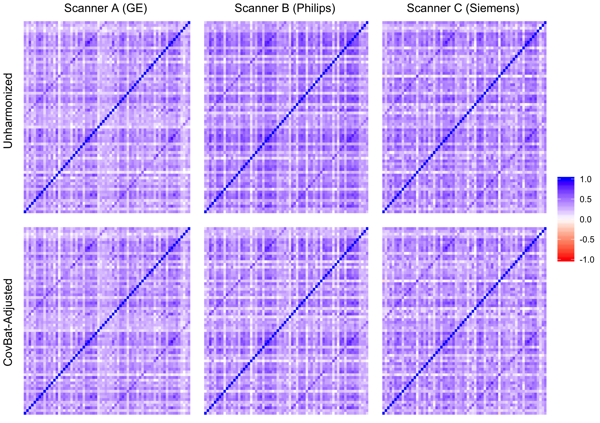

```{r setup, include=FALSE}
knitr::opts_chunk$set(echo = FALSE)

library(tableone)
library(reshape2)
library(ggplot2)
library(xaringanthemer)
library(xtable)

base_color = "#001F5B"
white_color = "#FFFFFF"
black_color = "#000000"
mono_accent(
  base_color = base_color,
  header_font_google = google_font("Source Sans Pro", "600"),
  text_font_google   = google_font("Source Sans Pro", "400", "400i"),
  code_font_google   = google_font("IBM Plex Mono"),
  title_slide_text_color = white_color,
  title_slide_background_color = base_color,
  title_slide_background_image = "cwp-pennSIVE_Logo_FINAL_main_W-O_tagline_horizontal-04.png",
  title_slide_background_position = "50% 12.5%",
  title_slide_background_size = "50%",
  background_image = "cwp-pennSIVE_Logo_icon.png",
  background_size = "7.5%",
  background_position = "95% 5%",
  table_row_even_background_color = white_color,
  header_h1_font_size = "50px",
  header_h2_font_size = "40px", 
  header_h3_font_size = "30px"
)

theme_set(theme_bw() + theme(panel.grid.major = element_blank(), panel.grid.minor = element_blank()))
options(digits = 4)
```

## CovBat Controlling for Covariates
After ComBat step we have
$$\xi_{ijk} = \mu_{ik} + \rho_{ik} \epsilon_{ijk}$$
Instead of assuming $\epsilon_{ijk} \sim N(0, \tau_{k}^2)$, let's assume $\epsilon_{ijk} \sim N(0, \tau_{ik})$ where $log(\tau_{ik}^2) = z_ij' \theta_k + x_ij' \eta_k$ where $x_i$ are the vector of covariates and $z_i$ are the vector of indicators for site. Our goal is to regress the score variances on the covariates and site then residualize with respect to the covariates before adjusting the variances for site. After estimation, we remove the covariate effect on the variances then find $\mu_{ik}$ and $\rho_{ik}$ that bring the residual variance to the pooled residual variance. Once we multiply back the covariate effect on the variance, the adjusted scores are
$$\xi_{ijk}^{CovBat} = \left(\frac{\xi_{ijk}}{e^{x_{ij}' \hat{\eta}_k}}  - \hat{\mu}_{ik}\right)\frac{e^{x_{ij}' \hat{\eta}_k}}{\hat{\rho}_{ik} }$$
The main difference between this model and the original CovBat model is that the $\hat{\rho}_{ik}$ are estimated using the variances residualized on covariates.

---

## ABCD Dataset
- 8198 subjects over 29 scanners with ID (17 Siemens, 9 GE, 3 Philips)
    - Scanners without serial number excluded from analyses (11400 subjects originally)
- For numerical reasons, subset to scanners with $\le 200$ subjects
- Subset considered is 1599 subjects over 13 scanners (7 Siemens, 5 GE, 1 Philips)
- Demographics from the three largest sites are displayed below

```{r, message=FALSE}
load("abcd_demo.Rdata")
demo_out <- print(demo_tab, printToggle = FALSE, noSpaces = TRUE)
```

```{r, results="asis"}
print(xtable(demo_out[,-5]), type = "html", comment = FALSE)
```

---

## Harmonization of Correlations

```{r out.width='95%', fig.show='hold', fig.align='center'}

```

---

## Harmonization of Covariance

```{r, results="asis"}
load("abcd_cor_tab.Rdata")
print(xtable(cor_dist), type = "html", comment = FALSE)
```

---

## Scanner MVPA
```{r out.width='50%', fig.show='hold', fig.align='center'}
knitr::include_graphics(c("abcd_auc_score_ctrl.png"))
```

---

## Sex MVPA
```{r out.width='50%', fig.show='hold', fig.align='center'}
knitr::include_graphics(c("abcd_auc_m_ctrl.png"))
```

---

## Handedness MVPA
```{r out.width='50%', fig.show='hold', fig.align='center'}
knitr::include_graphics(c("abcd_auc_hand_ctrl.png"))
```

---

## Summary
- Scanner effects on covariance less severe than ADNI dataset
    - Yet scanner even more easily detected before and after harmonization
- Lesser improvements across the board in MVPA experiments
- Less improvement when controlling for covariates
- Need to investigate numerical properties of variance effect estimation
    - Boils down to a problem with likelihood maximization