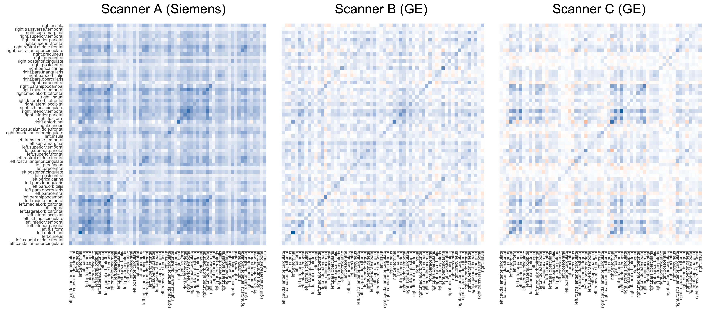
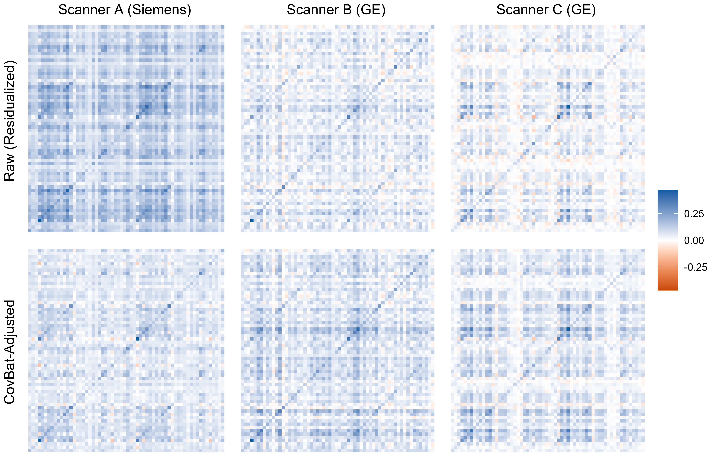
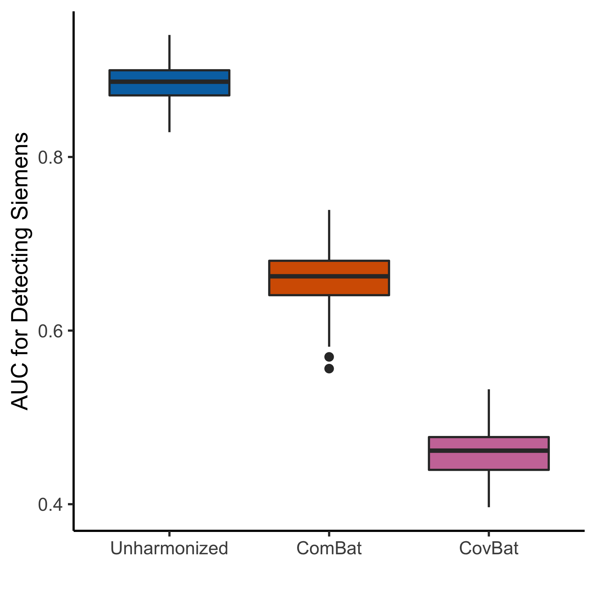
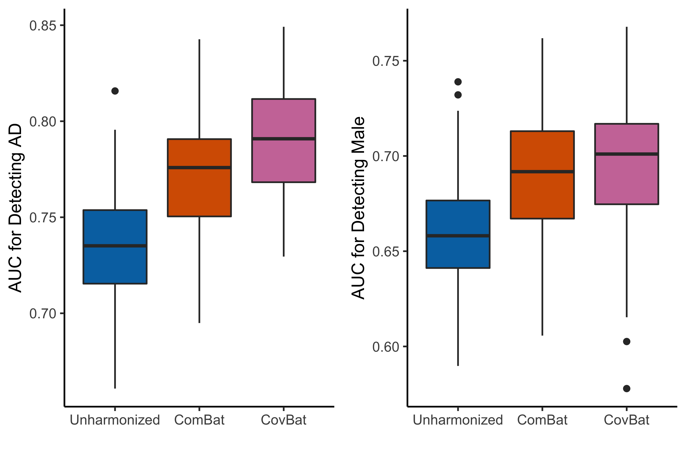
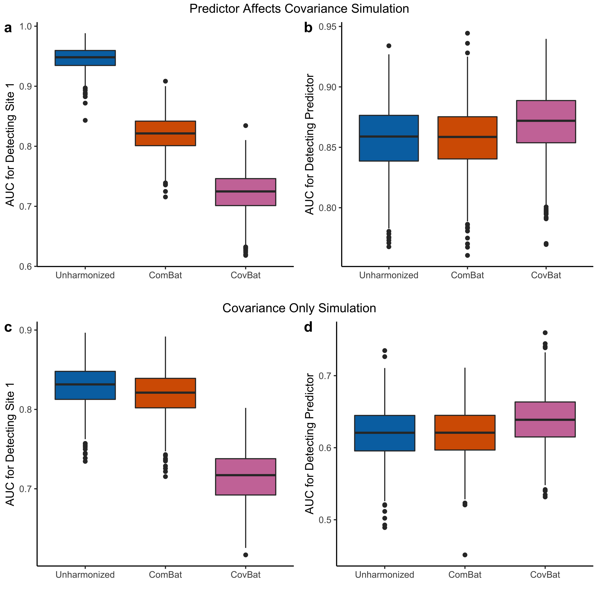

```{r setup, include=FALSE}
knitr::opts_chunk$set(
  echo = FALSE,
  dev = "png",
  fig.retina = 3,
  dev.args=list(bg="transparent"), # transparent plot backgrounds
  fig.height = 7,
  fig.width = 7,
  cache = TRUE
)

library(ggplot2)
library(ggridges)
library(patchwork)
library(reshape2)
library(dplyr)
library(tableone)
library(FCharmony)
library(kableExtra)
library(expm)
library(RColorBrewer)
```

```{r kable_setup, include=FALSE, cache=FALSE}
options("kableExtra.html.bsTable" = T)
options(knitr.kable.NA = '',
        digits = 3)
```

```{r loads, include=FALSE}
load("results/adni_df.Rdata")
```

```{css}
.medium{font-size: 85%}
.small{font-size: 70%}
```

## Scanner effects in neuroimaging
- Differences driven by scanner properties have been noted in diffusion tensor imaging<sup>1</sup>, volumetric data<sup>2</sup>, cortical thickness<sup>3</sup>, and functional connectivity<sup>4</sup>
- Wide variety of harmonization approaches exist, but ComBat<sup>5</sup> remains a prominent method

```{r, fig.width=12, fig.height=3.5, out.width="100%"}
wong_colors <- c("#E69F00", "#56B4E9", "#009E73", "#F0E442", "#0072B2", "#D55E00", "#CC79A7")
ggplot(data = adni_df_ss, aes(x = manufac.model.coil.strength.site, y = right.insula, fill = manufac)) +
  theme_classic() + 
  geom_boxplot() +
  labs(x = "Scanner", y = paste("Right Insula Cortical Thickness"),
       fill = "Manufacturer") +
  scale_fill_manual(values = wong_colors[c(5:7, 1:3)]) +
  theme(axis.ticks.x = element_blank(),
        axis.text.x = element_blank())
```

.footnote[
<sup>1</sup>[Fortin et al., 2017](https://doi.org/10.1016/j.neuroimage.2017.08.047)  
<sup>2</sup>[Reig et al., 2009](https://doi.org/10.1002/hbm.20511)  
<sup>3</sup>[Han et al., 2006](https://doi.org/10.1016/j.neuroimage.2006.02.051)  
<sup>4</sup>[Yu et al., 2018](https://doi.org/10.1002/hbm.24241)  
<sup>5</sup>[Johnson et al., 2007](https://academic.oup.com/biostatistics/article/8/1/118/252073)  
]

---

## Covariance differs across scanners
```{r, fig.align="center"}

```
---

## Combatting batch effects: ComBat
**Step 1**: Assume site effects exist in the mean and variance of multivariate observations.
$$y_{ijv} = \alpha_v + \mathbf{x}_{ij}^T \boldsymbol{\beta}_v + \gamma_{iv} + \delta_{iv}e_{ijv}$$
**Step 2**: Obtain empirical Bayes point estimates $\gamma_{iv}^*$ and $\delta_{iv}^*$ by imposing a common prior across features estimated using the data.

**Step 3**: Remove site effect while retaining the covariate effect.
$$y_{ijv}^{ComBat} = \frac{y_{ijv} - \hat{\alpha}_v - \mathbf{x}_{ij}^T \hat{\boldsymbol{\beta}}_v - \gamma_{iv}^*}{\delta_{iv}^*}+ \hat{\alpha}_v + \mathbf{x}_{ij}^T \hat{\boldsymbol{\beta}}_v$$
.footnote[
[Johnson et al., 2007](https://academic.oup.com/biostatistics/article/8/1/118/252073)  
]

---

## Correcting covariance batch effects: CovBat
**Step 1**: Apply ComBat then residualize out intercept and covariates to center the observations.

**Step 2**: Perform principal components analysis (PCA) to obtain scores.
$$
\begin{aligned}
\Sigma &= \sum_{k=1}^q \lambda_k \phi_k \phi_k^T & \hspace{5mm} & & e_{ij}^{ComBat} &= \sum_{k=1}^q \xi_{ijk} \phi_k
\end{aligned}
$$

**Step 3**: Harmonize mean and variance of first $K$ PC scores.
$$e_{ij}^{CovBat} = \sum_{k=1}^K \xi_{ijk}^{CovBat} \phi_k + \sum_{l=K+1}^q \xi_{ijl} \phi_l$$

**Step 4**: Reintroduce intercept and covariates to obtain CovBat-adjusted observations.
$$y_{ijv}^{CovBat} = e_{ijv}^{CovBat} + \hat{\alpha}_v + \mathbf{x}_{ij}^T \hat{\boldsymbol{\beta}}_v$$

---

## CovBat harmonizes covariance
```{r, out.width="70%", fig.align="center"}

```
---

## Obscures detection of scanner
```{r, fig.align="center", out.width="50%"}

```
---

## Maintains detection of covariates
```{r, fig.align="center", out.width="75%"}

```
---

## Performs well in simulations
```{r, fig.align="center", out.width="50%"}

```
---

## Acknowledgements
.pull-left[
**Advisors**  
Taki Shinohara  
Haochang Shou

**ComBat implementation**  
Jean-Philippe Fortin
]

.pull-right[
**ADNI Preprocessing**  
Joanne C. Beer  
Nicholas J. Tustison  
Philip A. Cook
]

<br/>
.center[]

