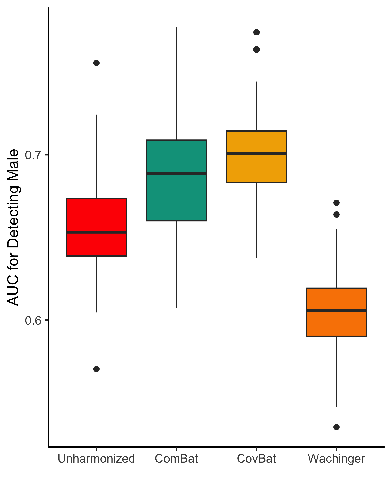

```{r setup, include=FALSE}
knitr::opts_chunk$set(echo = FALSE)
options(digits = 4)

library(RefManageR)
BibOptions(check.entries = FALSE,
           bib.style = "authoryear",
           cite.style = "alphabetic",
           style = "markdown",
           dashed = FALSE)
myBib <- ReadBib("bibliography.bib", check = FALSE)
```

## Wachinger et al. 2020
- Proposes a modified ComBat model that allows for known covariates to remain regressed out of harmonized dataset
- In our notation, this is

$$y_{ijv} = \alpha_v + \boldsymbol{x}_{ij}^T \boldsymbol{\beta}_v + \boldsymbol{r}_{ij}^T \boldsymbol{\zeta}_v + \gamma_{iv} + \delta_{iv} e_{ijv}$$

where $\alpha_{ijv}$ is the intercept, $\boldsymbol{x}_{ij}$ is the vector of covariates, $\boldsymbol{\beta}_v$ is the vector of regression coefficients, $\gamma_{iv}$ is the mean scanner effect, and $\delta_{iv}$ is the variance scanner effect. The modification is that $\boldsymbol{r}_{ij}$ is another vector of covariates that will remain regressed out and $\boldsymbol{\zeta}_v$ is the associated vector of regression coefficients. The errors $e_{ijv}$ are assumed to follow $e_{ijv} \sim N(0, \sigma_v^2)$.
- Then the harmonized values are

$$y_{ijv}^{Wachinger} = \frac{y_{ijv} - \hat{\alpha}_v - \boldsymbol{x}_{ij}^T \hat{\boldsymbol{\beta}}_v - \boldsymbol{r}_{ij}^T \hat{\boldsymbol{\zeta}}_v - \gamma_{iv}^*}{\delta_{iv}^*} + \hat{\alpha}_v + \boldsymbol{x}_{ij}^T \hat{\boldsymbol{\beta}}_v$$

---
## Wachinger et al. 2020
- For their "ComBat with PC" harmonization method, they "compute principal components *across all image features* on the whole dataset to capture generic variation that is not specific to a single brain feature"
- The authors claim to be adapting an approach used in genome-wide association studies called EIGENSTRAT (Price et al., 2006), which is based on PCA
    - However, this PCA is done on the genotype $\boldsymbol{x}_{ij}$ not the phenotypes $\boldsymbol{y}_{ij}$ (Price et al., 2006, Wu et al., 2011)
- Wachinger et al. (2020) are thus proposing a novel harmonization method that regresses out imaging PC scores from imaging features
    - Sounds like CovBat if it is balancing PC score distributions across sites, but we should test this

---
## CovBat vs ComBat with PC: Norms
- Applying ComBat with PC then residualizing out all known covariates we obtain

```{r, results="asis"}
load("../../covbat_v_eigenstrat_cor.Rdata")
knitr::kable(cor_resid, "html")
```

- Instead only residualizing the PC scores, we obtain

```{r, results="asis"}
knitr::kable(cor_no_resid, "html")
```

---
## Correlation Matrices: Residualized
```{r, fig.align="center", out.width="70%"}

```

---
## Correlation Matrices: ComBat with PC
```{r, fig.align="center", out.width="70%"}

```

---
## Preliminary MVPA for Manufacturer
```{r, fig.align="center", out.width="50%"}

```

---
## MVPA for Diagnosis
```{r, fig.align="center", out.width="50%"}

```

---
## MVPA for Sex
```{r, fig.align="center", out.width="50%"}

```

---
# References
```{r}
NoCite(myBib, c("price_principal_2006",
                "wachinger_detect_2020",
                "wu_comparison_2011"))
```

```{r ref, results="asis"}
PrintBibliography(myBib)
```