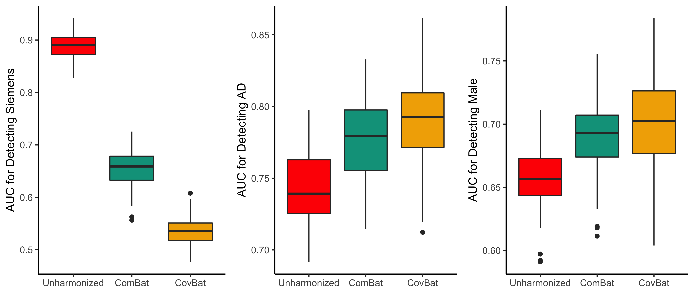

```{r setup, include=FALSE}
knitr::opts_chunk$set(echo = FALSE)
options(digits = 2)

library(kableExtra)
library(xtable)

load("../../ABCD Example/abcd_all_perm_tests.Rdata")
load("../../ABCD Example/abcd_demo_tests.Rdata")
source("../../ABCD Example/cor_perm.R")
```

class: divider, center, middle
```{css}
.divider h2 {
  color: #FFFFFF;
  font-weight:600;
}
```
<br />
## Does the correlation of cortical thickness measurements differ across scanners in the ABCD study?
---
## Motivation
- We developed **CovBat**, a method to harmonize covariance of neuroimaging measures across scanners
- Using the ADNI dataset, we showed that considerable scanner effects in covariance existed and could be removed via CovBat
    - Led to improvements in multivariate pattern analysis


---
## ABCD Dataset Demographics
```{css}
.small { font-size: 70% }
```
- Cortical thickness values computed using 3T scans for 11400 subjects
    - Excluded subjects without sex or scanner ID, *n* = 8196 included
- Demographics stratified by scanner model shown below

.small[
```{r, results="asis"}
#colnames(tab1_print) <- c("Achieva dStream)
add_indent(knitr::kable(tab1_print, "html"), 5:7)
```
]
---
## Correlation Permutation Test
- To test our hypothesis that correlation between cortical thickness values differs across scanner model, we design the following permutation test:
    1. Shuffle scanner model and scanner ID
    2. Compute correlation matrices within each scanner ID
    3. Find average pairwise distance between correlation matrices of different scanner models
    4. Repeat steps 1-3 one thousand times
    5. Compare the true average pairwise distance against the permutation values


- This test accounts for the sample size within each scanner ID by keeping it fixed across permutations
---
## Prisma vs. Prisma Fit
- Found large difference in correlation structure between Prisma and Prisma fit scanners (true value in blue, *p* = 0.001)
- Fitting a mixed model to account for nesting by scanner ID, no significant difference between subjects acquired on either scanner in age (*p* = `r demo_p[1]`) or sex (*p* = `r demo_p[2]`)
```{r, fig.retina=3, fig.align="center", out.width="60%", fig.width=4, fig.height=4}
plot(all_perm$pris, 5, "Average Frobenius Distance")
```
---
## All Comparisons Table
```{css}
th{
    font-weight: normal;
}
```

```{r, results="asis"}
scanners <- c("GE Discovery MR750", "Philips Achieva dStream", 
              "Philips Ingenia", "Siemens Prisma", "Siemens Prisma Fit")
# p <- sapply(1:length(all_perm), function(x) round(all_perm[[x]]$p, 3))
p <- sapply(all_p, function(x) {if (x < 0.05/length(all_perm)) {
  paste0('<font color="990000">',round(x, 3),"</font>")
} else {round(x, 3)}})
comp_tab <- matrix(c("", p[7:10],
                     "", "", p[2:4],
                     "", "", "", p[5:6],
                     "", "", "", "", p[1],
                     rep("", 5)), 5, 5, dimnames = list(scanners, scanners))
comp_x <- xtable(comp_tab, align = "lccccc")
```

```{r, results="asis"}
print(comp_x, "html", comment = FALSE, sanitize.text.function=function(x){x})
```

*p*-values in <font color="990000">red</font> are significant at the 0.05 level after Bonferroni correction
---
## Conclusions
- We found that significant differences in correlation structure existed between subjects acquired on Prisma and Prisma fit scanners
    - This difference was not present between Philips scanners (Achieva dStream vs Ingenia, *p* = `r p[2]`)
    - Differences also significant between Prisma and Philips scanners
    

- Suggests that significant scanner effects on covariance exist and harmonization of covariance is necessary


- Prisma and Prisma fit scanners are likely more distinguishable through multivariate pattern analysis, which leverages their distinct correlation structures
---
## Further Investigation
- Our suspicion is that field inhomogeneity is somehow related


- Mark Elliot from Radiology suggested looking into the following subject-level variables that we have already obtained
    - Head size (approximated using volume of brain mask)
    - Body weight


- However we are missing potentially important scanner variables such as
    - Scanner IDs for 3202 subjects
    - Head coil used in Prisma and Prisma fit scanners
    - Transmit reference voltage
    

- Any assistance would be greatly appreciated