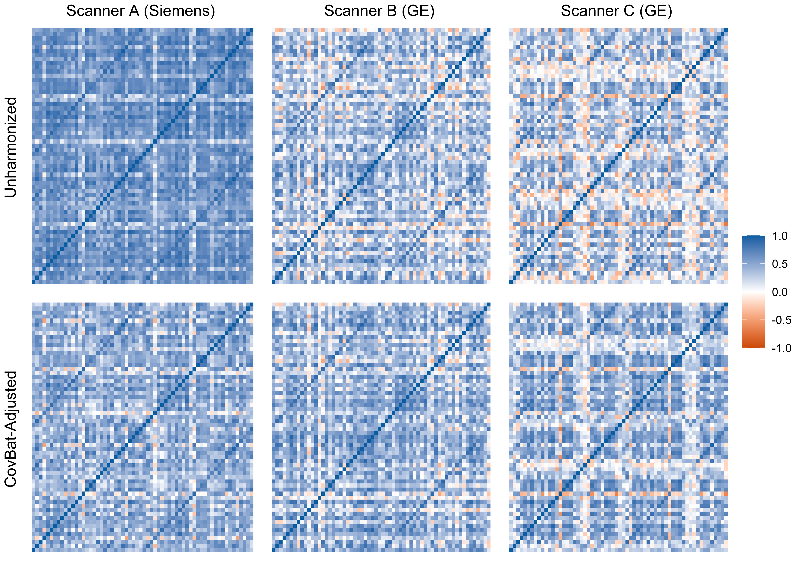
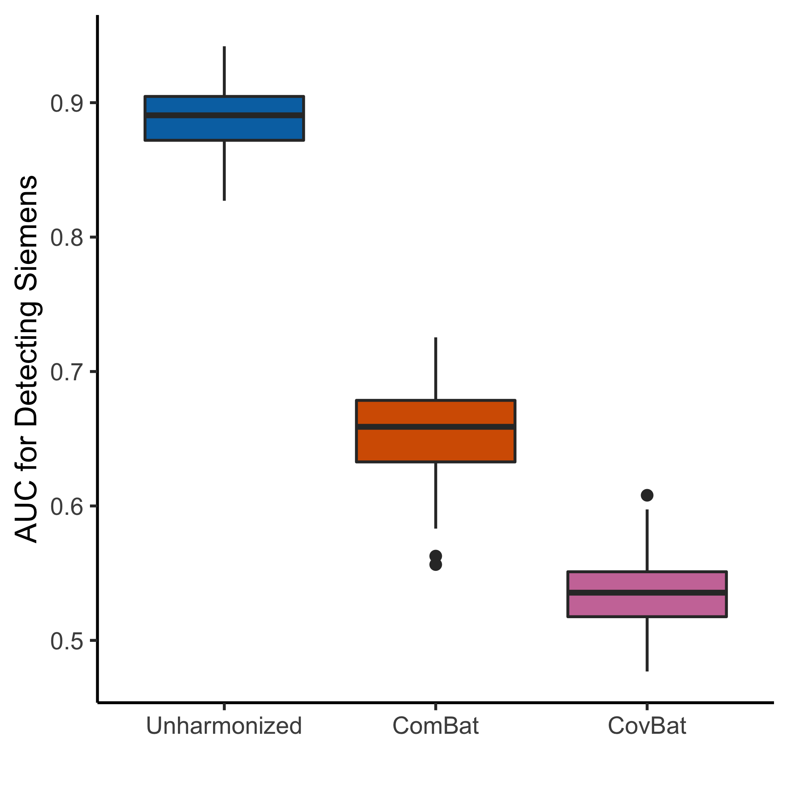
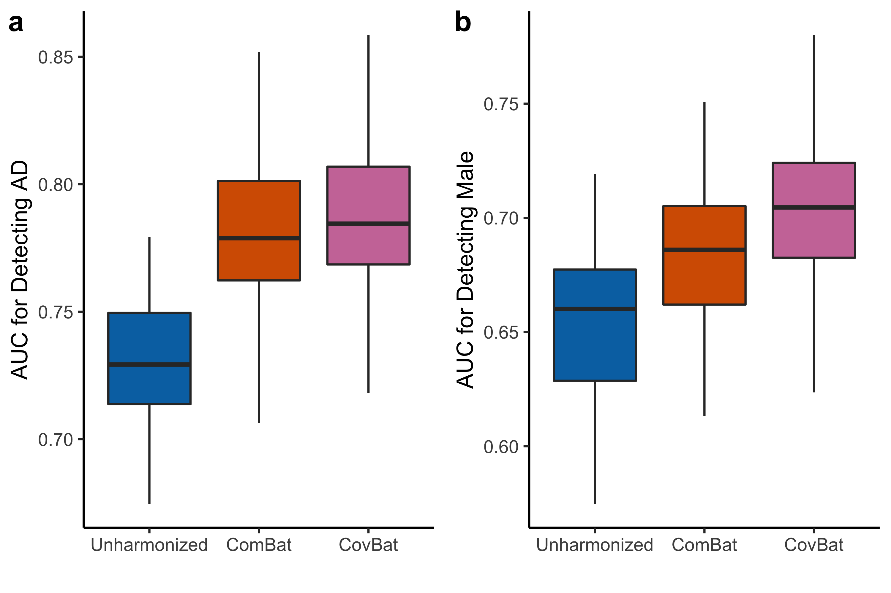

```{r setup, include=FALSE}
knitr::opts_chunk$set(
  echo = FALSE,
  fig.retina = 2, # higher quality plots
  dev = "svg", # vector graphics device
  dev.args=list(bg="transparent") # transparent plot backgrounds
)
options(digits = 3)

library(kableExtra)
library(reshape2)
library(xtable)
library(tableone)
library(dplyr)

source("../../covbat.R", chdir = TRUE)
source("../../ABCD Example/cor_perm.R")
```

## Outline of Projects
- Correcting Covariance Batch Effects: CovBat

- Harmonization of functional connectivity matrices (WIP)
- Covariance regression using principal components analysis (WIP)
---
class: divider, center, middle
# Correcting Covariance Batch Effects: CovBat
---

## CovBat Model
.footnote[<sup>1</sup>[Johnson et al., 2007](https://academic.oup.com/biostatistics/article/8/1/118/252073)]

**Step 1**: Remove scanner effect in mean and variance via ComBat<sup>1</sup> and then residualize out intercept and covariates
$$e_{ijv}^{ComBat} = \frac{y_{ijv} - \hat{\alpha}_v - \mathbf{x}_{ij}' \hat{\beta}_v - \gamma_{iv}^*}{\delta_{iv}^*}$$
**Step 2**: Perform principal components analysis (PCA) to obtain scores
$$
\begin{aligned}
\Sigma &= \sum_{k=1}^q \lambda_k \phi_k \phi_k' & & & e_{ij}^{ComBat} &= \sum_{k=1}^q \xi_{ijk} \phi_k
\end{aligned}
$$

**Step 3**: Harmonize mean and variance of first $K$ PC scores

$$e_{ij}^{CovBat} = \sum_{k=1}^K \xi_{ijk}^{CovBat} \phi_k + \sum_{l=K+1}^q \xi_{ijl} \phi_l$$

---
## CovBat Harmonizes Covariance


---
## CovBat Obscures Detection of Scanner
```{r, out.width="70%", fig.align="center"}

```

---
## CovBat Improves Detection of Covariates


---
class: divider, middle, center
# Functional Connectivity Harmonization
---

## Problem Setting
- Resting-state fMRI has been become an increasingly popular tool for understanding brain function and pathology
- Consists of fMRI sequence acquired without any associated task
- Typically analyzed as $p\times p$ correlation matrices calculated across regions of interest over time
- How do we correct for scanner differences across these objects?
---

## FC Harmonization using CPCs
Let $\Sigma_{ij}$ be the covariance matrices within site $i$ for subject $j$. We assume that there exist common principal components (CPCs) across the functional connectivity matrices such that
$$\Sigma_{ij} = \Phi \Lambda_{ij}\Phi^T$$
where $\Lambda_{ij}$ are $p\times p$ diagonal matrices with entries $\lambda_{ijk}$

We then directly apply the ComBat model to $q$ CPC eigenvalues such that
$$\log\lambda_{ijk} = x_{ij}^T \beta_k + \gamma_{ik} + \delta_{ik} e_{ijk}$$
for $k=1,2,\ldots,q$ where $q \leq p$.  
--


Ideally, this removes scanner effect from features shared between subjects, which is ultimately what would be important for later inference.
---

## Estimation of CPCs
- For now, $q$ is fixed at some value, but there could be a data-driven way (e.g. percentage of norm captured by CPC approximation)
- Estimation of CPCs can proceed via any method, major ones include the MLE estimation<sup>1</sup>, stepwise CPC<sup>2</sup>, or potentially covariate-assisted principal components (CAP)<sup>3</sup>
- However, no guarantees that any of these CPC methods fit the data well
    - Currently running into issues with how well the CPCs fit the data
    - Correction works on relatively small part of the FC matrices (in percentage of norm) even with large number of CPCs

.footnote[
<sup>1</sup>[Flury, 1986](https://projecteuclid.org/euclid.aos/1176349930)  
<sup>2</sup>[Trendafilov, 2010](https://doi.org/10.1016/j.csda.2010.03.010)  
<sup>3</sup>[Zhao et al., 2019](https://doi.org/10.1093/biostatistics/kxz057)
]
---

## Log-Transformation Approaches
- Apply log transformation then vectorize subject-specific matrices then perform PCA to obtain $\boldsymbol{\Phi}_k$, which are just the eigenvectors arranged as $p \times p$ symmetric matrices
$$\log\Sigma_{ij} = \sum_{k = 1}^K \Lambda_{ijk} \boldsymbol{\Phi}_k + \mathbf{E}_{ij}$$
- Apply ComBat including covariates to the $\Lambda_{ijk}$, harmonizing across sites indexed by $i$
- Recover CovBat-adjusted FC matrices by taking the matrix exponential
- Guarantees positive definiteness
--

- We also tried simply applying ComBat to the entries of $\log\Sigma_{ij}$
---

## BLSA/CARDIA Data Example
- For initial tests, we are using a subset of data from the Baltimore Longitudinal Study of Aging (BLSA) and the Coronary Artery Risk Development in Young Adults (CARDIA) study
- Starting with 50 subjects per site, and random subset of 50 ROIs from the 264 available ROIs
```{r, include=FALSE}
load("../../BLSA CARDIA Example/blsa_cardia_small.Rdata")
```

```{r, include=FALSE}
BLSA_CARDIA_demo$site <- droplevels(BLSA_CARDIA_demo$site)
demotab <- CreateTableOne(vars = c("age_at_scan", "sex"), data = BLSA_CARDIA_demo, strata = "site")
tabout <- print(demotab)
rownames(tabout) <- c("Number of Subjects", "Age (mean(SD))", "Male (%)")
```

```{r demo, results="asis"}
knitr::kable(tabout[,1:4], "html")
```
---

### Multivariate Distance Matrix Regression
- MDMR<sup>1,2</sup> is a technique for relating an arbitrary number of dependent variables to independent variables
    - Only relies on a distance matrix calculated using any metric
- Effective in high-dimensional settings, including FC
- Important to consider which metric to use
    - Both Frobenius norm and log-Euclidean<sup>3</sup> norm are tested

.footnote[
<sup>1</sup>[Zapala and Schork, 2012](https://doi.org/10.3389/fgene.2012.00190)  
<sup>2</sup>[McArdle and Anderson, 2001](https://doi.org/10.1890/0012-9658(2001)082[0290:FMMTCD]2.0.CO;2)  
<sup>3</sup>[Arsigny et al., 2016](https://doi.org/10.1002/mrm.20965)
]
---

## All Methods Considered
- Bolded methods guarantee positive definiteness
    - For others, we find the nearest PD matrix
- Tried all methods using covariance and correlation as inputs


- FC ComBat: ComBat on Fisher-transformed off-diagonal elements
- **Log-ComBat**: Log then ComBat on all elements
- **Log-CovBat**: Log then ComBat on PC scores
- CPC eigenvalues harmonized by taking the log and applying ComBat
    - Not handled
    - ComBat on all elements
    - **Removed entirely**
---

## MDMR Results: Covariance Inputs
```{r}
load("all_cov_harmony_out.Rdata")
```
- FC ComBat excluded since it only operates on correlation matrices
- MDMR implemented via 10,000 permutations of the independent variables
- Results reported for both covariance and correlation outputs

.center[Results for Frobenius Distance]
.small[
```{r , results="asis"}
ccolors <- colorRampPalette(c("#011F5B", "#000000", "#990000"))(256)
color_kable <- function(x) {
  colored <- as.data.frame(x) %>% 
    mutate_if(is.numeric, function(y) {
      cell_spec(y, "html", 
                color = ccolors[round(scales::rescale(y, to = c(1, 256), from = 0:1))])}
    )
  rownames(colored) <- rownames(x)
  knitr::kable(colored, "html", escape = FALSE, row.names = TRUE)
}

colnames(all_reg) <- c("All", "Age", "Sex", "Site", 
                         "All.Corr", "Age.Corr", "Sex.Corr", "Site.Corr")
colnames(all_regL) <- c("All", "Age", "Sex", "Site", 
                         "All.Corr", "Age.Corr", "Sex.Corr", "Site.Corr")
color_kable(all_reg)
```
]
---

## MDMR Results: Covariance Inputs
.center[Results for Log-Euclidean Distance]
.small[
```{r , results="asis"}
color_kable(all_regL)
```
]
---

## MDMR Results: Correlation Inputs
```{r}
load("all_corr_harmony_out.Rdata")
```
- Results reported for correlation outputs
- For log-Euclidean distance, had to find the nearest PD matrix to FC ComBat output

.center[Results for Frobenius Distance]
```{r , results="asis"}
colnames(all_reg) <- c("All", "Age", "Sex", "Site")
colnames(all_regL) <- c("All", "Age", "Sex", "Site")
color_kable(all_reg)
```
---

## MDMR Results: Correlation Inputs
.center[Results for Log-Euclidean Distance]
```{r , results="asis"}
color_kable(all_regL)
```
---

## FC Harmonization Summary
- Results depend heavily on the choice of metric
    - Promising results for CPC+ComBat and log-ComBat which show strong harmonization performance in both metrics
- Need to implement and test CPC-based regression methods
- Adapting CAP code for application in harmonization
- Further testing of network metrics
- Working on an R package to implement all methods and tests
---
class: divider, center, middle
# Covariance Regression
---

## Motivation: ABCD Study
- Applied CovBat to the Longitudinal Study of Adolescent Brain Cognitive Development (ABCD Study)
- Noticed substantial differences in covariance between scanners especially between Siemens Prisma and Siemens Prisma fit scanners
    - These are meant to be almost equivalent models
- Used a permutation test to investigate
---

## ABCD Study Demographics
```{r}
load("../../ABCD Example/abcd_all_perm_tests.Rdata")
load("../../ABCD Example/abcd_demo_tests.Rdata")
```

```{css}
.small { font-size: 70% }
```
- Cortical thickness values computed using 3T scans for 6341 subjects
    - Excluded subjects without sex or scanner ID
    - Also excluded subjects with conflicting scan information, *n* = 4857 included
- Demographics stratified by scanner model shown below

.small[
```{r, results="asis"}
#colnames(tab1_print) <- c("Achieva dStream)
add_indent(knitr::kable(tab1_print, "html"), 5:7)
```
]

---
## Correlation Permutation Test
- To test our hypothesis that correlation between cortical thickness values differs across scanner model, we design the following permutation test:
    1. Shuffle scanner model and scanner ID
    2. Compute correlation matrices within each scanner ID
    3. Find average pairwise distance between correlation matrices of different scanner models
    4. Repeat steps 1-3 one thousand times
    5. Compare the true average pairwise distance against the permutation values


- This test accounts for the sample size within each scanner ID by keeping it fixed across permutations

---
## Prisma vs. Prisma Fit
- Found large difference in correlation structure between Prisma and Prisma fit scanners (true value in blue, *p* = 0.005)
- Fitting a mixed model to account for nesting by scanner ID:
    - No significant difference in age (*p* = `r demo_p[1]`)
    - Or sex (*p* = `r demo_p[2]`)
```{r, fig.retina=3, fig.align="center", out.width="60%", fig.width=4, fig.height=4}
plot(all_perm$pris, 1, "Average Frobenius Distance")
```
---
## All Comparisons Table
```{css}
.medium { font-size: 85% }
```

.medium[
```{r, results="asis"}
scanners <- c("GE Discovery MR750", "Philips Achieva dStream", 
              "Philips Ingenia", "Siemens Prisma", "Siemens Prisma Fit")
all_p <- sapply(1:length(all_perm), function(x) round(all_perm[[x]]$p, 3))
# p <- sapply(all_p, function(x) {if (x < 0.05/length(all_perm)) {
#   paste0('<font color="990000">',round(x, 3),"</font>")
# } else {round(x, 3)}})
p <- all_p
comp_tab <- matrix(c(NA, p[7:10],
                     NA, NA, p[2:4],
                     NA, NA, NA, p[5:6],
                     NA, NA, NA, NA, p[1],
                     rep(NA, 5)), 5, 5, dimnames = list(scanners, scanners))

options(knitr.kable.NA = '')
options("kableExtra.html.bsTable" = T) # force loading of bootstrap style
as.data.frame(comp_tab) %>%
  tibble::rownames_to_column(var = " ") %>%
  mutate_if(is.numeric, function(x) {
    ifelse(x < 0.05/length(all_perm), 
           cell_spec(x, "html", color = "#990000"), x)}) %>%
  knitr::kable("html", escape = FALSE, align = "lccccc") %>%
  kable_styling("bordered") %>%
  column_spec(1, bold = TRUE)

# kable(out_tab, "html", escape = FALSE) %>%
#   column_spec(1, bold = TRUE) %>%
#   kable_styling("bordered")
```
]

*p*-values in <font color="990000">red</font> are significant at the 0.05 level after Bonferroni correction
---

## PCA-Based Covariance Regression
We work with a special case of an existing model.<sup>1</sup> Assume that the covariance matrices are positive definite and impose structure on the error covariances such that
$$\boldsymbol{\Sigma}_i=\sum_{k=1}^q \lambda_{ik} \boldsymbol{\phi}_k \boldsymbol{\phi}_k^T$$
where $\boldsymbol{\phi}_k$ is are the eigenvectors of the response matrix $\boldsymbol{Y}$ and $\lambda_{ik}$ are the corresponding eigenvalues. We furthermore assume a log-linear relationship between $r\leq q$ eigenvalues and predictors such that
$$\log(\lambda_{ik}) = \boldsymbol{x}_i^T \boldsymbol{\gamma}_k, \hspace{5mm}\text{for}\hspace{2.5mm}k=1,2,\ldots,r$$
which implies that
$$\boldsymbol{\Sigma}_i=\sum_{k=1}^r \exp({\boldsymbol{x}_i^T \gamma_k})\boldsymbol{\phi}_k \boldsymbol{\phi}_k^T+\boldsymbol{F}_i$$
.footnote[<sup>1</sup>[Boik, 2002](https://www.jstor.org/stable/4140565)]
---

## Covariance Regression in ABCD
```{r}
load("../../ABCD Example/abcd_demo_tests.Rdata")
load("abcd_lmcov_out.Rdata")
```
- Permutation tests showed significant difference in correlation across scanner manufacturers and models
- We regress all `r lmcov_res$npc` PC score variance on age, sex, handedness, and scanner manufacturer
- Likelihood ratio test comparing against model without scanner manufacturer yields `r sum(lr_manufac_p <= 0.05/length(lr_manufac_p))` PC scores with variance significantly associated with manufacturer after Bonferroni correction

```{r lr_plot, fig.align='center', fig.asp=0.4, fig.retina=2, out.width='100%'}
plot(1:length(lr_manufac_p), lr_manufac_p, xlab = "PC", ylab = "p-value",
     ylim = c(0, 0.05/length(lr_manufac_p) + 0.0012))
abline(h = 0.05/length(lr_manufac_p), col = "blue")
```
---

## Covariance Regression Directions
.footnote[
<sup>1</sup>[Boik, 2013](https://doi.org/10.1016/j.jmva.2012.11.017)  
<sup>2</sup>[Satterthwaite et al., 2013](https://doi.org/10.1016/j.neuroimage.2012.08.052)  
<sup>3</sup>[Murphy and Fox, 2017](https://doi.org/10.1016/j.neuroimage.2016.11.052)
]

- The theory is already well-established for this model, even for correlation matrix outcomes<sup>1</sup>
- We have also applied the method to covariance harmonization to control for covariate effects in variance/covariance adjustment
--
- Potential extension to preprocessing
    - Often is the case that motion<sup>2</sup> or global signal<sup>3</sup> is regressed out of ROI-level time series then residuals used to calculated correlation matrix
    - Potential loss of information: an example being if motion is correlated with your outcomes of interest
    - Can we directly regress out confounders from correlation or covariance matrix while controlling for outcome of interest?
---

## Summary
- Correcting Covariance Batch Effects: CovBat
    - Successfully harmonizes covariance across scanners
    - Wrapping up, but looking into extensions to longitudinal data and comparison with other batch effects correction for machine learning applications
--
- Harmonization of functional connectivity matrices (WIP)
    - CPC and log-transformation provide two separate approaches to harmonization
    - Working on further investigation into evaluation metrics
--
- Covariance regression using principal components analysis (WIP)
    - Model itself is already established
    - Adaptation to neuroimaging data is novel and may require extensions of basic model
--

Any feedback would be greatly appreciated!
---

## Acknowledgements
.pull-left[
**Advisors**  
Taki Shinohara  
Haochang Shou

**ADNI Preprocessing**  
Joanne C. Beer  
Nicholas J. Tustison  
Philip A. Cook
]

.pull-right[
**BLSA/CARDIA Preprocessing**  
Raymond Pomponio  
Dhivya Srinivasan

**ABCD Preprocessing and Advice**
Theodore D. Satterthwaite  
Adam Pines  
Mark A. Elliot
]

<br/>
.center[]


```{r, eval=FALSE}
pagedown::chrome_print("Projects-Overview.html") # print as pdf
```

