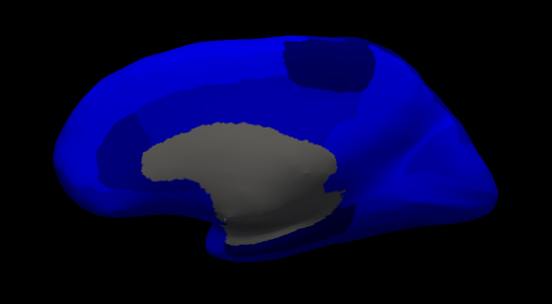
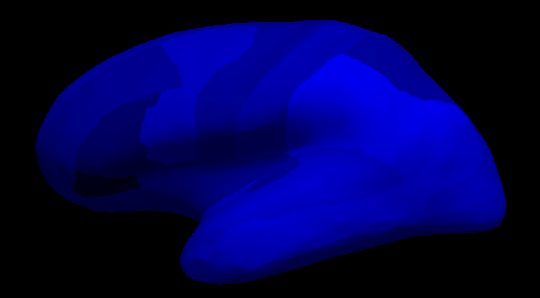
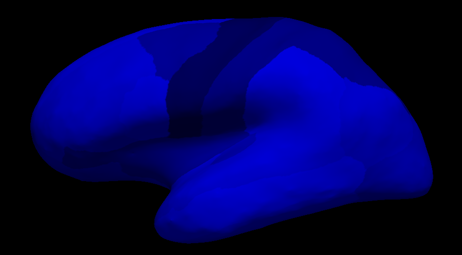
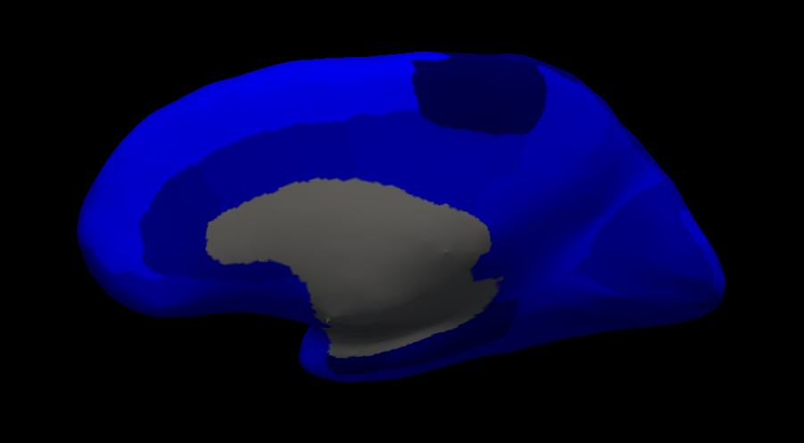
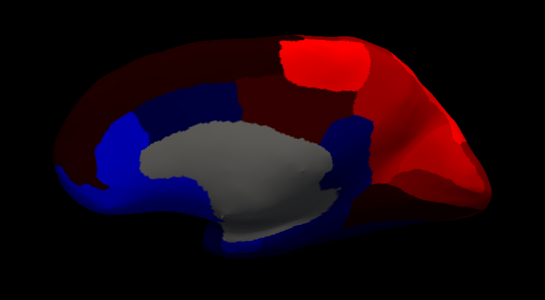

```{r setup, include=FALSE}
knitr::opts_chunk$set(echo = FALSE)

library(reshape2)
library(ggplot2)
library(xaringanthemer)
library(RefManageR)
library(xtable)
library(lessR)
library(tableone)
library(plotly)
library(png)
library(grid)

base_color = "#008080"
white_color = "#FFFFFF"
black_color = "#000000"
mono_accent(
  base_color = base_color,
  header_font_google = google_font("Source Sans Pro", "600"),
  text_font_google   = google_font("Source Sans Pro", "400", "400i"),
  code_font_google   = google_font("IBM Plex Mono"),
  title_slide_text_color = base_color,
  title_slide_background_color = white_color,
  table_row_even_background_color = white_color,
  header_h1_font_size = "45px"
)

BibOptions(check.entries = FALSE, 
           bib.style = "authoryear", 
           cite.style = 'alphabetic', 
           style = "html",
           hyperlink = FALSE, 
           dashed = FALSE,
           bibpunct = c("(",")","(",")",";",","))
myBib <- ReadBib("../Literature Review/Citations.bib", check = FALSE)

theme_set(theme_bw() + theme(panel.grid.major = element_blank(), panel.grid.minor = element_blank()))
options(digits = 4)

load("ADNI_covbat_ex.Rdata")
source("../covbat.R", chdir = TRUE)
```

# Introducing CovBat
- Dubbed Correcting **Cov**ariance **Bat**ch Effects
- Corrects for site effects in principal component scores
- Two-step procedure starting with ComBat to remove mean and variance batch effects
    - Also residualize on intercept and covariates to obtain $y_{ij}^{ComBat} \sim N(\mathbf{0}, \Sigma_i)$
- Then perform PCA on the ComBat-adjusted data matrix
- We assume that the site effect lies within the first $K$ principal component scores $\lambda_{ijk}$, $k = 1, \ldots, K$ such that 

  $$\lambda_{ijk} = \mu_{ik} + \rho_{ik} \epsilon_{ijk}$$ 
  where $\epsilon_{ijk} \sim N(0, \tau_{k})$ and $\mu_{ik}$, $\rho_{ik}$ are the center and scale parameters corresponding to each principal component, each having their own prior distribution
- After obtaining Bayesian point estimates for all of the site effect parameters, we obtain CovBat-adjusted observations via
$\lambda_{ijk}^{CovBat} = \frac{\lambda_{ijk} - \hat{\mu}_{ik}}{\hat{\rho}_{ik}}$ and

$$y_{ij}^{CovBat} = \sum_{k=1}^K \lambda_{ijk}^{CovBat} \phi_k + \sum_{l=K+1}^p \lambda_{ijl} \phi_l + \hat{\alpha} + X_{ij}^T \hat{\beta}$$

---

# CovBat: Methodological Investigation
- Covariance changes with variance of site score

$$Cov(Y) = Cov(\sum_{k=1}^P \Lambda_{k} \phi_k) = \sum_{k=1}^P Var(\Lambda_k) \phi_k \phi_k^T$$

- What about multilevel PCA?
    - Decomposes between-site and within-site covariance separately
    - Within-site principal components are same across sites
    - Could correct on between-site PC scores while keeping within-site
    - Possible extensions?

---

# Site 23

```{r fig.width=10, fig.height=10, fig.show='hold', fig.align='center', out.width = "70%"}
plot_cov(cor(y_obs[bat == 1,]))
```

---

# Site 23 Post-CovBat

```{r fig.width=10, fig.height=10, fig.show='hold', fig.align='center', out.width = "70%"}
plot_cov(cor(t(y_covbat$dat.covbat)[bat == 1,]))
```

---

# Site 23 Sum of Squared Correlations
```{r out.width='70%', fig.show='hold', fig.align='center'}
knitr::include_graphics("adni_ssc1.png")

```

---

# Site 27

```{r fig.width=10, fig.height=10, fig.show='hold', fig.align='center', out.width = "70%"}
plot_cov(cor(y_obs[bat == 2,]))
```

---

# Site 27 Post-CovBat

```{r fig.width=10, fig.height=10, fig.show='hold', fig.align='center', out.width = "70%"}
plot_cov(cor(t(y_covbat$dat.covbat)[bat == 2,]))
```

---

# Site 27 Sum of Squared Correlations
```{r out.width='70%', fig.show='hold', fig.align='center'}


```

---

# Site 33

```{r fig.width=10, fig.height=10, fig.show='hold', fig.align='center', out.width = "70%"}
plot_cov(cor(y_obs[bat == 3,]))
```

---

# Site 33 Post-CovBat

```{r fig.width=10, fig.height=10, fig.show='hold', fig.align='center', out.width = "70%"}
plot_cov(cor(t(y_covbat$dat.covbat)[bat == 3,]))
```

---

# Site 33 Sum of Squared Correlations
```{r out.width='70%', fig.show='hold', fig.align='center'}


```

---

# Variance Correction
```{r out.width='50%', fig.show='hold', fig.align='default'}


```

---

# PC Score Correction
```{r out.width='50%', fig.show='hold', fig.align='default'}


```

---

# MVPA Results
```{r out.width='50%', fig.show='hold', fig.align='default'}


```

---

# Real Data PCs: PC 1 (13.2%)
```{r fig.width=10, fig.height=10, fig.show='hold', fig.align='center', out.width = "70%"}
plot_mat(tcrossprod(y_covbat$x.pc$rotation[,1]))
```

---

# Real Data PCs: PC 1 (13.2%)
```{r out.width='70%', fig.show='hold', fig.align='center'}


```

---

# Real Data PCs: PC 2 (8.1%)
```{r fig.width=10, fig.height=10, fig.show='hold', fig.align='center', out.width = "70%"}
plot_mat(tcrossprod(y_covbat$x.pc$rotation[,2]))
```

---

# Real Data PCs: PC 2 (8.1%)
```{r out.width='70%', fig.show='hold', fig.align='center'}


```

---

# Real Data PCs: PC 3 (5.1%)
```{r fig.width=10, fig.height=10, fig.show='hold', fig.align='center', out.width = "70%"}
plot_mat(tcrossprod(y_covbat$x.pc$rotation[,3]))
```

---

# Real Data PCs: PC 3 (5.1%)
```{r out.width='70%', fig.show='hold', fig.align='center'}


```

---

# Real Data PCs: PC 4 (4.3%)
```{r fig.width=10, fig.height=10, fig.show='hold', fig.align='center', out.width = "70%"}
plot_mat(tcrossprod(y_covbat$x.pc$rotation[,4]))
```

---

# Real Data PCs: PC 4 (4.3%)
```{r out.width='70%', fig.show='hold', fig.align='center'}


```

---

# Simulation Design
- Aim to first determine if ComBat performs poorly in any situations
- Generate observations from
  $$y_{ij} = \alpha + x_{ij}' \beta + \gamma_i + \Delta_i' e_{ij}$$
  where $\gamma_i$ and the $p \times p$ matrix $\Delta_i$ are drawn from some multivariate distributions and $e_{ij} \sim N(\mathbf{0}, \Sigma)$ and $\Sigma$ is not necessarily diagonal
- When $\gamma_{iv}$ are i.i.d drawn from the same normal distribution, $\Delta_{i}$ is diagonal with elements i.i.d drawn from the same inverse gamma distribution, and $\Sigma$ is diagonal, this is exactly the ComBat model

---

# Simulation Evaluation
- Preliminary results suggest that ComBat performs adequately on variance regardless of $\Sigma$ and $\Delta_i$
- Power and type I error evaluated by defining a single beta (or set of betas) then regressing on simulated covariate
    - In both cases and under many different types of multiple comparisons corrections, no difference between ComBat and CovBat power curves
- Evaluating Frobenius norm between site correlation matrices shows CovBat performs significantly better

---

# Peeking Cat
```{r fig.width=10, fig.height=10, fig.show='hold', fig.align='center', out.width = "70%"}
load("../animats.Rdata")
plot_mat(allmat[,,1])
```

---

# Peking Duck
```{r fig.width=10, fig.height=10, fig.show='hold', fig.align='center', out.width = "70%"}
plot_mat(allmat[,,3])
```

---

# Peeking Pig
```{r fig.width=10, fig.height=10, fig.show='hold', fig.align='center', out.width = "70%"}
plot_mat(allmat[,,2])
```

---

# Animal Matrices Problems
- Now we allow for site-specific scaling matrices
- We still multiple each matrix by a vector of draws from some site-specific random variable. Let $K_i$ be the animal matrix

$$\Delta_{i} = diag(\mathbf{\delta_i}) \times K_i$$

where each $\mathbf{\delta_i}$ is a vector of draws from a site-specific distribution $F_i$

- For these simulations, we used site specific distributions: $InvGamma(2, 0.5), InvGamma(3, 0.5), InvGamma(4, 0.5)$

---

# Animal Matrix, Site 33 Covariance
```{r fig.width=10, fig.height=10, fig.show='hold', fig.align='center', out.width = "70%", fig.retina = 3}
load("sim_cov_allmat.Rdata")
df_in <- ex_sim[[1]]
plot_mat(df_in$cov[[1]])
```

---

# Animal Matrix, Site 33 Covariance
```{r fig.width=10, fig.height=10, fig.show='hold', fig.align='center', out.width = "70%", fig.retina = 3}
plot_mat(df_in$cov[[2]])
```

---

# Animal Matrix, Site 33 Covariance
```{r fig.width=10, fig.height=10, fig.show='hold', fig.align='center', out.width = "70%", fig.retina = 3}
plot_mat(df_in$cov[[3]])
```

---

```{r, include = FALSE}
m <- 3
com_out <- combat(t(df_in$y), df_in$bat, mod = df_in$x)
cov_out <- CovBat(t(df_in$y), df_in$bat, mod = df_in$x)

var_in <- t(sapply(1:m, function(x) apply(df_in$y[df_in$bat == x,], 2, var)))
var_out <- t(sapply(1:m, function(x) apply(t(com_out$dat.combat)[bat == x,], 2, var)))
var_cov <- t(sapply(1:m, function(x) apply(t(cov_out$dat.covbat)[bat == x,], 2, var)))

all_pair <- combn(1:m, 2)
var_dist <- matrix(0, ncol(all_pair), 3, dimnames = list(apply(all_pair, 2, function(x) paste(x, collapse = ",")), c("Original", "ComBat", "CovBat"))) # row = pair ID
for (i in 1:ncol(all_pair)) {
  var_dist[i, 1] <- mean(abs(var_in[all_pair[1, i],] - var_in[all_pair[2, i],]))
  var_dist[i, 2] <- mean(abs(var_out[all_pair[1, i],] - var_out[all_pair[2, i],]))
  var_dist[i, 3] <- mean(abs(var_cov[all_pair[1, i],] - var_cov[all_pair[2, i],]))
}
var_dist

tab_out <- print(var_dist, printToggle = FALSE, noSpaces = TRUE)

# examine correlations
corr <- NULL
corr[[1]] <- lapply(1:3, function(x) cor(df_in$y[df_in$bat == x,]))
corr[[2]] <- lapply(1:3, function(x) cor(t(com_out$dat.combat)[df_in$bat == x,]))
corr[[3]] <- lapply(1:3, function(x) cor(t(cov_out$dat.covbat)[df_in$bat == x,]))

cor_dist <- matrix(0, ncol(all_pair), 3, dimnames = list(apply(all_pair, 2, function(x) paste(x, collapse = ",")), c("Original", "ComBat", "CovBat"))) # row = pair ID
for (j in 1:3) {
  for (i in 1:ncol(all_pair)) {
    cor_dist[i, j] <- sum(diag(crossprod(corr[[j]][[all_pair[1, i]]] - corr[[j]][[all_pair[2, i]]])))
  }
}

tab2_out <- print(cor_dist, printToggle = FALSE, noSpaces = TRUE)
```

Pairwise Frobenius distances between site correlation matrices:

```{r, results = "asis"}
print(xtable(tab2_out), type = "html")
```

---

# Site 1 Before

```{r fig.width=10, fig.height=10, fig.show='hold', fig.align='center', out.width = "70%"}
plot_cov(corr[[1]][[1]])
```

---

# Site 1 After

```{r fig.width=10, fig.height=10, fig.show='hold', fig.align='center', out.width = "70%"}
plot_cov(corr[[3]][[1]])
```

---

# Site 2 Before

```{r fig.width=10, fig.height=10, fig.show='hold', fig.align='center', out.width = "70%"}
plot_cov(corr[[1]][[2]])
```

---

# Site 2 After

```{r fig.width=10, fig.height=10, fig.show='hold', fig.align='center', out.width = "70%"}
plot_cov(corr[[3]][[2]])
```

---

# Site 3 Before

```{r fig.width=10, fig.height=10, fig.show='hold', fig.align='center', out.width = "70%"}
plot_cov(corr[[1]][[3]])
```

---

# Site 3 After

```{r fig.width=10, fig.height=10, fig.show='hold', fig.align='center', out.width = "70%"}
plot_cov(corr[[3]][[3]])
```

---

# MVPA Results
```{r out.width='50%', fig.show='hold', fig.align='center'}

```

---


# Boring Matrices, Site 33 Covariance
```{r fig.width=10, fig.height=10, fig.show='hold', fig.align='center', out.width = "70%", fig.retina = 3}
load("sim_cov_boring.Rdata")
df_in <- ex_sim[[1]]
plot_mat(df_in$cov[[1]])
```

---

# Boring Matrices, Site 33 Covariance
```{r fig.width=10, fig.height=10, fig.show='hold', fig.align='center', out.width = "70%", fig.retina = 3}
plot_mat(df_in$cov[[2]])
```

---

# Boring Matrices, Site 33 Covariance
```{r fig.width=10, fig.height=10, fig.show='hold', fig.align='center', out.width = "70%", fig.retina = 3}
plot_mat(df_in$cov[[3]])
```

---

```{r, include = FALSE}
m <- 3
com_out <- combat(t(df_in$y), df_in$bat, mod = df_in$x)
cov_out <- CovBat(t(df_in$y), df_in$bat, mod = df_in$x)

var_in <- t(sapply(1:m, function(x) apply(df_in$y[df_in$bat == x,], 2, var)))
var_out <- t(sapply(1:m, function(x) apply(t(com_out$dat.combat)[bat == x,], 2, var)))
var_cov <- t(sapply(1:m, function(x) apply(t(cov_out$dat.covbat)[bat == x,], 2, var)))

all_pair <- combn(1:m, 2)
var_dist <- matrix(0, ncol(all_pair), 3, dimnames = list(apply(all_pair, 2, function(x) paste(x, collapse = ",")), c("Original", "ComBat", "CovBat"))) # row = pair ID
for (i in 1:ncol(all_pair)) {
  var_dist[i, 1] <- mean(abs(var_in[all_pair[1, i],] - var_in[all_pair[2, i],]))
  var_dist[i, 2] <- mean(abs(var_out[all_pair[1, i],] - var_out[all_pair[2, i],]))
  var_dist[i, 3] <- mean(abs(var_cov[all_pair[1, i],] - var_cov[all_pair[2, i],]))
}
var_dist

tab_out <- print(var_dist, printToggle = FALSE, noSpaces = TRUE)

# examine correlations
corr <- NULL
corr[[1]] <- lapply(1:3, function(x) cor(df_in$y[df_in$bat == x,]))
corr[[2]] <- lapply(1:3, function(x) cor(t(com_out$dat.combat)[df_in$bat == x,]))
corr[[3]] <- lapply(1:3, function(x) cor(t(cov_out$dat.covbat)[df_in$bat == x,]))

cor_dist <- matrix(0, ncol(all_pair), 3, dimnames = list(apply(all_pair, 2, function(x) paste(x, collapse = ",")), c("Original", "ComBat", "CovBat"))) # row = pair ID
for (j in 1:3) {
  for (i in 1:ncol(all_pair)) {
    cor_dist[i, j] <- sum(diag(crossprod(corr[[j]][[all_pair[1, i]]] - corr[[j]][[all_pair[2, i]]])))
  }
}

tab2_out <- print(cor_dist, printToggle = FALSE, noSpaces = TRUE)
```

Pairwise Frobenius distances between site correlation matrices:

```{r, results = "asis"}
print(xtable(tab2_out), type = "html")
```

---

# Site 1 Before

```{r fig.width=10, fig.height=10, fig.show='hold', fig.align='center', out.width = "70%"}
plot_cov(corr[[1]][[1]])
```

---

# Site 1 After

```{r fig.width=10, fig.height=10, fig.show='hold', fig.align='center', out.width = "70%"}
plot_cov(corr[[3]][[1]])
```

---

# Site 2 Before

```{r fig.width=10, fig.height=10, fig.show='hold', fig.align='center', out.width = "70%"}
plot_cov(corr[[1]][[2]])
```

---

# Site 2 After

```{r fig.width=10, fig.height=10, fig.show='hold', fig.align='center', out.width = "70%"}
plot_cov(corr[[3]][[2]])
```

---

# Site 3 Before

```{r fig.width=10, fig.height=10, fig.show='hold', fig.align='center', out.width = "70%"}
plot_cov(corr[[1]][[3]])
```

---

# Site 3 After

```{r fig.width=10, fig.height=10, fig.show='hold', fig.align='center', out.width = "70%"}
plot_cov(corr[[3]][[3]])
```

---

# MVPA Results
```{r out.width='50%', fig.show='hold', fig.align='center'}

```
