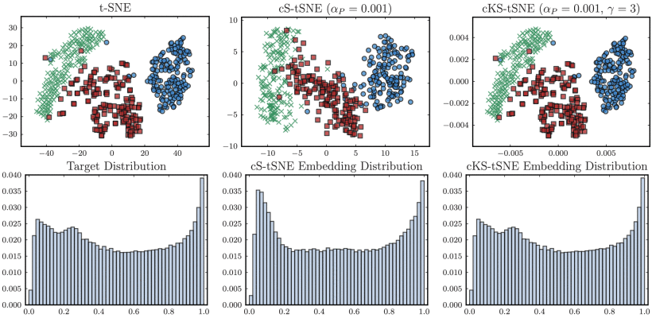
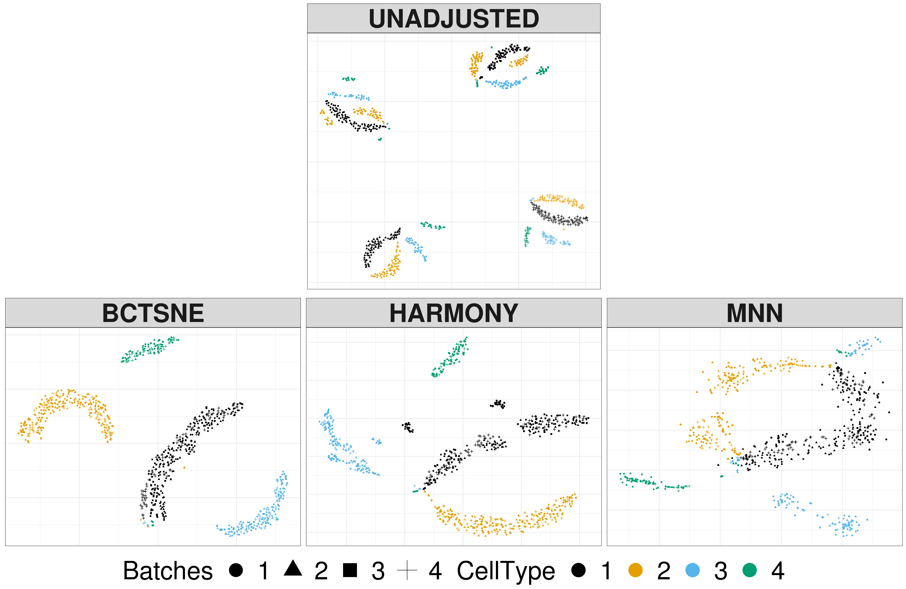

```{r setup, include=FALSE}
knitr::opts_chunk$set(
  echo = FALSE,
  dev = "png", # vector graphics device
  fig.retina = 3,
  dev.args=list(bg="transparent"), # transparent plot backgrounds
  fig.height = 4,
  fig.width = 4,
  out.width = "100%",
  cache = TRUE
)

library(ggplot2)
library(patchwork)
```

```{r kable_setup, include = FALSE}
options("kableExtra.html.bsTable" = T)
options(knitr.kable.NA = '')

# Colored Kable function, uses PennSIVE colors
ccolors <- colorRampPalette(c("#011F5B", "#000000", "#990000"))(256)
color_kable <- function(x) {
  x[is.nan(x)] <- "NaN"
  colored <- as.data.frame(x) %>%
    mutate_if(is.numeric, function(y) {
      cell_spec(y, "html",
                color = ccolors[round(scales::rescale(y, to = c(1, 256), from = 0:1))])}
    )
  rownames(colored) <- rownames(x)
  knitr::kable(colored, "html", escape = FALSE, row.names = TRUE)
}
```

```{r plot_fx, include=FALSE}
plot_tsne <- function(tsne, lab, label = "Label") {
  df <- data.frame(tsne$Y, lab = lab)
  ggplot(df, aes(x = X1, y = X2, color = lab)) +
    geom_point() +
    labs(x = "Direction 1",
         y = "Direction 2",
         color = label) +
    theme_classic()
}
```

```{css}
.medium{font-size: 85%}
.small{font-size: 70%}
```

```{r bc_ex, eval=FALSE}
library(Rtsne)
library(FCharmony)
load("~/Documents/GitHub/Covariance-Harmonization/BLSA CARDIA Example/blsa_cardia_whole_no_c2.Rdata")
fc_dat <- BLSA_CARDIA
fc_dat[] <- array(apply(BLSA_CARDIA, 3, cov2cor), dim(BLSA_CARDIA))
bat <- droplevels(BLSA_CARDIA_demo$site)
demo <- BLSA_CARDIA_demo
covt_mod <- model.matrix(~ age_at_scan + sex, BLSA_CARDIA_demo)

age_grp <- cut(demo$age_at_scan, c(24, 50, 55, 70, 92), include.lowest = TRUE)

yu_out <- fcharmony(fc_dat, bat = bat, mod = covt_mod, method = "FC-ComBat",
                    to.corr = c(F, F))

dat <- apply(fc_dat, 3, function(x) x[lower.tri(x)])
dat_yu <- dat <- apply(yu_out$dat.out, 3, function(x) x[lower.tri(x)])

tsne <- Rtsne(t(dat), pca = FALSE, perplexity = 5)
tsne_yu <- Rtsne(t(dat_yu), pca = FALSE, perplexity = 5)

plot_tsne(tsne, age_grp, "Age")
plot_tsne(tsne, bat, "Site")

plot_tsne(tsne_yu, age_grp, "Age")
plot_tsne(tsne_yu, bat, "Site")
```

```{r adni_ex, eval=FALSE}
library(Rtsne)
library(dplyr)
library(CovBat)
adni_df <- read.csv("~/Documents/GitHub/Covariance-Harmonization/ADNI Example/ADNI_ANTsSST_protocol_2019_03_14.csv")
adni_df <- adni_df[adni_df$VISIT == 0,]
adni <- adni_df %>% 
  group_by(manufac.model.coil.strength.site) %>% 
  filter(n() >= 3) # remove less than 3 obs
adni_ct <- adni[, which(colnames(adni) == 
                                "thickness.left.caudal.anterior.cingulate"):
                        which(colnames(adni) == "thickness.right.insula")]
rois <- substring(colnames(adni_ct), 11)
colnames(adni_ct) <- rois

bat <- as.factor(adni$manufac.model.coil.strength.site)
bat <- droplevels(bat)

manufac <- adni$manufac

covt <- adni[,c("AGE", "SEX", "DIAGNOSIS")]
covt_mod <- model.matrix(~ AGE + SEX + DIAGNOSIS, data = covt)

# Apply ComBat and CovBat
adni_c <- t(combat(t(adni_ct), bat, mod = covt_mod)$dat.combat)
adni_cv <- t(covbat(t(adni_ct), bat, mod = covt_mod)$dat.covbat)

set.seed(888)
perp <- c(5, 10, 20, 30)
ad_tsne <- lapply(perp, function(p) Rtsne(adni_ct, pca = FALSE, perplexity = p, theta = 0))
ad_tsne_c <- lapply(perp, function(p) Rtsne(adni_c, pca = FALSE, perplexity = p, theta = 0))
ad_tsne_cv <- lapply(perp, function(p) Rtsne(adni_cv, pca = FALSE, perplexity = p, theta = 0))

plot_tsne(ad_tsne[[2]], adni$DIAGNOSIS, "Diagnosis")
plot_tsne(ad_tsne[[2]], adni$SEX, "Sex")
plot_tsne(ad_tsne[[2]], bat, "Site") + theme(legend.position = "none")
plot_tsne(ad_tsne[[2]], manufac, "Manufacturer")

plot_tsne(ad_tsne_c[[2]], adni$DIAGNOSIS, "Diagnosis")
plot_tsne(ad_tsne_c[[2]], adni$SEX, "Sex")
plot_tsne(ad_tsne_c[[2]], as.factor(adni$site), "Site") + theme(legend.position = "none")
plot_tsne(ad_tsne_c[[2]], manufac, "Manufacturer")

plot_tsne(ad_tsne_cv[[2]], adni$DIAGNOSIS, "Diagnosis")
plot_tsne(ad_tsne_cv[[2]], adni$SEX, "Sex")
plot_tsne(ad_tsne_cv[[2]], as.factor(adni$site), "Site") + theme(legend.position = "none")
plot_tsne(ad_tsne_cv[[2]], manufac, "Manufacturer")

# PCA for reference
ad_pca <- prcomp(adni_ct)
ad_pca$Y <- ad_pca$x[,1:2]
colnames(ad_pca$Y) <- NULL

plot_tsne(ad_pca, adni$DIAGNOSIS, "Diagnosis")
plot_tsne(ad_pca, adni$SEX, "Sex")
plot_tsne(ad_pca, as.factor(adni$site), "Site") + theme(legend.position = "none")
plot_tsne(ad_pca, manufac, "Manufacturer")

# try estimating the probability distributions
library(tsne)
D <- as.matrix(dist(adni_ct))
p <- 10
n <- dim(D)[1]

r <- tsne:::.x2p(D, perplexity = perp) # helper function to get distribution
sigma <- sqrt(1/r$beta)
P <- r$P
P <-  0.5 * (P + t(P))
eps <- 2^(-52)
P[P < eps] <- eps
P <- P/sum(P)

Dq <- as.matrix(dist(ad_tsne[[which(perp == p)]]$Y))
# have to remove the diagonals from (1 + Dq^2)^(-1) for the denominator
Q <- (1 + Dq^2)^(-1)/(sum((1 + Dq^2)^(-1)) - length(diag(Dq)))
(KLQ <- sum(apply(P * log((P + eps)/(Q + eps)), 1, sum)))

# for PCA
Dpc <- as.matrix(dist(ad_pca$Y))
Qpc <- (1 + Dpc^2)^(-1)/sum((1 + Dpc^2)^(-1))
(KLQpc <- sum(apply(P * log((P + eps)/(Qpc + eps)), 1, sum))) # KL divergence

i <- 1
plot(D[i,-i], P[i,-i], xlab = "Distance", ylab = "Probability")
plot(D[i,-i], Q[i,-i], xlab = "Distance", ylab = "Probability")
plot(D[i,-i], Qpc[i,-i], xlab = "Distance", ylab = "Probability")

save(D, P, Q, Qpc, ad_tsne, ad_tsne_c, ad_tsne_cv, adni, bat, manufac, ad_pca,
     file = "ad_tsne.Rdata")
```

```{r abcd_ex, eval=FALSE}
library(Rtsne)
library(CovBat)
load("~/Documents/GitHub/Covariance-Harmonization/ABCD Example/abcd_cleaned.Rdata")

abcd <- abcd[abcd$sex != "",]
site <- abcd$scanner_serialNumber
bat <- site
covt <- abcd[,c("sex", "age","ehi_y_ss_scoreb")]
covt$sex <- droplevels(covt$sex)
covt$age <- as.numeric(covt$age)
covt$ehi_y_ss_scoreb <- droplevels(covt$ehi_y_ss_scoreb)
covt_mod <- model.matrix(~ -1 + sex + age + ehi_y_ss_scoreb, covt)[,-1]
age_grp <- cut(covt$age, breaks = c(4, 113, 120, 126, 133), 
               include.lowest = TRUE)
manufac <- abcd$scanner_manufacturer
model <- abcd$scanner_type

cthick <- data.matrix(abcd[,53:120])
abcd_c <- t(combat(t(cthick), bat, mod = covt_mod)$dat.combat)
abcd_cv <- t(covbat(t(cthick), bat, mod = covt_mod)$dat.covbat)

set.seed(888)
perp <- c(5, 10, 20, 30)
abcd_tsne <- lapply(perp, function(p) Rtsne(cthick, pca = FALSE, perplexity = p))
abcd_tsne_c <- lapply(perp, function(p) Rtsne(abcd_c, pca = FALSE, perplexity = p))
abcd_tsne_cv <- lapply(perp, function(p) Rtsne(abcd_cv, pca = FALSE, perplexity = p))

plot_tsne(abcd_tsne[[3]], age_grp, "Age")
plot_tsne(abcd_tsne[[3]], covt$sex, "Sex")
plot_tsne(abcd_tsne[[3]], covt$ehi_y_ss_scoreb, "Handedness")
plot_tsne(abcd_tsne[[4]], manufac, "Manufacturer")
plot_tsne(abcd_tsne[[3]], model, "Model")
plot_tsne(abcd_tsne[[3]], site) + theme(legend.position = "none")

save(abcd_tsne, abcd_tsne_c, abcd_tsne_cv, age_grp, covt, manufac, model,
     site, file = "abcd_tsne.Rdata")
```

## Summary of t-SNE
- t-Distributed Stochastic Neighbor Embedding (t-SNE) is an extremely popular tool for visualization of high-dimensional data (cited 13246 times!)
- Aims to generate a set of lower-dimensional points that best preserves a similarity measure computed in the original space
- Original form cannot apply to out-of-sample points, but extensions have been developed

.footnote[
[Maaten and Hinton, 2008](http://www.jmlr.org/papers/v9/vandermaaten08a.html)  
]
---

## How does t-SNE work?
- Given data $x_1, x_2, \ldots, x_n$, find lower-dimensional data $y_1, y_2, \ldots, y_n$ that preserves important structures
- Define probabilities that $x_i$ "chooses" $x_j$ as a neighbor as proportional to density of normal distribution centered on $x_i$ with variance $\sigma_i^2$
$$p_{j|i} = \frac{\exp(-\lVert x_i-x_j\rVert^2/2\sigma_i^2)}{\sum_{k\ne l}\exp(-\lVert x_k-x_l\rVert^2/2\sigma_i^2)}$$
    - The variances $\sigma_i^2$ are chosen to maintain a perplexity value, which ensures each point has a similar number of effective neighbors
    - t-SNE works on the symmetric probabilities $p_{ij} = (p_{j|i} + p_{i|j})/2n$ for computational reasons

.footnote[
[Maaten and Hinton, 2008](http://www.jmlr.org/papers/v9/vandermaaten08a.html)  
]
---

## How does t-SNE work?
- In lower-dimensional space, define probabilities for $y_i$ and $y_j$ as proportional to density of t-distribution with one degree of freedom
$$q_{ij} = \frac{(1 + \lVert y_i-y_j\rVert^2)^{-1}}{\sum_{k\ne l}(1 + \lVert y_k-y_l\rVert^2)^{-1}}$$
    - Original SNE used Gaussian density with fixed variance but suffers from the crowding problem
- t-SNE then chooses $y_i$ that minimize the KL divergence between the joint distributions of  $p_{ij}$ and $q_{ij}$
$$C = \sum_i\sum_j p_{ij}\log\frac{p_{ij}}{q_{ij}}$$
- Gradient descent with a few modifications is used in the original t-SNE
    - Faster approximate method often employed<sup>1</sup>
- Excellent introduction with interactive visualizations [here](https://distill.pub/2016/misread-tsne/)

.footnote[
<sup>1</sup>[Maaten, 2014](http://lvdmaaten.github.io/publications/papers/JMLR_2014.pdf)  
[Maaten and Hinton, 2008](http://www.jmlr.org/papers/v9/vandermaaten08a.html)  
]
---

## t-SNE in ADNI: Diagnosis
```{r, fig.width = 12, fig.height = 4}
load("ad_tsne.Rdata")
perp <- c(5, 10, 20, 30)
i <- 1
adni_dx <- lapply(ad_tsne, function(x) plot_tsne(x, adni$DIAGNOSIS, "Diagnosis"))
adni_dx <- lapply(1:4, function(i) adni_dx[[i]] + 
                    labs(title = paste("Perplexity =", perp[i])))
wrap_plots(adni_dx, ncol = 4) + plot_layout(guides = "collect") & theme(legend.position = "bottom")
```
---

## t-SNE in ADNI: Manufacturer
```{r, fig.width = 12, fig.height = 4}
adni_dx <- lapply(ad_tsne, function(x) plot_tsne(x, manufac, "Manufacturer"))
adni_dx <- lapply(1:4, function(i) adni_dx[[i]] + 
                    labs(title = paste("Perplexity =", perp[i])))
wrap_plots(adni_dx, ncol = 4) + plot_layout(guides = "collect") & theme(legend.position = "bottom")
```
---

## t-SNE in ADNI: Manufacturer after ComBat
```{r, fig.width = 12, fig.height = 4}
adni_dx <- lapply(ad_tsne_c, function(x) plot_tsne(x, manufac, "Manufacturer"))
adni_dx <- lapply(1:4, function(i) adni_dx[[i]] + 
                    labs(title = paste("Perplexity =", perp[i])))
wrap_plots(adni_dx, ncol = 4) + plot_layout(guides = "collect") & theme(legend.position = "bottom")
```
---

## t-SNE in ADNI: Manufacturer after CovBat
```{r, fig.width = 12, fig.height = 4}
adni_dx <- lapply(ad_tsne_cv, function(x) plot_tsne(x, manufac, "Manufacturer"))
adni_dx <- lapply(1:4, function(i) adni_dx[[i]] + 
                    labs(title = paste("Perplexity =", perp[i])))
wrap_plots(adni_dx, ncol = 4) + plot_layout(guides = "collect") & theme(legend.position = "bottom")
```
---

## PCA in ADNI: Manufacturer
```{r, fig.width = 4, fig.height = 4, out.width="50%"}
plot_tsne(ad_pca, manufac, "Manufacturer") + theme(legend.position = "bottom")
```
---

## t-SNE vs. PCA in ADNI
- Estimated densities $p_{ij}$ for subject 1 along with $q_{ij}$ and $q^{PCA}_{ij}$ calculated using the first two PCs
```{r, fig.show="hold", out.width="33%"}
i <- 1
plot(D[i,-i], P[i,-i], xlab = "Distance", ylab = "Probability", main = "Density for original")
plot(D[i,-i], Q[i,-i], xlab = "Distance", ylab = "Probability", main = "Density for t-SNE")
plot(D[i,-i], Qpc[i,-i], xlab = "Distance", ylab = "Probability", main = "Density for PCA")
```
---

## t-SNE in ABCD: Manufacturer
```{r, fig.width = 12, fig.height = 4}
update_geom_defaults("point", list(size = 0.25))

load("abcd_tsne.Rdata")
abcd_out <- lapply(abcd_tsne, function(x) plot_tsne(x, manufac, "Manufacturer"))
abcd_out <- lapply(1:4, function(i) abcd_out[[i]] + 
                    labs(title = paste("Perplexity =", perp[i])))
wrap_plots(abcd_out, ncol = 4) + plot_layout(guides = "collect") & theme(legend.position = "bottom")
```
---

## t-SNE in ABCD: Manufacturer after ComBat
```{r, fig.width = 12, fig.height = 4}
update_geom_defaults("point", list(size = 0.25))

abcd_out <- lapply(abcd_tsne_c, function(x) plot_tsne(x, manufac, "Manufacturer"))
abcd_out <- lapply(1:4, function(i) abcd_out[[i]] + 
                    labs(title = paste("Perplexity =", perp[i])))
wrap_plots(abcd_out, ncol = 4) + plot_layout(guides = "collect") & theme(legend.position = "bottom")
```
---

## Out-of-sample extensions
- t-SNE is limited as a dimension reduction tool since it cannot be applied to new data
- Kernel t-SNE learns a parametric mapping $f$ such that $y_i = f_W(x_i)$<sup>1</sup>
    - $f_W(x)$ takes the form $\sum_j \alpha_j \frac{k(x, x_j)}{\sum_l k(x, x_l)}$ where $k(x,x_j)$ is the Gaussian kernel and $x_j$ comprise a fixed subsample of $x_1,\ldots,x_n$
    - Parameters $\alpha_j$ are $m$-dimensional and obtained by using t-SNE to find $x_j$ and $y_j$ in training sample
- More general approach developed for any nonparametric dimension reduction tool<sup>2</sup>

.footnote[
<sup>1</sup>[Gisbrecht et al., 2015](https://doi.org/10.1016/j.neucom.2013.11.045)  
<sup>2</sup>[Passalis and Tefas, 2018](https://doi.org/10.1109/TNNLS.2017.2728818)
]
---

## Similarity-induced embeddings
.footnote[
[Passlis and Tefas, 2018](https://doi.org/10.1109/TNNLS.2017.2728818)
]

- General framework covering t-SNE and related tools
- Notes that distance-based dimension reduction (DR) tools are sensitive to outliers
    - Also notes limitations in using second-order statistics
- Defines similarity metric $S$ such that $S_x(y) = S(x,y)\in [0,1]$
    - Analogous to a kernel function, provides the density induced by $x$
--


- A similarity-induced embeddings is a function $f_W$ such that $y_i = f_W(x_i)$
    - $f_W$ is constrained to take some parametric form
    - Parameter optimization proceeds by minimizing some function $J$ of the embedding similarity matrix $Q$ with elements $Q_{ij} = S(f_W(x_i), f_W(x_j))$ and a target similarity matrix $P$
        - Penalization term included to enforce orthonormality of directions
- t-SNE is a special case of their model with $J$ chosen as the KL divergence
---

## Cloning a DR technique
- Target matrix can be chosen to leverage any given information (e.g. class labels)
- The authors suggest a way to clone an arbitrary mapping $y_i = g(x_i)$ by using a target matrix
$$P_{ij} = \exp\left(-\frac{\lVert g(x_i) - g(x_j)\rVert^2}{\sigma_{copy}}\right)$$
- Used to succesfully clone t-SNE results

.center[]

.footnote[
[Passlis and Tefas, 2018](https://doi.org/10.1109/TNNLS.2017.2728818)
]
---

## Potential extensions
- Batch-corrected t-SNE (BC-t-SNE) introduced to avoid batch effects<sup>1</sup>
    - For each iteration, projects $y_i$ onto subspace orthogonal to batch using linear regression
.center[]
- Similarity-based dimension reduction while accounting for covariates $z_1, z_2, \ldots, z_n$
    - Is there some way to incorporate a target matrix using similarities calculated on $z_i$?
    - Or alternatively, an "avoidance" matrix to control for confounder
- Can similarity matrix be used in distance-based approaches?
    - Seems feasible in MDMR for instance
    - Could be less sensitive to outliers, yet to be tested

.footnote[
<sup>1</sup>[Aliverti et al., 2020](https://doi.org/10.1093/bioinformatics/btaa189)
]

