```{r setup, include=FALSE}
knitr::opts_chunk$set(
  echo = FALSE,
  dev = "png",
  fig.retina = 3,
  fig.height = 7,
  fig.width = 7,
  out.width = "100%",
  cache = TRUE,
  warning = FALSE
)

library(ggplot2)
library(patchwork)
library(reshape2)
library(dplyr)
library(tableone)
library(FCharmony)
library(kableExtra)
library(expm)
library(RColorBrewer)

source("scripts/plot_matlab_comm.R")

gghist <- function(input) {
  df <- data.frame(x = c(input))
  ggplot(df, aes(x = x)) + geom_histogram(color = "black", fill = "white") + theme_minimal()
}
```

```{r kable_setup, include=FALSE, cache=FALSE}
options("kableExtra.html.bsTable" = T)
options(knitr.kable.NA = '',
        digits = 3)

# Colored Kable function, uses PennSIVE colors
ccolors <- colorRampPalette(c("#011F5B", "#000000", "#990000"))(256)
color_kable <- function(x) {
  x[is.nan(x)] <- "NaN"
  colored <- as.data.frame(x) %>%
    mutate_if(is.numeric, function(y) {
      cell_spec(y, "html",
                color = ccolors[round(scales::rescale(y, to = c(1, 256), from = 0:1))])}
    )
  rownames(colored) <- rownames(x)
  knitr::kable(colored, "html", escape = FALSE, row.names = TRUE)
}

# p-value Kable function, select digits and round
pkable <- function(tab, digits = 2, colored = FALSE, 
                   color = "#990000", pthres = 0.05/length(c(tab))) {
  if (colored) {
    colortab <- as.data.frame(tab) %>%
      mutate_if(is.numeric, function(y) {
        if (digits == 2) {
          rounded <- replace(round(y, 2), y < 0.01, "<0.01")
        } else if (digits == 3) {
          rounded <- replace(round(y, 3), y < 0.001, "<0.001")
        } else {
          stop("Digits must be 2 or 3")
        }
        cell_spec(rounded, "html",
                  color = ifelse(y < pthres, color, "#000000"))}
      )
    rownames(colortab) <- rownames(tab)
    knitr::kable(colortab, "html", escape = FALSE, row.names = TRUE)
  } else {
    if (digits == 2) {
      tab_out <- replace(round(tab, 2), tab < 0.01, "<0.01")
    } else if (digits == 3) {
      tab_out <- replace(round(tab, 3), tab < 0.001, "<0.001")
    } else {
      stop("Digits must be 2 or 3")
    }
    knitr::kable(tab_out, "html")
  }
}
```

```{css}
.medium{font-size: 85%}
.small{font-size: 70%}
.tiny{font-size: 60%}
.bottomright {
  position: absolute;
  top: 66%;
  left: 61%;
}
```


## Updated progress summary and timeline
**Aim 1:** Addressing batch effects in the covariance of multivariate observations
- Identified covariance site effects and developed a novel method to address them
- Paper resubmitted to *Biostatistics* after major revisions at *NeuroImage*, pending journal response


--
***
**Aim 2:** Assessing the impact of batch effects in covariance matrix observations and developing methods to mitigate these effects
- Preliminary analyses show promising results for proposed harmonization methods
- Organizing results and performing follow-up analyses, aiming for submission **within the next 6 months**


--
***
**Aim 3:** Developing novel methods for simultaneous inference on multiple data types
- Initial method performs well in both simulation and real data
- Ongoing methodological development and additional real data examples, aiming for submisssion **within the next year**

---
class: center, middle, divider
# Developing novel methods for simultaneous inference on multiple data types
---

## Motivation
.pull-left[
- Large-scale studies including the [UKBB](https://www.ukbiobank.ac.uk/)<sup>1</sup> and upcoming [RURAL (Risk Underlying Rural Areas Longitudinal) Cohort Study](https://www.theruralstudy.org/) are increasingly collecting a wide range of data

- Incorporation of multiple imaging modalities shown to improve multiple sclerosis lesion detection<sup>2</sup> and reveal developmental patterns<sup>3</sup>

- Dearth of methodologies available for regression of multiple types of outcome data
]
.pull-right[
[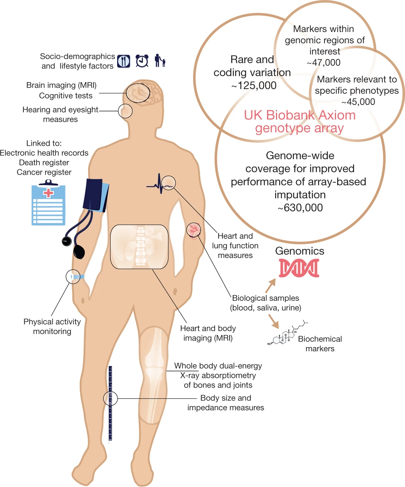](https://www.nature.com/articles/s41586-018-0579-z/figures/1)
]

.footnote[
[<sup>1</sup>Sudlow et al., 2015](https://doi.org/10.1371/journal.pmed.1001779)
&emsp;[<sup>2</sup>Valcarcel et al., 2018](https://doi.org/10.1111/jon.12506) 
&emsp;[<sup>3</sup>Vandekar et al., 2016](https://doi.org/10.1016/j.neuroimage.2016.03.002)

]

```{css}
.teal {
  background-color: #9DE4DB;
}

.teal .remark-slide-number {
  display: none;
}
```

---
class: hide-logo, teal

.center[[](https://www.ukbiobank.ac.uk/media/5b5aqozc/breadth-and-depth-enable.jpg)]

.footnote[https://www.ukbiobank.ac.uk/enable-your-research
]
---

## Distance-based regression methods
- Permutational multivariate analysis of variance (PERMANOVA)<sup>1</sup> tests for differences between $K$ groups using within-group sum of squared distances $SS_W$ and across-group sum of squared distances $SS_A$ via the test statistic
$$F_{\text{PERMANOVA}} = \frac{SS_A/(K-1)}{SS_W/(n-K)}$$
- Significance tests performed either via permutations or using the asymptotic null distribution<sup>2</sup>


.pull-left[
.center[
[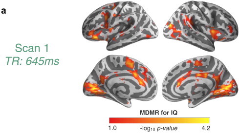](https://doi.org/10.1016/j.neuroimage.2014.02.024)  
.small[[Fig. 3 from Shehzad et al., 2014](https://doi.org/10.1016/j.neuroimage.2014.02.024)]
 ]
]
.pull-right[
.center[
  [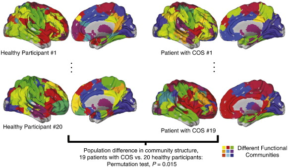](https://doi.org/10.1016/j.neuroimage.2011.11.035)  
  .small[[Fig. 4 from Alexander-Bloch et al., 2012](https://doi.org/10.1016/j.neuroimage.2011.11.035)]
 ]
]

.footnote[
[<sup>1</sup>Anderson, 2001](https://doi.org/10.1111/j.1442-9993.2001.01070.pp.x)
&emsp;[<sup>2</sup>Shinohara, Shou, et al., 2020](https://doi.org/10.1111/biom.13123)
]
---

## Distance-based regression methods
<!-- - Define Gower's centered matrix $G = (I - \mathbf{1}\mathbf{1}^T/n)D(I - \mathbf{1}\mathbf{1}^T/n)$ and the hat matrix $H = X(X^TX)^{-1}X^T$ -->
- Multivariate distance matrix regression (MDMR) tests for associations with an $n\times p$ design matrix $X$ via the pseudo-F statistic
$$\DeclareMathOperator{\tr}{tr} F_{\text{MDMR}} = \frac{\tr(HGH)/(p-1)}{\tr[(I-H)G(I-H)]/(n-p)}$$
which can be tested via permutation<sup>1</sup>

- By noting that $G = ZZ^T$, MDMR can be thought of as regressing multidimensional scaling (MDS) scores on the predictors<sup>2</sup>
$$\DeclareMathOperator{\tr}{tr} F_{\text{MDMR}} = \frac{\tr(Z^THZ)/(p-1)}{\tr[Z^T(I-H)Z]/(n-p)}$$

.footnote[
[<sup>1</sup>McArdle and Anderson, 2001](https://esajournals.onlinelibrary.wiley.com/doi/abs/10.1890/0012-9658%282001%29082%5B0290%3AFMMTCD%5D2.0.CO%3B2)
&emsp;[<sup>2</sup>McArtor et al., 2017](https://doi.org/10.1007/s11336-016-9527-8)
]
---

## Multiple MDMR
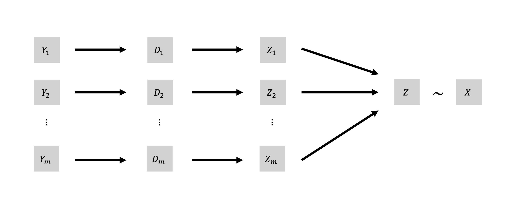
---

## Multiple MDMR
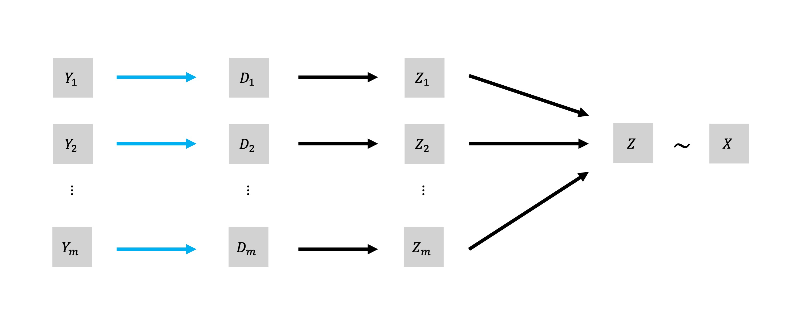
---

## Multiple MDMR
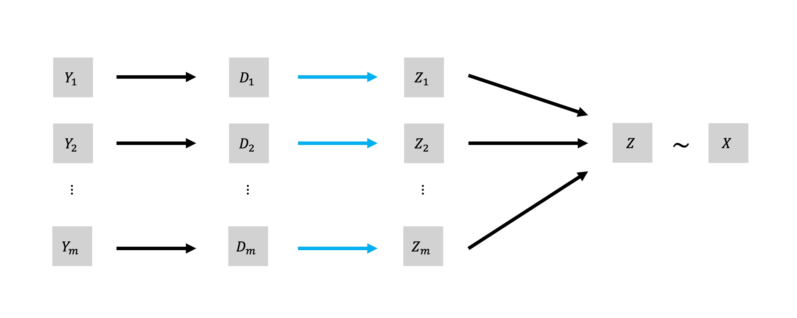
---

## Multiple MDMR
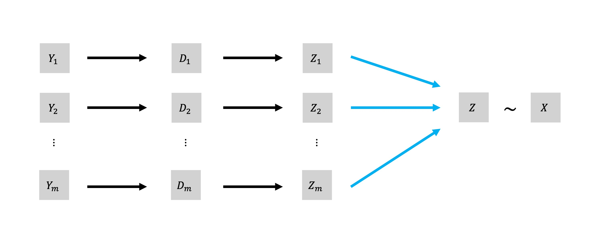
---

## Multiple MDMR
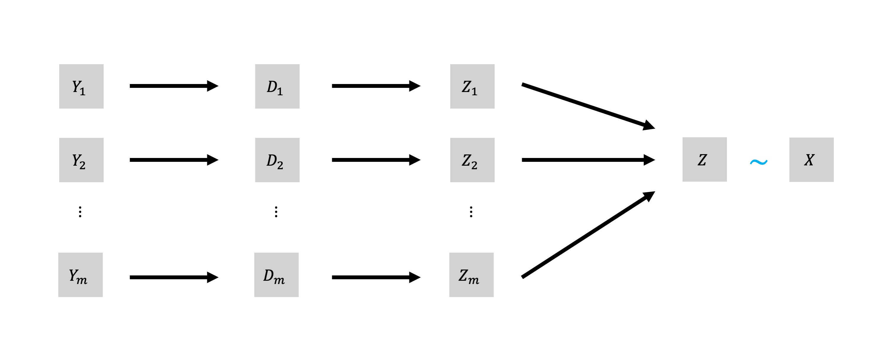
---


## High-dimensional multivariate multiple regression
- Denote $\hat{E} = Z(I-H)Z$ as the sum of squares and cross products (SSCP) error matrix and $\hat{H}$ as the hypothesis SSCP matrix
- In high dimensional settings, $\hat{E}$ is not necessarily invertible and classic multivariate multiple regression (MMR) cannot be performed

--
- Proposed methods generally fall into four major categories:


- **Alternative test statistics**
    - Dempster's trace<sup>1</sup>: $\DeclareMathOperator{\tr}{tr} \tr(\hat{H})/\tr(\hat{E})$
- **PCA regression**<sup>2</sup>
- **Generalized inverse**<sup>3</sup>
- **Regularization**
    - Both ridge<sup>4</sup> and LASSO<sup>5</sup> have been used to obtain regularized estimates $\tilde{E}$
    
.footnote[
[<sup>1</sup>Fujikoshi et al., 2004](https://doi.org/10.14490/jjss.34.19)
&emsp; [<sup>2</sup>Tomfohr et al., 2005](https://doi.org/10.1186/1471-2105-6-225)
&emsp; [<sup>3</sup>Srivastava and Fujikoshi, 2006](https://doi.org/10.1016/j.jmva.2005.08.010)
&emsp; [<sup>4</sup>Warton, 2008](https://doi.org/10.1198/016214508000000021)
&emsp; [<sup>5</sup>Ullah and Jones, 2015](https://doi.org/10.1109/CVPR.2005.445)
]
---

## Proposed test statistics
- After applying PCA to obtain an $n \times k$ score matrix, denote $\hat{E}_{PC}$ and $\hat{H}_{PC}$ the associated SSCP error matrix and hypothesis SSCP matrix
    - PCA is applied after dividing the Gower's matrices $G_1, G_2, \ldots, G_m$ by their top eigenvalue<sup>1</sup>


| Statistic            | Equation
|:---------------------|----------
| Psuedo-F (Dempster's)| $\DeclareMathOperator{\tr}{tr} \tr(\hat{H})/\tr(\hat{E})$
| Top PCs              | $\DeclareMathOperator{\tr}{tr} \tr(\hat{H}_{PC}(\hat{E}_{PC}+\hat{H}_{PC})^{-1})$
| Generalized inverse  | $\DeclareMathOperator{\tr}{tr} \tr(\hat{H}(\hat{E}+\hat{H})^+)$

.footnote[
[<sup>1</sup>Abdi et al., 2005](https://doi.org/10.1109/CVPR.2005.445)
]
---

## Simulation settings
- Let $n$ be the number of subjects, $m$ be the number of feature sets, and $q$ be the number of features within each set
    - To generate separate feature sets with dependencies, we simulate $m\times q$ dimensional features $Y \sim N(0, \Sigma)$, then split them evenly into $Y_1, Y_2, \ldots, Y_m$
    - A simple binary covariate $x \sim \text{Bernoulli}\,(1/2)$ induces shifts along PC axes of $\Sigma$, $\sum_{k \in K} \gamma\boldsymbol{\phi}_k$, where $K$ is selected depending on the setting
--


- For each simulation settings, we conduct 1000 simulations
    - $n = 25$ simulated subjects
    - $999$ permutations to compute $p$-values
    - $\Sigma$ as an exchangeable correlation matrix with correlation $\rho$
    - $\rho = 0.25, 0.75$: low or high correlation
    - $m = 2, 3, 10$: varying number of feature sets
    - $q = 5, 10, 15, 20, 25, 50, 100, 200$: potentially high dimensional features
---

## 2 Feature sets, type I error
```{r, fig.width=10, fig.height=6.5, fig.align="center", out.width="80%"}
load("results/plots/sims.Rdata")

(plots$low_corr$`2_none` + labs(title = "Low Correlation") + 
   plots$high_corr$`2_none` + labs(title = "High Correlation")) +
  plot_layout(guides = "collect") & theme(legend.position = 'bottom') & labs(y = "Rejection rate")
```
---

## Power with 2 feature sets 
```{r, fig.width=10, fig.height=6.5, fig.align="center", out.width="80%"}
load("results/plots/sims.Rdata")

(plots$low_corr$`2_1` + labs(title = "Low Correlation, First PC") + 
   plots$high_corr$`2_1` + labs(title = "High Correlation, First PC")) /
  (plots$low_corr$`2_all` + labs(title = "Low Correlation, All PCs") +
     plots$high_corr$`2_all` + labs(title = "High Correlation, All PCs")) /
  plot_layout(guides = "collect") & theme(legend.position = 'bottom')
```
---

## Philadelphia Neurodevelopmental Cohort connectivity
- Sample of 727 youths aged 8 to 23 years with structural connectivity (SC) measurements and functional connectivity (FC) measurements
- Each connectivity observation contains 79800 distinct elements

.center[
[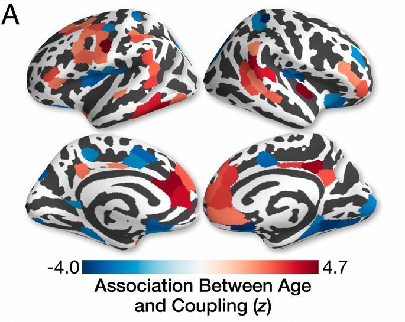](https://www.pnas.org/content/117/1/771.full#sec-9)  
.small[[Fig. 3 from Baum et al., 2020](https://doi.org/10.1073/pnas.1912034117)]
]

.footnote[
Data provided by Ted Satterthwaite and Azeez Adebimpe
]
---

## Evaluating association with age
- In each model, we control for relevant quality metrics and sex

```{r fig.align="center", fig.height=4.5, fig.width=10, message=FALSE, out.width="100%"}
load("results/plots/coupling.Rdata")

plots$`m=2,age` + labs(title = "n-back FC and SC on age") +
  plots$`m=4,age` + labs(title = "n-back FC and rsFC on age") +
  plots$`m=3,age` + labs(title = "n-back FC, rsFC, and SC on age") +
  plot_layout(guides = "collect") & theme(legend.position = 'bottom')
```

---

## Psuedo type I error evaluation
- We do not expect strong associations between FC motion and DTI motion metrics

```{r, message = FALSE, fig.align="center", out.width = "35%", fig.width = 3.5, fig.height = 4}
load("results/plots/coupling.Rdata")

plots$`m=4,dti64MeanRelRMS` + labs(title = "n-back FC and rsFC on DTI motion") +
  plot_layout(guides = "collect") & theme(legend.position = 'bottom') & labs(y = "Rejection rate")
```
---

## PNC cortical thickness and sulcal depth
- Sample of 912 youths aged 8 to 22 years with cortical thickness and sulcal depth measurements on 20486 ROIs (10243 in each hemisphere)

- Correlation among these features across subjects is relatively low

```{r, message = FALSE, fig.align="center", out.width = "50%", fig.width = 5, fig.height = 3}
load("results/cort_sulc_subj_corr.Rdata")

gghist(subj_corr) + 
  labs(title = "Cortical thickness and sulcal depth", x = "Correlation", y = "") +
  plot_layout(guides = "collect") & theme(legend.position = 'bottom')
```

.footnote[
Data provided by Ted Satterthwaite and Sarah Weinstein
]
---

## Cortical thickness and sulcal depth power test
- Previous PNC analyses found age effects in cortical thickness<sup>1</sup> and both age and sex effects in coupling between cortical thickness and sulcal depth<sup>2</sup>

```{r, message = FALSE, fig.align="center", out.width = "75%", fig.width = 7, fig.height = 4}
load("results/plots/cort_sulc.Rdata")

plots$age + labs(title = "Association with age") +
  plots$sex + labs(title = "Association with sex") +
  plot_layout(guides = "collect") & theme(legend.position = 'bottom')
```

.footnote[
[<sup>1</sup>Vandekar et al., 2015](https://doi.org/10.1016/j.neuroimage.2016.03.002)
&emsp; [<sup>2</sup>Vandekar et al., 2016](https://doi.org/10.1016/j.neuroimage.2016.03.002)]
---

## Choice of PCs influences performance
```{r fig.align="center", fig.height=4.5, fig.width=10, message=FALSE, out.width="100%"}
load("results/plots/sims_pcs.Rdata")
psims <- plots
load("results/plots/coupling_pcs.Rdata")
pcoup <- plots
load("results/plots/cort_sulc_pcs.Rdata")

psims$high_corr$`2_all` + labs(title = "High correlation sim, All PCs") +
  pcoup$`m=2,age` + labs(title = "n-back FC and SC on age") +
  plots$age + labs(title = "CT and SD on age") +
  plot_layout(guides = "collect") & theme(legend.position = 'bottom')
```
---

## Open questions
- How to choose number of PCs for PC-based test statistics?

--


- Alternatives to selecting a number of PCs?
    - minP or maxT testing across all feasible numbers of PCs


--


- Why do PC-based test statistics perform subpar in real data applications?
    - Warrants further investigation of correlation structure and covariate effects


--

- What kind of multimodal data may show higher correlations between modalities?
    - We are investigating data from the National Institute of Mental Health Family Study of Affective Spectrum Disorder, which includes physical activity and ecological momentary assessment data<sup>1</sup>


.footnote[
[Merikangas et al., 2014](https://doi.org/10.1038/mp.2013.116)]
---

## Acknowledgements
.pull-left[
**Advisors**  
Taki Shinohara  
Haochang Shou

**PNC Sharing/Preprocessing**  
Azeez Adebimpe  
Sarah Weinstein

**BLSA/CARDIA Preprocessing**  
Raymond Pomponio  
Dhivya Srinivasan

**Advice and Feedback on Network Analyses**  
Theodore D. Satterthwaite  
Danielle S. Bassett
]

.pull-right[
**Dissertation Committee**  
Kristin A. Linn  
Jing Huang  
Theodore D. Satterthwaite  

And all of PennSIVE for the support!

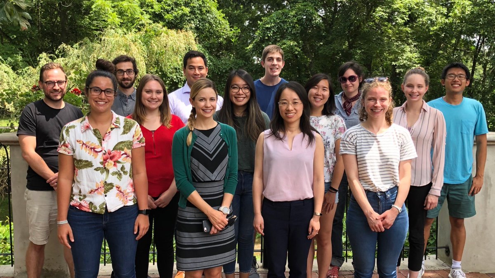
]

---
class: center, middle, divider
# Questions?
---
class: center, middle, divider
# Appendix
---

## Proposed harmonization methods
- Modularity depends on the relationship between sets of edge weights

- FC-ComBat does not handle site effects in the covariance of connectivity values


- We propose two extensions:  
    - **FC-CovBat** to harmonize the mean and covariance of edge weights
    - **Block-ComBat** to utilize prior subnetwork information in harmonization

--
***
**Steps**
1. Starting from correlation matrices, vectorize off-diagonal elements

2. Fisher-transform connectivity values

3. Apply ComBat (FC-ComBat) or CovBat (**FC-CovBat**)

4. (Optional) After ComBat, apply ComBat again within prespecified blocks (**Block-ComBat**)
---

## BLSA/CARDIA sample
- For our analyses, we are using data from the Baltimore Longitudinal Study of Aging (BLSA) and the Coronary Artery Risk Development in Young Adults (CARDIA) study

- These studies are part of the Imaging-based coordinate SysTem for AGing and NeurodeGenerative diseases (iSTAGING) consortium led by the Center for Biomedical Image Computing and Analytics

- Functional connectivity matrices are computed using the Power atlas<sup>1</sup> with 264 regions of interest across 14 subnetworks

```{r, include=FALSE}
load("results/whole_comm_exs.Rdata")

demo$site <- droplevels(demo$site)
demotab <- CreateTableOne(vars = c("age_at_scan", "sex"), data = demo, strata = "site")
tabout <- print(demotab)
tabout <- rbind("Scanner" = c("Philips Achieva 3T", "Philips Achieva 3T", 
                              "Siemens Trio 3T", "Siemens Trio 3T", "", ""),
                tabout)

rownames(tabout) <- c("Scanner", "Number of Subjects", "Age (mean (SD))", "Male (%)")
colnames(tabout) <- c("BLSA", "CARDIA 1", "CARDIA 3", "CARDIA 4", "p", "test")
```

```{r, results="asis"}
knitr::kable(tabout[,1:5], "html") %>% kable_styling
```

.footnote[
[<sup>1</sup>Power et al., 2011](https://doi.org/10.1016/j.neuron.2011.09.006)
]
---

## Updates on other projects
- **Distributed ComBat** with Yong Chen and Chongliang Luo:
    - Aiming for submission in the near future


--
- **Longitudinal CovBat** with Joanne Beer and Kristin Linn
    - Delayed due to CovBat revisions and other projects, but aiming to pick up with preliminary tests in simulation and real data


--
- Numerous collaborations including
    - **Effects of reliability on Pearson Correlation** with Aki Nikolaidis from Child Mind Institute
    - **Accuracy and replicability analyses of BraTS ratings** with Spyridon (Spyros) Bakas from CBICA
    - **iStaging longitudinal harmonization** with Christos Davatzikos and Guray Erus from CBICA

---

## Multiple MDMR (working title)
Let $D_1, D_2, \ldots, D_m$ be $n \times n$ distance matrices obtained on the same subjects and $X$ be a full-rank $n \times p$ design matrix


1. First, use MDS to obtain $m$ sets of coordinates $Z_1, Z_2, \ldots, Z_m$
2. Then concatenate these into an $n \times mn$ matrix $Z = \begin{bmatrix} Z_1 & Z_2 & \cdots & Z_m \end{bmatrix}$
3. We then regress $Z$ on $X$ using multivariate multiple regression (MMR)
4. Inference can be achieved through the sums of squares and cross products (SSCP) error $\text{SSCP}_E = Z^T (I-H) Z$ and regression
$$\text{SSCP}_R = Z^T H Z = \begin{bmatrix} 
Z_1^T H Z_1 & Z_1^T H Z_2 & \cdots & Z_1^T H Z_m\\
Z_2^T H Z_1 & Z_2^T H Z_2 & \cdots & Z_2^T H Z_m\\
\vdots & \vdots & \ddots & \vdots\\
Z_m^T H Z_1 & Z_m^T H Z_2 & \cdots & Z_m^T H Z_m\\
\end{bmatrix}$$
5. Several test statistics including Pillai's trace are based on these SSCP matrices<sup>1</sup> and can be evaluated using permutation testing or possibly through $F$ approximations (requires derivation)

.footnote[
[<sup>1</sup>Lecture notes by Helwig, 2017](http://users.stat.umn.edu/~helwig/notes/mvlr-Notes.pdf)
]
---

## Proposed simulation settings
- Let $n$ be the number of subjects, $m$ be the number of feature sets, and $q_j$ be the number of features within each set indexed by $j$
    - We generate separate feature sets via $Y_j \sim N(0, \Sigma_j)$, where $\Sigma_j$ may vary to simulate feature sets with different scales and covariance structures
    - Simple continuous and binary covariates can induce mean/variance shifts
    
    
- Potential simulation settings could vary across the following
    - Magnitude of covariate-induced shifts in mean/variance
    - Differences in variability within feature sets
    - Dependence among feature sets (possibly not as important)
    
    
- We now compare three methods
    - Traditional MMR (for $nq \leq n-2$)
    - Separate MDMRs
    - Psuedo-F statistic (Dempster's trace)
        - With various scaling options
---

## Simulation settings
- Let $n$ be the number of subjects, $m$ be the number of feature sets, and $q$ be the number of features within each set
    - To generate separate feature sets with dependencies, we simulate $m\times q$ dimensional features $Y \sim N(0, \Sigma)$, then split them evenly into $Y_1, Y_2, \ldots, Y_m$
    - A simple binary covariate $x \sim \text{Bernoulli}\,(1/2)$ induces shifts along PC axes of $\Sigma$, $\sum_{k \in K} \gamma\boldsymbol{\phi}_k$, where $K$ is selected depending on the setting
--


- For each simulation settings, we conduct 1000 simulations
    - $999$ permutations to compute $p$-values
    - $\rho = 0.25, 0.75$: low or high correlation of $\Sigma$
    - AR(1) or between correlations, other structures for $\Sigma$
    - $m = 2, 3, 10$: varying number of feature sets
    - $q = 5, 10, 15, 20, 25, 50, 100, 200$: potentially high dimensional features
--
- **Simple effects**
    - $K = 1$ and $\gamma = 3$
    - 25% of PCs and $\gamma = 0.7$
- **Complex effects**
    - 50% of PCs and $\gamma = 0.5$
    - $K = mq$ and $\gamma = 0.15$
    
---

## Evaluating association with sex
- In each model, we control for relevant quality metrics and sex

```{r fig.align="center", fig.height=4.5, fig.width=10, message=FALSE, out.width="100%"}
load("results/plots/coupling.Rdata")

plots$`m=2,sex` + labs(title = "n-back FC and SC on sex") +
  plots$`m=4,sex` + labs(title = "n-back FC and rsFC on sex") +
  plots$`m=3,sex` + labs(title = "n-back FC, rsFC, and SC on sex") +
  plot_layout(guides = "collect") & theme(legend.position = 'bottom')
```

---
class: center, middle, divider
# Assessing and mitigating the impact of batch effects in covariance matrix observations

.footnote[
.left[Joint work with Danielle Bassett and Theodore Satterthwaite  
Data provided by CBICA led by Christos Davatzikos with preprocessing by Raymond Pomponio and Dhivya Srinivasan]]
---

## Community detection in rsfMRI
- Changes in brain subnetworks identified through resting-state fMRI associated with conditions including depression<sup>1</sup> and Alzheimer's disease<sup>2</sup>
- Major impact of scanner effects found for several network properties<sup>3</sup>, but effects on community detection have not been investigated

.center[[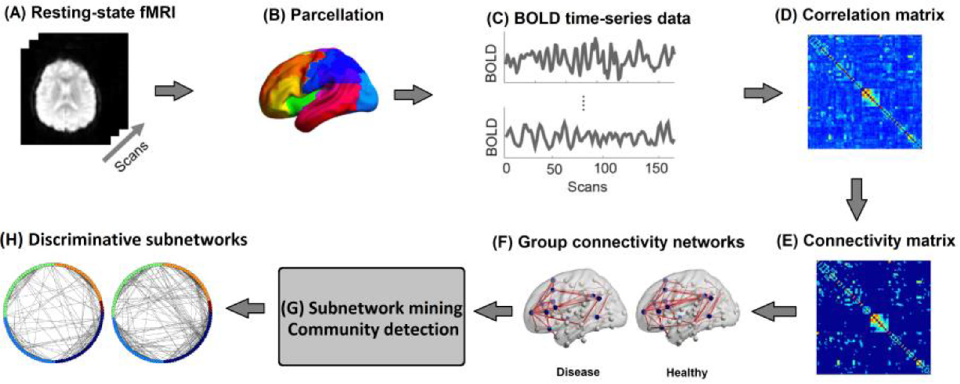](https://www.semanticscholar.org/paper/A-Network-Based-Perspective-in-Alzheimer%27s-Disease%3A-Dragomir-Vrahatis/4629661519f1598c3284ad7eec5d8f2c588081d7/figure/1)]

.footnote[
[<sup>1</sup>He et al., 2018](https://doi.org/10.1093/cercor/bhx335)
&emsp;[<sup>2</sup>Dragomir et al., 2019](https://doi.org/10.1109/JBHI.2018.2863202)
&emsp;[<sup>3</sup>Yu et al., 2018](https://doi.org/10.1002/hbm.24241)
&emsp;[Figure 2 from Dragomir et al., 2019](https://doi.org/10.1109/JBHI.2018.2863202)
]
---

## Community detection via modularity maximization
.pull-left[
- Many community detection methods including the Louvain algorithm<sup>1</sup> maximize modularity

.center[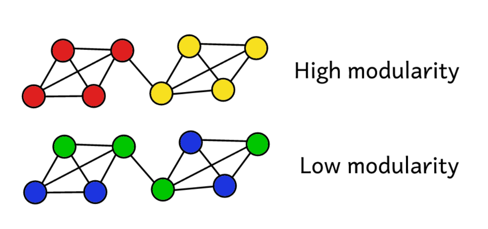  
.small[[Peter Gleeson, Revolut.](https://www.kdnuggets.com/2019/04/introduction-clustering-algorithms.html)]
]
]
.pull-right[
.center[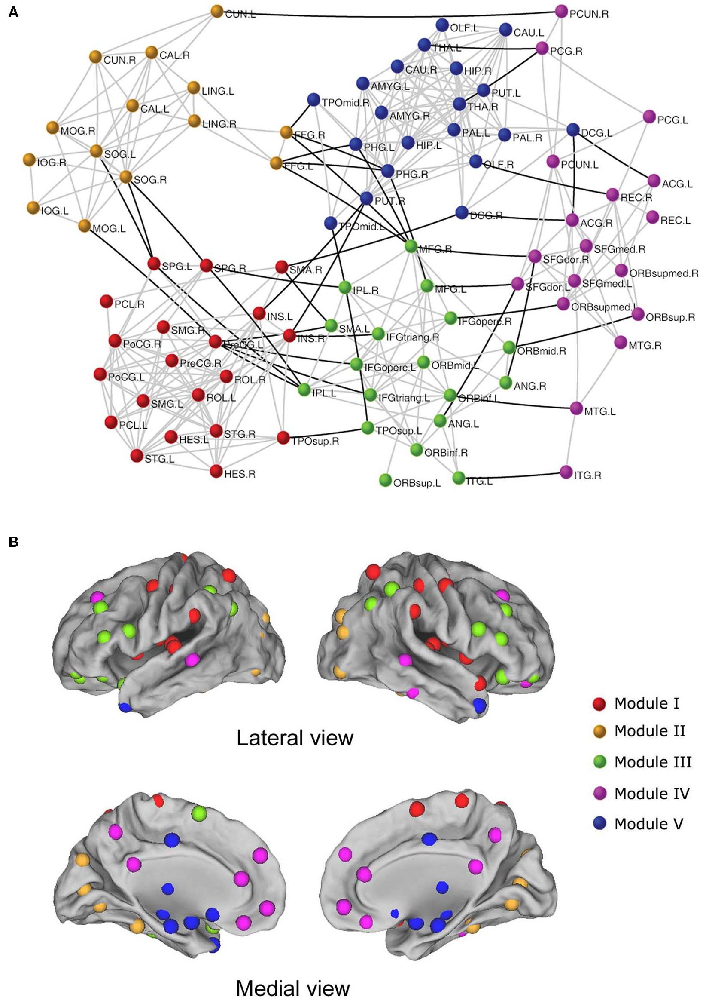  
.small[[Fig. 2 from Wang et al., 2010](https://www.frontiersin.org/articles/10.3389/fnsys.2010.00016/full#B57)]
]
]


    
.footnote[
[<sup>1</sup>Blondel et al., 2008](https://doi.org/10.1088/1742-5468/2008/10/P10008)
]
---

## ComBat for functional connectivity (FC-ComBat)
**Steps**
1. Starting from correlation matrices, vectorize off-diagonal elements

2. Fisher-transform connectivity values

3. Apply ComBat and reconstruct connectivity matrices

.center[[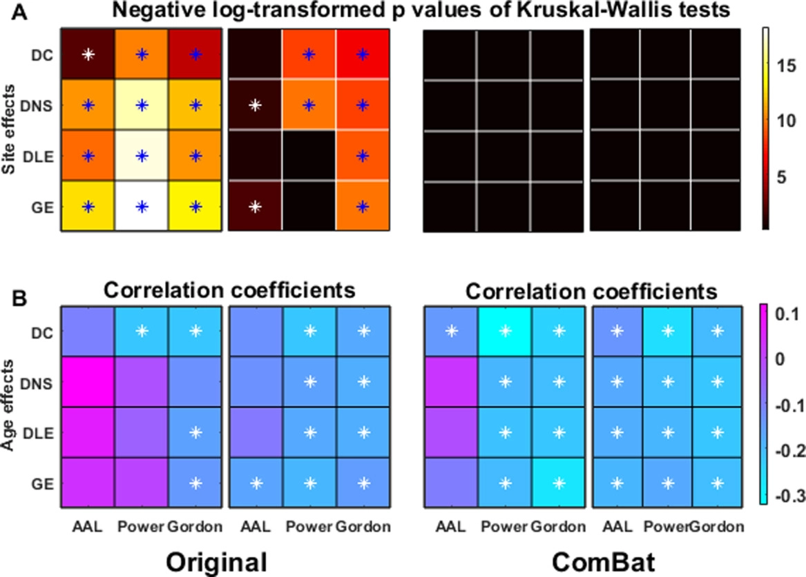](https://onlinelibrary.wiley.com/doi/full/10.1002/hbm.24241#)]

.footnote[
[Yu et al., 2018](https://doi.org/10.1002/hbm.24241)
]
---

## Assessing scanner effects in community detection
<!-- **Analysis 1**: Identify representative communities for each site and compare them across sites -->


<!-- -- -->
<!-- **Analysis 2**: Find communities for each subject and compare across subjects using distance-based methods -->


<!-- -- -->
<!-- **Analysis 3**: Assess metrics of network organization for site effects -->

We assess the scanner differences in community measures on three scales:

--
1. Concordance of population-average communities between scanners


--
2. Distances of subject-specific communities (tested using distance-based methods)


--
3. Differences in the summary network statistics derived from subject-specific networks

---

## Analysis 1: Site-level communities
1. Obtain scanner-level matrices as average of Fisher-transformed FC matrices<sup>1,2</sup>

2. Form fully-connected signed networks using Fisher-transformed connectivity values as edge weights

3. Apply signed Louvain 100 times on each scanner-level network with $\gamma = 4.25$ and obtain consensus with $\tau = 0.5$ and 100 iterations<sup>3</sup>

4. Compare scanner-level communities visually and using adjusted Rand index (ARI)

.footnote[
[<sup>1</sup>Betzel et al., 2013](https://doi.org/10.1017/nws.2013.19)
&emsp;[<sup>2</sup>He et al., 2018](https://doi.org/10.1093/cercor/bhx335)
&emsp;[<sup>3</sup>Lancichinetti and Fortunato, 2012](https://doi.org/10.1038/srep00336)
]
---

## Scanner-level communities results
```{r, cache=FALSE}
load("results/site_sl.Rdata")
grps = c("BLSA", "CARDIA_1", "CARDIA_3", "CARDIA_4")
m <- 1
```


```{r, fig.width = 18, fig.height = 9}
set.seed(888)
m <- 1
comm_plots <- lapply(1:4, function(m) {
  plot_matlab_comm(sl_res, grps, m, patlas, "Power") + 
    labs(title = c("Unharmonized, (mean ARI 0.48)", "FC-ComBat (mean ARI 0.72)", "Bl-ComBat (mean ARI 0.69)", "FC-CovBat (mean ARI 0.74)")[m],
         y = c("ROI", rep("", 3))[m]) +
    theme(legend.position = c(rep("none", 3), "right")[m])
})

comm_plots[[1]] + comm_plots[[2]] + comm_plots[[3]] + comm_plots[[4]] + plot_layout(nrow = 1, guides = "collect")
```
---

## Analysis 2: Subject-level communities
1. For every subject, use 100 repetitions of signed Louvain with $\gamma = 4.75$ and obtain consensus with $\tau = 0.5$ and 100 iterations

2. Compute distance matrix using variation of information (VI)

3. Run permutational multivariate analysis of variance (PERMANOVA) and multivariate distance matrix regression (MDMR) with 1000 permutations each and report $p$-values<sup>1</sup>
    
4. Repeat procedure after applying FC-ComBat, Block-ComBat, and FC-CovBat

.footnote[
[<sup>1</sup>Alexander-Bloch et al., 2012](https://doi.org/10.1016/j.neuroimage.2011.11.035)
]
---

## Associations with site and demographic variables
.pull-left[
.center[PERMANOVA *p*-values for scanner]
```{r}
load("results/signed_louvain_cons_assoc_4.75.Rdata")
perm_tab <- cbind("All Scanners" = sapply(all_sl_assoc, function(x) x[1,6]),
                  "CARDIA Only" = sapply(all_sl_assoc_cardia, function(x) x[1,6]))

pkable(perm_tab, colored = TRUE)
```
]
--
.pull-right[
.center[MDMR *p*-values for scanner, age, and sex]
```{r}
mdmr_pv <- lapply(all_mdmr, function(x) x$pv$perm.pvals)
mdmr_tab <- do.call(cbind, mdmr_pv)
rownames(mdmr_tab) <- c("Omnibus", "Scanner", "Age", "Sex")
mdmr_tab <- t(mdmr_tab)

# pkable(mdmr_tab[,-1], colored = TRUE)
```
<table>
 <thead>
  <tr>
   <th style="text-align:left;">   </th>
   <th style="text-align:left;"> Scanner </th>
   <th style="text-align:left;"> Age </th>
   <th style="text-align:left;"> Sex </th>
  </tr>
 </thead>
<tbody>
  <tr>
   <td style="text-align:left;"> Raw </td>
   <td style="text-align:left;"> <span style="     color: #990000 !important;" >&lt;0.01</span> </td>
   <td style="text-align:left;"> <span style="     color: #009999 !important;" >&lt;0.01</span> </td>
   <td style="text-align:left;"> <span style="     color: #009999 !important;" >&lt;0.01</span> </td>
  </tr>
  <tr>
   <td style="text-align:left;"> FC-ComBat </td>
   <td style="text-align:left;"> <span style="     color: #990000 !important;" >&lt;0.01</span> </td>
   <td style="text-align:left;"> <span style="     color: #009999 !important;" >&lt;0.01</span> </td>
   <td style="text-align:left;"> <span style="     color: #009999 !important;" >&lt;0.01</span> </td>
  </tr>
  <tr>
   <td style="text-align:left;"> Bl-ComBat </td>
   <td style="text-align:left;"> <span style="     color: #000000 !important;" >0.04</span> </td>
   <td style="text-align:left;"> <span style="     color: #009999 !important;" >&lt;0.01</span> </td>
   <td style="text-align:left;"> <span style="     color: #009999 !important;" >&lt;0.01</span> </td>
  </tr>
  <tr>
   <td style="text-align:left;"> FC-CovBat </td>
   <td style="text-align:left;"> <span style="     color: #000000 !important;" >0.86</span> </td>
   <td style="text-align:left;"> <span style="     color: #009999 !important;" >&lt;0.01</span> </td>
   <td style="text-align:left;"> <span style="     color: #009999 !important;" >&lt;0.01</span> </td>
  </tr>
</tbody>
</table>
]
---

## Analysis 3: Network organization metrics
1. Form subject-level networks as in **Analysis 2**

2. Calculate signed modularity for the $\gamma = 4.75$ consensus communities and for the Power atlas

3. Compute signed clustering coefficient

4. Derive participation coefficients in positive subgraph

5. Calculate within/between connectivities and participation coefficients for auditory subnetwork,
previously found to be significantly associated with age<sup>1</sup>

.footnote[
[<sup>1</sup>Varangis et al. 2019](https://doi.org/10.3389/fnagi.2019.00234)
]
---

## Network metric associations
.center[*p*-values for age association]
.medium[
```{r , results="asis"}
load("results/all_metrics.Rdata")

net.results <- all_net$net.results[1:4,seq(2,14,2)]
net.results.site <- all_net$net.results.site[1:4,]
colnames(net.results) <- colnames(net.results.site) <- 
  c("Within", "Between", "Comm Modularity",
    "Atlas Modularity", "Pos Part Coeff",
    "Neg Part Coeff", 
    "Clust Coeff")

pkable(net.results[,-6], 2, TRUE, "#009999")
```
]


--
.center[*p*-values for scanner assocations]
.medium[
```{r , results="asis"}
pkable(net.results.site[,-6], 2, TRUE)
```
]