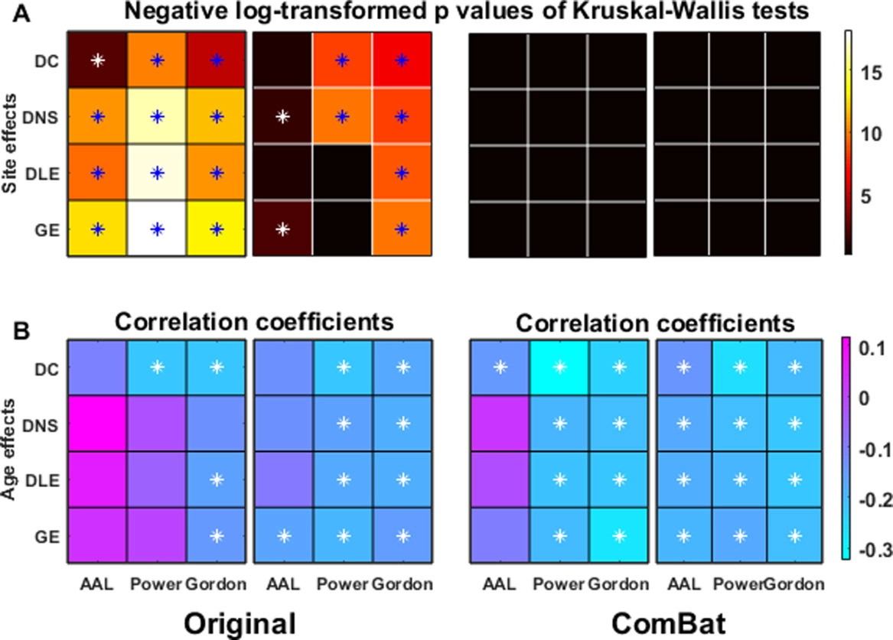

```{r setup, include=FALSE}
knitr::opts_chunk$set(
  echo = FALSE,
  dev = "png",
  fig.retina = 3,
  fig.height = 7,
  fig.width = 7,
  out.width = "100%",
  cache = TRUE,
  warning = FALSE
)

library(ggplot2)
library(patchwork)
library(reshape2)
library(dplyr)
library(tableone)
library(FCharmony)
library(kableExtra)
library(expm)
library(RColorBrewer)

source("scripts/plot_matlab_comm.R")

gghist <- function(input) {
  df <- data.frame(x = c(input))
  ggplot(df, aes(x = x)) + geom_histogram(color = "black", fill = "white") + theme_minimal()
}
```

```{r kable_setup, include=FALSE, cache=FALSE}
options("kableExtra.html.bsTable" = T)
options(knitr.kable.NA = '',
        digits = 3)

# Colored Kable function, uses PennSIVE colors
ccolors <- colorRampPalette(c("#011F5B", "#000000", "#990000"))(256)
color_kable <- function(x) {
  x[is.nan(x)] <- "NaN"
  colored <- as.data.frame(x) %>%
    mutate_if(is.numeric, function(y) {
      cell_spec(y, "html",
                color = ccolors[round(scales::rescale(y, to = c(1, 256), from = 0:1))])}
    )
  rownames(colored) <- rownames(x)
  knitr::kable(colored, "html", escape = FALSE, row.names = TRUE)
}

# p-value Kable function, select digits and round
pkable <- function(tab, digits = 2, colored = FALSE, 
                   color = "#990000", pthres = 0.05/length(c(tab))) {
  if (colored) {
    colortab <- as.data.frame(tab) %>%
      mutate_if(is.numeric, function(y) {
        if (digits == 2) {
          rounded <- replace(round(y, 2), y < 0.01, "<0.01")
        } else if (digits == 3) {
          rounded <- replace(round(y, 3), y < 0.001, "<0.001")
        } else {
          stop("Digits must be 2 or 3")
        }
        cell_spec(rounded, "html",
                  color = ifelse(y < pthres, color, "#000000"))}
      )
    rownames(colortab) <- rownames(tab)
    knitr::kable(colortab, "html", escape = FALSE, row.names = TRUE)
  } else {
    if (digits == 2) {
      tab_out <- replace(round(tab, 2), tab < 0.01, "<0.01")
    } else if (digits == 3) {
      tab_out <- replace(round(tab, 3), tab < 0.001, "<0.001")
    } else {
      stop("Digits must be 2 or 3")
    }
    knitr::kable(tab_out, "html")
  }
}
```

```{css}
.medium{font-size: 85%}
.small{font-size: 70%}
.tiny{font-size: 60%}
.bottomright {
  position: absolute;
  top: 66%;
  left: 61%;
}
```

## Outline
- Review of previous results
--


- Association between edge weight and number of Louvain communities
--


- Updated visualizations of network analyses
---

## ComBat for functional connectivity (FC-ComBat)
**Steps**
1. Starting from correlation matrices, vectorize off-diagonal elements

2. Fisher-transform connectivity values

3. Apply ComBat and reconstruct connectivity matrices

.center[[](https://onlinelibrary.wiley.com/doi/full/10.1002/hbm.24241#)]

.footnote[
[Yu et al., 2018](https://doi.org/10.1002/hbm.24241)
]
---

## Proposed harmonization methods
- Modularity depends on the relationship between sets of edge weights

- FC-ComBat does not handle site effects in the covariance of connectivity values


- We propose two extensions:  
    - **FC-CovBat** to harmonize the mean and covariance of edge weights
    - **Block-ComBat** to utilize prior subnetwork information in harmonization

--
***
**Steps**
1. Starting from correlation matrices, vectorize off-diagonal elements

2. Fisher-transform connectivity values

3. Apply ComBat (FC-ComBat) or CovBat (**FC-CovBat**)

4. (Optional) After ComBat, apply ComBat again within prespecified blocks (**Block-ComBat**)
---

## BLSA/CARDIA sample
- For our analyses, we are using data from the Baltimore Longitudinal Study of Aging (BLSA) and the Coronary Artery Risk Development in Young Adults (CARDIA) study

- These studies are part of the Imaging-based coordinate SysTem for AGing and NeurodeGenerative diseases (iSTAGING) consortium led by the Center for Biomedical Image Computing and Analytics

- Functional connectivity matrices are computed using the Power atlas<sup>1</sup> with 264 regions of interest across 14 subnetworks

```{r, include=FALSE}
load("results/whole_comm_exs.Rdata")

demo$site <- droplevels(demo$site)
demotab <- CreateTableOne(vars = c("age_at_scan", "sex"), data = demo, strata = "site")
tabout <- print(demotab)
tabout <- rbind("Scanner" = c("Philips Achieva 3T", "Philips Achieva 3T", 
                              "Siemens Trio 3T", "Siemens Trio 3T", "", ""),
                tabout)

rownames(tabout) <- c("Scanner", "Number of Subjects", "Age (mean (SD))", "Male (%)")
colnames(tabout) <- c("BLSA", "CARDIA 1", "CARDIA 3", "CARDIA 4", "p", "test")
```

```{r, results="asis"}
knitr::kable(tabout[,1:5], "html") %>% kable_styling
```

.footnote[
[<sup>1</sup>Power et al., 2011](https://doi.org/10.1016/j.neuron.2011.09.006)
]
---

## Assessing scanner effects in community detection
<!-- **Analysis 1**: Identify representative communities for each site and compare them across sites -->


<!-- -- -->
<!-- **Analysis 2**: Find communities for each subject and compare across subjects using distance-based methods -->


<!-- -- -->
<!-- **Analysis 3**: Assess metrics of network organization for site effects -->

We assess the scanner differences in community measures on three scales:

--
1. Concordance of population-average communities between scanners


--
2. Distances of subject-specific communities (tested using distance-based methods)


--
3. Differences in the summary network statistics derived from subject-specific networks

---

## Analysis 1: Site-level communities
1. Obtain scanner-level matrices as average of Fisher-transformed FC matrices<sup>1,2</sup>

2. Form fully-connected signed networks using Fisher-transformed connectivity values as edge weights

3. Apply signed Louvain 100 times on each scanner-level network with $\gamma = 4.25$ and obtain consensus with $\tau = 0.5$ and 100 iterations<sup>3</sup>

4. Compare scanner-level communities visually and using adjusted Rand index (ARI)

.footnote[
[<sup>1</sup>Betzel et al., 2013](https://doi.org/10.1017/nws.2013.19)
&emsp;[<sup>2</sup>He et al., 2018](https://doi.org/10.1093/cercor/bhx335)
&emsp;[<sup>3</sup>Lancichinetti and Fortunato, 2012](https://doi.org/10.1038/srep00336)
]
---

## Louvain communities
```{r, fig.width = 18, fig.height = 9}
load("results/site_sl.Rdata")
grps = c("BLSA", "CARDIA_1", "CARDIA_3", "CARDIA_4")
m <- 1

set.seed(888)
m <- 1
comm_plots <- lapply(1:4, function(m) {
  plot_matlab_comm(sl_res, grps, m, patlas, "Power") + 
    labs(title = c("Unharmonized, (mean ARI 0.48)", "FC-ComBat (mean ARI 0.72)", "Bl-ComBat (mean ARI 0.69)", "FC-CovBat (mean ARI 0.74)")[m],
         y = c("ROI", rep("", 3))[m]) +
    theme(legend.position = c(rep("none", 3), "right")[m])
})

comm_plots[[1]] + comm_plots[[2]] + comm_plots[[3]] + comm_plots[[4]] + plot_layout(nrow = 1, guides = "collect")
```
---

## WSBM with 14 communities
```{r, fig.width = 18, fig.height = 9}
load("results/site_wsbm.Rdata")
grps = c("BLSA", "CARDIA_1", "CARDIA_3", "CARDIA_4")
m <- 1

set.seed(888)
m <- 1
comm_plots <- lapply(1:4, function(m) {
  plot_matlab_comm(wsbm_res, grps, m, patlas, "Power") + 
    labs(title = c("Unharmonized, (mean ARI 0.37)", "FC-ComBat (mean ARI 0.44)", "Bl-ComBat (mean ARI 0.47)", "FC-CovBat (mean ARI 0.47)")[m],
         y = c("ROI", rep("", 3))[m]) +
    theme(legend.position = c(rep("none", 3), "right")[m])
})

comm_plots[[1]] + comm_plots[[2]] + comm_plots[[3]] + comm_plots[[4]] + plot_layout(nrow = 1, guides = "collect")
```
---

## Stochastic block model follow-up
- Previously fitted the weighted stochastic block model with 7 and 14 communities
- Using log-evidence as a criteria, we investigated other potential numbers

```{r, fig.width=4, fig.height=2.5, out.width="70%",fig.align="center"}
load("results/all_subj_wsbm_5_60.Rdata")

qplot(K, Log.Evidence, data = scores) + 
  theme_minimal() +
  scale_x_continuous(breaks = seq(10,60,10))
```
---

## Analysis 2: Subject-level communities
1. For every subject, use 100 repetitions of signed Louvain with $\gamma = 4.75$ and obtain consensus with $\tau = 0.5$ and 100 iterations

2. Compute distance matrix using variation of information (VI)

3. Run permutational multivariate analysis of variance (PERMANOVA) and multivariate distance matrix regression (MDMR) with 1000 permutations each and report $p$-values<sup>1</sup>
    
4. Repeat procedure after applying FC-ComBat, Block-ComBat, and FC-CovBat

.footnote[
[<sup>1</sup>Alexander-Bloch et al., 2012](https://doi.org/10.1016/j.neuroimage.2011.11.035)
]
---

## Associations with site and demographic variables
.pull-left[
.center[PERMANOVA *p*-values for scanner]
```{r}
load("results/signed_louvain_cons_assoc_4.75.Rdata")
perm_tab <- cbind("All Scanners" = sapply(all_sl_assoc, function(x) x[1,6]),
                  "CARDIA Only" = sapply(all_sl_assoc_cardia, function(x) x[1,6]))

pkable(perm_tab, colored = TRUE)
```
]
--
.pull-right[
.center[MDMR *p*-values for scanner, age, and sex]
```{r}
mdmr_pv <- lapply(all_mdmr, function(x) x$pv$perm.pvals)
mdmr_tab <- do.call(cbind, mdmr_pv)
rownames(mdmr_tab) <- c("Omnibus", "Scanner", "Age", "Sex")
mdmr_tab <- t(mdmr_tab)

# pkable(mdmr_tab[,-1], colored = TRUE)
```
<table>
 <thead>
  <tr>
   <th style="text-align:left;">   </th>
   <th style="text-align:left;"> Scanner </th>
   <th style="text-align:left;"> Age </th>
   <th style="text-align:left;"> Sex </th>
  </tr>
 </thead>
<tbody>
  <tr>
   <td style="text-align:left;"> Raw </td>
   <td style="text-align:left;"> <span style="     color: #990000 !important;" >&lt;0.01</span> </td>
   <td style="text-align:left;"> <span style="     color: #009999 !important;" >&lt;0.01</span> </td>
   <td style="text-align:left;"> <span style="     color: #009999 !important;" >&lt;0.01</span> </td>
  </tr>
  <tr>
   <td style="text-align:left;"> FC-ComBat </td>
   <td style="text-align:left;"> <span style="     color: #990000 !important;" >&lt;0.01</span> </td>
   <td style="text-align:left;"> <span style="     color: #009999 !important;" >&lt;0.01</span> </td>
   <td style="text-align:left;"> <span style="     color: #009999 !important;" >&lt;0.01</span> </td>
  </tr>
  <tr>
   <td style="text-align:left;"> Bl-ComBat </td>
   <td style="text-align:left;"> <span style="     color: #000000 !important;" >0.04</span> </td>
   <td style="text-align:left;"> <span style="     color: #009999 !important;" >&lt;0.01</span> </td>
   <td style="text-align:left;"> <span style="     color: #009999 !important;" >&lt;0.01</span> </td>
  </tr>
  <tr>
   <td style="text-align:left;"> FC-CovBat </td>
   <td style="text-align:left;"> <span style="     color: #000000 !important;" >0.86</span> </td>
   <td style="text-align:left;"> <span style="     color: #009999 !important;" >&lt;0.01</span> </td>
   <td style="text-align:left;"> <span style="     color: #009999 !important;" >&lt;0.01</span> </td>
  </tr>
</tbody>
</table>
]
---

## Analysis 3: Network organization metrics
1. Form subject-level networks as in **Analysis 2**

2. Calculate signed modularity for the $\gamma = 4.75$ consensus communities and for the Power atlas

3. Compute signed clustering coefficient

4. Derive participation coefficients in positive subgraph

5. Calculate within/between connectivities and participation coefficients for auditory subnetwork,
previously found to be significantly associated with age<sup>1</sup>

.footnote[
[<sup>1</sup>Varangis et al. 2019](https://doi.org/10.3389/fnagi.2019.00234)
]
---

## Network metric associations
.center[*p*-values for age association]
.medium[
```{r , results="asis"}
load("results/all_metrics.Rdata")

net.results <- all_net$net.results[1:4,seq(2,14,2)]
net.results.site <- all_net$net.results.site[1:4,]
colnames(net.results) <- colnames(net.results.site) <- 
  c("Within", "Between", "Comm Modularity",
    "Atlas Modularity", "Pos Part Coeff",
    "Neg Part Coeff", 
    "Clust Coeff")

pkable(net.results[,-6], 2, TRUE, "#009999")
```
]


--
.center[*p*-values for scanner assocations]
.medium[
```{r , results="asis"}
pkable(net.results.site[,-6], 2, TRUE)
```
]
---
class: center, middle, divider
# Association between edge weight and number of Louvain communities
---

## Mean edge weight and communities
```{r, fig.height=4, fig.width=6, out.width="50%", fig.align="center"}
load("results/unharmonized_summaries.Rdata")
load("results/signed_louvain_cons_assoc_4.75.Rdata")
load("results/all_subj_wsbm_5_60.Rdata")

plot(mean_weight, n_comms[[1]], 
     xlab = "Mean edge weight (Fisher-transformed connectivity)", 
     ylab = "Number of communities")
```
- Communities obtained as consensus communities over 100 repetitions of signed Louvain with $\gamma=4.75$
    - $\gamma$ chosen to yield median 14 communities
- Can potentially address by normalizing each subject's edge weights prior to community detection
---

## Association with edge weights after rescaling
```{r, cache=FALSE, fig.show="hold", out.width="33%", fig.align="none"}
load("results/signed_louvain_cons_assoc_4.75.Rdata")
plot(mean_weight, n_comms[[1]], 
     xlab = "Mean edge weight (Fisher-transformed connectivity)", 
     ylab = "Number of communities",
     main = "Unscaled")
load("results/signed_louvain_cons_assoc_normalized_4.75.Rdata")
plot(mean_weight, n_comms[[1]], 
     xlab = "Mean edge weight (Fisher-transformed connectivity)", 
     ylab = "Number of communities",
     main = "Divided by mean edge weight")
load("results/signed_louvain_cons_assoc_scaled_4.75.Rdata")
plot(mean_weight, n_comms[[1]], 
     xlab = "Mean edge weight (Fisher-transformed connectivity)", 
     ylab = "Number of communities",
     main = "Scaled to variance 1")
```

- Surprisingly, both dividing by within-subject mean edge weight and standardizing to variance 1 (that is, keep the mean the same but rescale using the standard deviation) do not address the high variance in the number of communities
- Results suggest that both fixing mean and fixing variance in edge weights are insufficient

---

## Association with positive edges after rescaling
```{r, cache=FALSE, fig.show="hold", out.width="33%", fig.align="none"}
load("results/signed_louvain_cons_assoc_4.75.Rdata")
plot(pos_weight, n_comms[[1]], 
     xlab = "Proportion of positive edges", 
     ylab = "Number of communities",
     main = "Unscaled")
load("results/signed_louvain_cons_assoc_normalized_4.75.Rdata")
plot(pos_weight, n_comms[[1]], 
     xlab = "Proportion of positive edges", 
     ylab = "Number of communities",
     main = "Divided by mean edge weight")
load("results/signed_louvain_cons_assoc_scaled_4.75.Rdata")
plot(pos_weight, n_comms[[1]], 
     xlab = "Proportion of positive edges", 
     ylab = "Number of communities",
     main = "Scaled to variance 1")
```

- Higher communities are associated with a much higher proportion of positive edges
---
class: center, middle, divider
# Interactive visualizations of network analyses

<!-- <iframe src="https://andrew-a-chen.shinyapps.io/FCHarmonyApp/" width=90% height=120% frameBorder="0"></iframe> -->