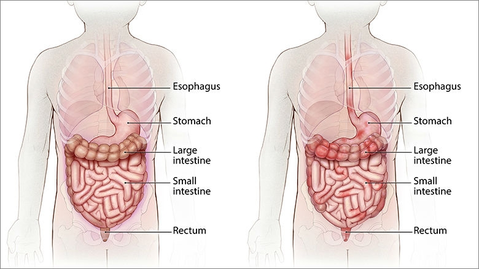

```{r setup, include=FALSE}
knitr::opts_chunk$set(
  echo = FALSE,
  dev = "svg", # vector graphics device
  dev.args=list(bg="transparent") # transparent plot backgrounds
)

library(ggplot2)
# Dark Theme
theme_dark <- function () { 
  theme_classic() %+replace% 
    theme(
      panel.background = element_rect(fill = "transparent", colour = NA),
      plot.background = element_rect(fill = "transparent", colour = NA),
      legend.background = element_rect(fill = "transparent", colour = NA),
      legend.key = element_rect(fill = "transparent", colour = NA),
      text = element_text(colour = "white"),
      axis.text = element_text(colour = "white"),
      axis.line = element_line(colour = "white"),
      axis.ticks.x = element_line(colour = "white"),
      axis.ticks.y = element_line(colour = "white")
    )
}
theme_set(theme_dark())

library(kableExtra)
options(knitr.kable.NA = '')
options("kableExtra.html.bsTable" = T)

library(patchwork)
library(reshape2)
library(dplyr)
library(readxl)
library(tableone)
library(xtable)
library(SCBmeanfd)
library(ggpubr)
library(stringr)
library(survival)
library(SCBmeanfd)
library(survminer)

load("../code/IBD_fpca_2-5yr.Rdata")

# read in data
IBD.dat <- read_excel("../code/Deidentified 05_labs.xlsx")
IBD.subj.df <- read_excel("../code/Deindentified 01_patient_list.xlsx")

# remove subjects based on exclusion criteria (280 removed)
excl <- scan("../code/subj_exclusion.txt", sep = ",")
IBD.dat <- IBD.dat[!(IBD.dat$SUBJECT_ID %in% excl), ]

# align collection times to diagnosis date
diag.date <- IBD.subj.df[,c("SUBJECT_ID", "Age at Diagnosis")]
IBD.dat <- left_join(IBD.dat, diag.date)
IBD.dat$Yr_std = IBD.dat$LAB_AGE_YR - IBD.dat$`Age at Diagnosis`
```

class: title-slide, middle
## Use of Trajectory Cluster Analysis to Identify Subgroups of Pediatric Crohn's Disease
<hr color='#70c0b1' size=2em>
### Andrew Chen
### Advised by Jing Huang, PhD
### In collaboration with Ronen Stein, MD

---

## Motivation
- Crohn's disease (CD) is a severe chronic inflammatory bowel disease
    - Affects as many as 780,000 Americans[<sup>1</sup>](https://www.chop.edu/conditions-diseases/crohns-disease)
    - Recently recognized as one of the most important chronic conditions in children
- Treatment and clinical presentation of Pediatric CD are highly heterogeneous

<br />
.center[]
---

## Longitudinal Subtyping of Pediatric CD
.footnote[
<sup>1</sup>[Weiser et al., 2018](https://dx.doi.org/10.1136%2Fgutjnl-2016-312518)  
<sup>2</sup>[Mossotto et al., 2017](https://www.nature.com/articles/s41598-017-02606-2)
]
.pull-left[
- Previous research primarily utilized cross-sectional data including gene expression<sup>1</sup>, endoscopic, and histological samples<sup>2</sup>
- Researchers have yet to leverage longitudinal electronic health record (EHR) in subtyping
]
--
.pull-right[
- EHRs at Children's Hospital of Philadelphia (CHOP) include
    - **C-reactive protein (CRP)**
    - Calprotectin
    - Infliximab concentration
]
--
```{r raw_crp, fig.width=10, fig.height=3, fig.align='center'}
time <- IBD.result$argvals
IBD.all.raw <- data.frame(y = t(IBD.result$Y), time = time)
IBD.all.melt <- melt(IBD.all.raw, id = "time")
IBD.all.melt <- na.omit(IBD.all.melt) # remove na values to have geom_line plot between actual values

ggplot(IBD.all.melt, aes(x = time, y = value, group = variable)) + geom_line(color="white") + labs(x = 'Year after diagnosis of PCD', y = 'Serum CRP Concentration (mg/dL)')
```
---

## Trajectory Cluster Analysis
**Step 1**: Perform functional principal components analysis (FPCA) on CRP values to identify unique patterns of disease trajectory in the study population
--


**Step 2**: Cluster using a Gaussian mixture model to identify subgroups of pediatric CD patients
--

- Shown to have strong performance compared to other functional clustering techniques<sup>1</sup>
- Chose number of FPCs that explain 75% of the variation
- Follow-up analyses examined distributions of patient characteristics and long-term outcomes
    - Chi-squared tests for categorical variables
    - One-way ANOVA for continuous variables
- Other follow-up analyses consisted of Cox regression of long-term outcomes on known clinical covariates and subtype assignment

.footnote[
<sup>1</sup>[Jacques and Preda, 2014](https://doi.org/10.1007/s11634-013-0158-y)
]

---

## Study Design and Demographics
.pull-left[
- Obtained EHRs from children with diagnosis of pediatric CD between 2009 and 2017
    - Also started on Remicade (infliximab) therapy between January 2010 and December 2017
- Excluded patients with less than two CRP measurements within 2.5 years of diagnosis
- Defined early onset as having been diagnosed before age five
]
.pull-right[.small[
```{r demo_tab, include=FALSE}
load("../code/tab1.Rdata")
tab1_df <- data.frame("Variables" = rownames(tab1.mat), "Overall" = tab1.mat[,1])
tab1_df$Variables <- as.character(tab1_df$Variables)
tab1_df[1:6,1] <- c("Number of Subjects", 
                    "Male (%)",
                    "Age at diagnosis, mean (SD)",
                    "Early Onset (%)",
                    "Baseline Phenotype (%)",
                    "Stricturing and Penetrating")
tab1_df[10,1] <- "Perianal (%)"
tab1_df[16:17,1] <- c("Type of Combination Therapy (%)",
                      "Azathioprine")
```

```{r demo_tab_out, results='asis'}
knitr::kable(tab1_df[c(1:10, 16:20),], booktabs = TRUE, row.names = FALSE) %>%
  add_indent(c(6:9, 12:15))
```
]]
---

## FPCA Results
```{r FPCA, include=FALSE}
time <- IBD.result$argvals
time.crp <- time

prop.exp <- IBD.result$evalues/sum(IBD.result$evalues)
IBD.pc <- data.frame(y = IBD.result$efunctions, time = time)
IBD.pc.m <- melt(IBD.pc, id = 'time')

# for (pcn in 1:IBD.result$npc) {
#   fpc.plot <- ggplot(subset(IBD.pc.m, variable %in% paste0('y.', pcn)), 
#          aes(x = time, y = 3*value, group = variable)) + 
#     geom_path(show.legend = FALSE) + 
#     labs(x = "Year after diagnosis of PCD", 
#          y = "Serum CRP Concentration (mg/dL)", 
#          title = paste0("PC ", pcn, ", ", round(prop.exp[pcn], 4)*100, "% var explained"))
#   print(fpc.plot)
#}

manual_colors <- c(rep('#d54e53', IBD.result$npc), rep('#7aa6da', IBD.result$npc), 'white')
names(manual_colors) <- c(paste0('pos.', 1:IBD.result$npc), paste0('neg.', 1:IBD.result$npc), 'mu')

fpc.plots <- vector(mode = "list", length = 4)

for (pcn in 1:4) {
  IBD_pc_mean <- data.frame(
    pos = matrix(rep(IBD.result$mu, IBD.result$npc), nrow = length(time), ncol = IBD.result$npc) + IBD.result$efunctions, 
    neg = matrix(rep(IBD.result$mu, IBD.result$npc), nrow = length(time), ncol = IBD.result$npc) - IBD.result$efunctions, 
    mu = IBD.result$mu,
    time = time)
  IBD_pc_mean_m <- melt(IBD_pc_mean, id = 'time')
  fpc.plot <- ggplot(subset(IBD_pc_mean_m, variable %in% c('mu', paste0('pos.', pcn), paste0('neg.', pcn))), 
                     aes(x = time, y = value, group = variable, colour = variable, shape = variable)) + 
    geom_line(show.legend = FALSE) + 
    scale_color_manual(values = manual_colors) +
    labs(x = "Year after diagnosis of PCD", 
         y = "Serum CRP Concentration (mg/dL)", 
         title = paste0("PC ", pcn, ", ", round(prop.exp[pcn], 4)*100, "% var explained"))
  print(fpc.plot)
  fpc.plots[[pcn]] <- fpc.plot
}
```

```{r, fig.width=10, fig.height=6.5, fig.align='center', out.width='80%'}
# annotate_figure(ggarrange(plotlist = fpc.plots), left = "Serum CRP Concentration (mg/dL)", bottom = "Year after diagnosis of PCD")
(fpc.plots[[1]] + fpc.plots[[2]]) / (fpc.plots[[3]] + fpc.plots[[4]]) +
  plot_annotation()
```
---

## Subgrouping Results
```{r mean_clust, fig.width=10, fig.height=2.7, fig.align='center'}
load("../code/paper_clust.Rdata")
load("../code/paper_means.Rdata")
tom_colors <- c("#d54e53", "#70c0b1", "#7aa6da", "#c397d8")

ggplot(IBD.cl.mu, aes(x = index, y = mu, group = cluster, colour = cluster)) + geom_path() + geom_ribbon(aes(ymin = lb.norm, ymax = ub.norm, fill = cluster), alpha = 0.25, colour = NA) + labs(x = 'Year after diagnosis of PCD', y = 'Serum CRP Concentration (mg/dL)', colour = "Subgroup", fill = "Subgroup", title = '') + scale_color_manual(values = tom_colors) + scale_fill_manual(values = tom_colors)
```

```{r raw_clust, fig.width=10, fig.height=2.75, fig.align='center'}
IBD.all.raw <- data.frame(y = t(IBD.result$Y), time = time)
IBD.all.melt <- melt(IBD.all.raw, id = "time")
IBD.all.melt <- na.omit(IBD.all.melt) # remove na values to have geom_line plot between actual values
IBD.all.melt$cl <- as.factor(clust$classification[as.numeric(substr(IBD.all.melt$variable, 3, 5))])

ggplot(IBD.all.melt, aes(x = time, y = value, group = variable, color = cl)) + geom_line()+ labs(x = 'Year after diagnosis of PCD', y = 'Serum CRP Concentration (mg/dL)', colour = "Subgroup") + scale_color_manual(values = tom_colors)

cl_plots <- list()
for (i in 1:clust$G) {
  cl_plots[[i]] <- ggplot(IBD.all.melt[IBD.all.melt$cl == i,], aes(x = time, y = value, group = variable)) + 
    geom_line(color = tom_colors[i]) + 
    labs(x = 'Year after diagnosis of PCD', y = 'Serum CRP Concentration (mg/dL)') + 
    coord_cartesian(ylim = c(0, 40))
}
```
---

## Subgrouping Results: Comparisons
```{r res_tab, include=FALSE}
load("../code/tab2.Rdata")
tab2.mat <- tab2.mat[,-6]
tab2_df <- data.frame("Variables" = rownames(tab2.mat), tab2.mat)
names(tab2_df) <- c("Variables", 1:4, "p")
rownames(tab2_df) <- NULL
tab2_df$Variables <- as.character(tab2_df$Variables)
tab2_df[1:6,1] <- c("Number of Subjects", 
                    "Male (%)",
                    "Age at diagnosis, mean (SD)",
                    "Early Onset (%)",
                    "Baseline Phenotype (%)",
                    "Stricturing and Penetrating")
tab2_df[17:18,1] <- c("Ileocolonoscopy at 10 years (%)",
                      "Surgery at 10 years (%)")
tab2_df[21:22,1] <- c("Type of Combination Therapy (%)",
                      "Azathioprine")
tab2_df[c(26,28),1] <- c("Baseline CRP, mean (SD)", "Remicade Start, mean (SD)")
```

.small[
```{r res_tab_out, results='asis'}
knitr::kable(tab2_df[c(1:9, 17:18, 21:26, 28),], booktabs = TRUE, row.names = FALSE) %>%
  add_indent(c(6:9, 13:16))
```
]
---

## Subgrouping Results: Comparisons
.small[
```{r res_tab_out2, results='asis'}
knitr::kable(tab2_df[c(1:9, 17:18, 21:26, 28),], booktabs = TRUE, row.names = FALSE) %>%
  add_indent(c(6:9, 13:16)) %>% row_spec(5:11, bold=TRUE, color="#70c0b1")
```
]
---

## Cluster 1: Non-responder Patients
```{r cl1, fig.width=10, fig.height=2.75, fig.align='center'}
cl_plots[[1]]
```
- Characterized by high baseline CRP (mean 10.38 mg/dL) and frequent relapses after diagnosis
- Higher proportion of non-inflammatory disease phenotypes, with more patients having penetrating, stricturing, or both phenotypes (n = 17, 47.2%)
- Highest proportion of patients of receiving ileocolonoscopy (33.3%) or other surgeries (16.7%)
---

## Cluster 2: Patients with moderate disease control
```{r cl2, fig.width=10, fig.height=2.75, fig.align='center'}
cl_plots[[2]]
```
- Less severe disease activity at the baseline (mean CRP 4.88 mg/dL) and moderate disease control over the study period
- Higher rate of having an ileocolonoscopy performed (13.6%)

---

## Cluster 3: Patients with well-controlled disease
```{r cl3, fig.width=10, fig.height=2.75, fig.align='center'}
cl_plots[[3]]
```
- Low baseline CRP (mean 2.88 mg/dL) and good disease control
- Lesser proportion of patients on combined therapy (35.1%) compared to Subgroup 2 (42.7%). 

---

## Cluster 4: Patients with less severe disease
```{r cl4, fig.width=10, fig.height=2.75, fig.align='center'}
cl_plots[[4]]
```
- Lowest baseline CRP (mean 2.53) as well as the highest proportion of inflammatory (93.0%)
- Proportion undergoing ileocolonoscopy (4.7%) or other surgeries (2.3%) were the lowest out of all the subgroups
- Lowest proportion on combined therapy (23.3%)
---

## Ileocolonoscopy Analysis
.pull-left[
```{r ileo, fig.width=5, fig.height=5, out.width="100%"}
load("../code/paper_IC.Rdata")
fit <- survfit(Surv(time, status) ~ as.factor(cluster), data = ic_df)
ggsurvplot(fit, data = ic_df, 
           conf.int = TRUE,
           legend.labs = 1:4,
           ggtheme = theme_dark(),
           palette = tom_colors)
```
]
.pull-right[
```{r ileo_phenotype}
ic_df$Phenotype <- as.factor(ic_df$Phenotype)
ic_df$Phenotype <- factor(ic_df$Phenotype, 
                          c("Both Stricturing and Penetrating", "Stricturing", "Penetrating", "Inflammatory"))
fit <- survfit(Surv(time, status) ~ Phenotype, data = ic_df)
ggsurvplot(fit, data = ic_df, 
           conf.int = TRUE,
           legend.labs = c("Both Stricturing and Penetrating", 
                           "Stricturing", "Penetrating", "Inflammatory"),
           ggtheme = theme_dark(),
           palette = tom_colors)
```
]
---

## Ileocolonoscopy Analysis: Cox Regression
.pull-left[
- Cox regression fit including sex, age at diagnosis, phenotype, and subgroup
- Likelihood ratio test shows that addition of subgroup improves model fit (*p* = 0.0035)
]
.pull-right[
```{r ileo_tab}
ic_tab <- summary(ic_fit)$coefficients[,c(2,5)]
rownames(ic_tab) <- c("Male", "Age at Diagnosis", "Inflammatory", "Penetrating", 
                      "Stricturing", "Subgroup 2", "Subgroup 3", "Subgroup 4")
ic_tab_df <- data.frame("Variables" = rownames(ic_tab), ic_tab)
names(ic_tab_df) <- c("Variables", "Hazard Ratio", "p")

knitr::kable(ic_tab_df, booktabs = TRUE, row.names = FALSE, digits = 3) %>%
  row_spec(c(3,7), bold=TRUE, color="#70c0b1")
```
]
---

## Conclusions
- Pediatric CD can be divided into subgroups using available EHR data
- These subgroups distinguish levels of disease control beyond baseline patient characteristics and treatment information
    - Provide additional insight into long-term outcomes
--


- Further investigation could enable earlier detection of these subgroups
- Potentially could be used to tailor treatment regimens
--


### Acknowledgements
Huge thanks to Jing for suggesting and supervising this project.

Additional thanks to Yong for his advice and Ronen for his help in interpretting results and sharing his extensive clinical knowledge.