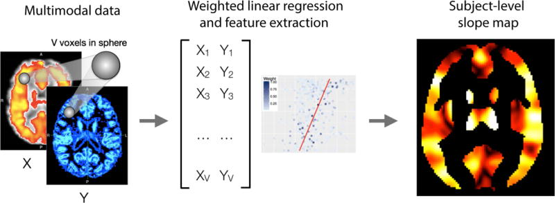
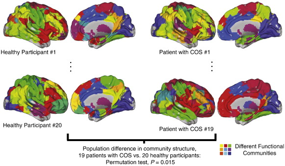
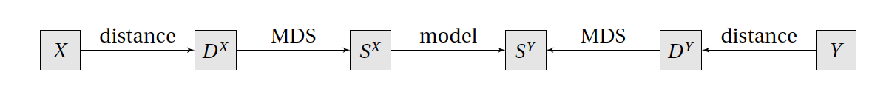

```{r setup, include=FALSE}
knitr::opts_chunk$set(
  echo = FALSE,
  dev = "png",
  fig.retina = 2,
  # dev.args=list(bg="transparent"), # transparent plot backgrounds
  fig.height = 7,
  fig.width = 7,
  out.width = "100%",
  cache = TRUE
)

```

```{r kable_setup, include=FALSE, cache=FALSE}
options("kableExtra.html.bsTable" = T)
options(knitr.kable.NA = '',
        digits = 3)

# Colored Kable function, uses PennSIVE colors
ccolors <- colorRampPalette(c("#011F5B", "#000000", "#990000"))(256)
color_kable <- function(x) {
  x[is.nan(x)] <- "NaN"
  colored <- as.data.frame(x) %>%
    mutate_if(is.numeric, function(y) {
      cell_spec(y, "html",
                color = ccolors[round(scales::rescale(y, to = c(1, 256), from = 0:1))])}
    )
  rownames(colored) <- rownames(x)
  knitr::kable(colored, "html", escape = FALSE, row.names = TRUE)
}
```

```{css}
.medium{font-size: 85%}
.small{font-size: 70%}
.tiny{font-size: 60%}
.bottomright {
  position: absolute;
  top: 66%;
  left: 61%;
}
```

## Motivation
.pull-left[
- Large-scale studies including the [UKBB](https://www.ukbiobank.ac.uk/)<sup>1</sup> and upcoming [RURAL (Risk Underlying Rural Areas Longitudinal) Cohort Study](https://www.theruralstudy.org/) are increasingly collecting a wide range of data


- Dearth of methodologies available for regression of multiple types of outcome data
]
.pull-right[
[](https://www.nature.com/articles/s41586-018-0579-z/figures/1)
]

.footnote[
[<sup>1</sup>Sudlow et al., 2015](https://doi.org/10.1371/journal.pmed.1001779)
]
---

## Motivation
- Incorporation of multiple imaging modalities shown to improve multiple sclerosis lesion detection<sup>1</sup> and reveal developmental patterns<sup>2</sup>

- Limited to voxel-level data and structural imaging

.center[[](https://www.ncbi.nlm.nih.gov/pmc/articles/PMC6030441/figure/F2/)]

.footnote[
[<sup>1</sup>Valcarcel et al., 2018](https://doi.org/10.1111/jon.12506) 
&emsp;[<sup>2</sup>Vandekar et al., 2016](https://doi.org/10.1016/j.neuroimage.2016.03.002)
]
---

## Distance-based regression methods
- Regression using only pairwise dissimilarity information between observations $Y_i$, $i=1,2,\ldots,n$
- Requires a dissimilarity measure $d$ that can be any semimetric, which has to satisfy
    - $d(Y_i, Y_j) = d(Y_j, Y_i)$ (symmetry)
    - $d(Y_i, Y_j) \geq 0$ (nonnegativity)
    - $d(Y_i, Y_j) = 0$ if and only if $Y_i = Y_j$ (identifibility)
--


- Permutational multivariate analysis of variance (PERMANOVA)<sup>1</sup> tests for differences between $K$ groups using within-group sum of squared distances $SS_W$ and across-group sum of squared distances $SS_A$ via the test statistic
$$F_{\text{PERMANOVA}} = \frac{SS_A/(K-1)}{SS_W/(n-K)}$$
- Significance tests performed either via permutations or using the asymptotic null distribution<sup>2</sup>

.footnote[
[<sup>1</sup>Anderson, 2001](https://doi.org/10.1111/j.1442-9993.2001.01070.pp.x)
&emsp;[<sup>2</sup>Shinohara, Shou, et al., 2020](https://doi.org/10.1111/biom.13123)
]
---

## Distance-based regression methods
<!-- - Define Gower's centered matrix $G = (I - \mathbf{1}\mathbf{1}^T/n)D(I - \mathbf{1}\mathbf{1}^T/n)$ and the hat matrix $H = X(X^TX)^{-1}X^T$ -->
- Multivariate distance matrix regression (MDMR) tests for associations with an $n\times p$ design matrix $X$ via the pseudo-F statistic
$$\DeclareMathOperator{\tr}{tr} F_{\text{MDMR}} = \frac{\tr(HGH)/(p-1)}{\tr[(I-H)G(I-H)]/(n-p)}$$
which can be tested via permutation or through its asymptotic null distribution<sup>2</sup>

.pull-left[
.center[
[](https://doi.org/10.1016/j.neuroimage.2014.02.024)  
.small[[Fig. 3 from Shehzad et al., 2014](https://doi.org/10.1016/j.neuroimage.2014.02.024)]
 ]
]
.pull-right[
.center[
  [](https://doi.org/10.1016/j.neuroimage.2011.11.035)  
  .small[[Fig. 4 from Alexander-Bloch et al., 2012](https://doi.org/10.1016/j.neuroimage.2011.11.035)]
 ]
]

.footnote[
[<sup>1</sup>McArdle and Anderson, 2001](https://esajournals.onlinelibrary.wiley.com/doi/abs/10.1890/0012-9658%282001%29082%5B0290%3AFMMTCD%5D2.0.CO%3B2)
&emsp;[<sup>2</sup>McArtor et al., 2017](https://doi.org/10.1007/s11336-016-9527-8)
]
---

## Limitations and potential extensions
- Current distance-based methods are limited to a single distance matrix

- Combining distance matrices can improve classification performance<sup>1</sup> but has not been attempted in PERMANOVA or MDMR


.footnote[
[<sup>1</sup>Ibba et al., 2010](https://doi.org/10.1109/ICPR.2010.820)
]

--
- We aim to extend distance-based methods to handle multiple distance matrices
    - Enables simultaneous analysis of multiple data types and dissimilarity metrics
    - Potentially leverages covariance between dissimilarities to detect associations of interest
---

## Classical multidimensional scaling
- Using only the pairwise distances, can we reconstruct points into Euclidean space that preserves the distances?
    - Can we find $Z = [z_1, z_2, \ldots, z_n]^T$ such that $\lVert z_i - z_j \rVert = d_{ij}$?
    

- The solution is obtained through eigendecomposition of $G = U\Lambda U^T$ as $Z = U\Lambda^{1/2}$
    - Note similarities with PCA, MDS is sometimes called principal coordinates analysis (PCoA)
    - Analogously, the first columns of $Z$ best preserve the distances among linear dimension reductions of $Y$
    - However, $Z$ can be a complex matrix since $G$ is not necessarily positive semi-definite when $D$ is constructed using non-Euclidean distances


- By noting that $G = ZZ^T$, MDMR can be thought of as regressing multidimensional scaling (MDS) scores on the predictors<sup>1</sup>
$$\DeclareMathOperator{\tr}{tr} F_{\text{MDMR}} = \frac{\tr(Z^THZ)/(p-1)}{\tr[Z^T(I-H)Z]/(n-p)}$$

.footnote[
&emsp; [<sup>1</sup>McArtor et al., 2017](https://doi.org/10.1007/s11336-016-9527-8)
]
---

## Regression with distance matrices
- JJ Faraway proposes a general regression framework for distance matrices

.center[
  [](https://doi.org/10.1080/02664763.2014.909794)  
  .small[[Fig. 1 from Faraway, 2014](https://doi.org/10.1080/02664763.2014.909794)]
 ]
 
 
- He does not specify a model but suggests possible options including PLS, CCA, and multivariate multiple regression (MMR)


- Discusses adding an additional predictor matrix $W$ to $Y$
    - Advises against working on their distance matrices (combining $D^W$ and $D^Y$)
    - Instead, recommends concatenation of $S^W$ and $S^Y$
    
.footnote[
[Faraway, 2014](https://doi.org/10.1080/02664763.2014.909794)
]
---

## Multiple MDMR (working title)
Let $Y_1, Y_2, \ldots, Y_m$ be matrices of dependent variables of dimensions $n \times q_i$ and $X$ be a design matrix


1. First, use MDS to obtain $m$ sets of coordinates $Z_1, Z_2, \ldots, Z_m$, each being $n \times n$ matrices
2. Then concatenate these into an $n \times mn$ matrix $Z = \begin{bmatrix} Z_1 & Z_2 & \cdots & Z_m \end{bmatrix}$
3. We then regress $Z$ on $X$ using multivariate multiple regression
4. Inference can be achieved through the sums-of-squares and cross products (SSCP) error $\text{SSCP}_E = Z^T (I-H) Z$ and regression
$$\text{SSCP}_R = Z^T H Z = \begin{bmatrix} 
Z_1^T H Z_1 & Z_1^T H Z_2 & \cdots & Z_1^T H Z_m\\
Z_2^T H Z_1 & Z_2^T H Z_2 & \cdots & Z_2^T H Z_m\\
\vdots & \vdots & \ddots & \vdots\\
Z_m^T H Z_1 & Z_m^T H Z_2 & \cdots & Z_m^T H Z_m\\
\end{bmatrix}$$
5. Several test statistics including Pillai's trace are based on these SSCP matrices<sup>1</sup> and can be evaluated using permutation testing or possibly through $F$ approximations (requires derivation)

.footnote[
[<sup>1</sup>Lecture notes by Helwig, 2017](http://users.stat.umn.edu/~helwig/notes/mvlr-Notes.pdf)
]
---

## Initial steps
1. Identify a multi-modal dataset, ideally of different data types (e.g. functional and matrix-valued data)

2. Explore relationship between distance matrices via Mantel's test or DISTATIS<sup>1</sup>

3. Compare several methods for inference including combining distance matrices<sup>2</sup>, separate MDMR runs, and the proposed multiple MDMR (with permutation testing)

4. Attempt derivations to determine if asymptotic null distribution can be derived (may involve transformations of the test statistics, as is done in MMR)

5. Use simulations to evaluate type I error and power, potentially comparing to common experimental designs such as reducing multi-modal features into a vector

.footnote[
[<sup>1</sup>Abdi et al., 2005](https://doi.org/10.1109/CVPR.2005.445)
&emsp; [<sup>2</sup>Ibba et al., 2010](https://doi.org/10.1109/ICPR.2010.820)
]