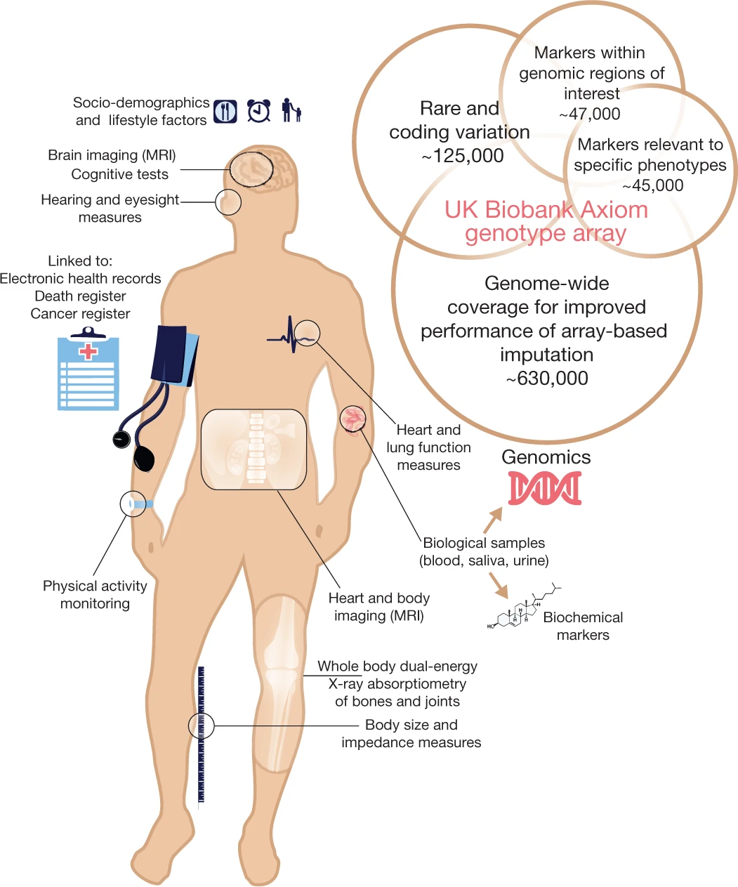
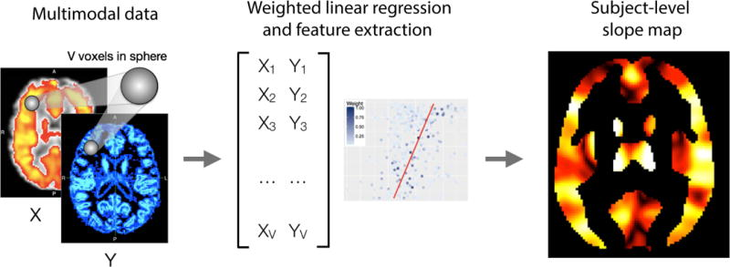
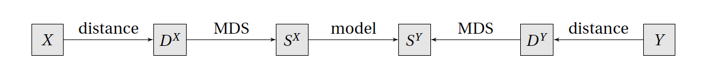

```{r setup, include=FALSE}
knitr::opts_chunk$set(
  echo = FALSE,
  dev = "png",
  fig.retina = 2,
  # dev.args=list(bg="transparent"), # transparent plot backgrounds
  fig.height = 7,
  fig.width = 7,
  out.width = "100%",
  cache = TRUE
)

library(ggplot2)

load("results/explore_dists.Rdata")
fc_mdmr_p <- cbind("25 subject subsample p-value" = print(fc_mdmr_25), print(fc_mdmr))
sc_mdmr_p <- cbind("25 subject subsample p-value" = print(sc_mdmr_25), print(sc_mdmr))
```

```{r kable_setup, include=FALSE, cache=FALSE}
options("kableExtra.html.bsTable" = T)
options(knitr.kable.NA = '',
        digits = 3)

# Colored Kable function, uses PennSIVE colors
ccolors <- colorRampPalette(c("#011F5B", "#000000", "#990000"))(256)
color_kable <- function(x) {
  x[is.nan(x)] <- "NaN"
  colored <- as.data.frame(x) %>%
    mutate_if(is.numeric, function(y) {
      cell_spec(y, "html",
                color = ccolors[round(scales::rescale(y, to = c(1, 256), from = 0:1))])}
    )
  rownames(colored) <- rownames(x)
  knitr::kable(colored, "html", escape = FALSE, row.names = TRUE)
}
```

```{css}
.medium{font-size: 85%}
.small{font-size: 70%}
.tiny{font-size: 60%}
.bottomright {
  position: absolute;
  top: 66%;
  left: 61%;
}
```

## Motivation
.pull-left[
- Large-scale studies including the [UKBB](https://www.ukbiobank.ac.uk/)<sup>1</sup> and upcoming [RURAL (Risk Underlying Rural Areas Longitudinal) Cohort Study](https://www.theruralstudy.org/) are increasingly collecting a wide range of data


- Dearth of methodologies available for regression of multiple types of outcome data
]
.pull-right[
[](https://www.nature.com/articles/s41586-018-0579-z/figures/1)
]

.footnote[
[<sup>1</sup>Sudlow et al., 2015](https://doi.org/10.1371/journal.pmed.1001779)
]
---

## Motivation
- Incorporation of multiple imaging modalities shown to improve multiple sclerosis lesion detection<sup>1</sup> and reveal developmental patterns<sup>2</sup>

- Limited to voxel-level data and structural imaging

.center[[](https://www.ncbi.nlm.nih.gov/pmc/articles/PMC6030441/figure/F2/)]

.footnote[
[<sup>1</sup>Valcarcel et al., 2018](https://doi.org/10.1111/jon.12506) 
&emsp;[<sup>2</sup>Vandekar et al., 2016](https://doi.org/10.1016/j.neuroimage.2016.03.002)
]
---

## Distance-based regression methods
- Regression using only pairwise dissimilarity information between observations $y_i$, $i=1,2,\ldots,n$
- Requires a dissimilarity measure $d$ that can be any semimetric, which has to satisfy
    - $d(y_i, y_j) = d(y_j, y_i)$ (symmetry)
    - $d(y_i, y_j) \geq 0$ (nonnegativity)
    - $d(y_i, y_j) = 0$ if and only if $y_i = y_j$ (identifibility)
--


- Permutational multivariate analysis of variance (PERMANOVA)<sup>1</sup> tests for differences between $K$ groups using within-group sum of squared distances $SS_W$ and across-group sum of squared distances $SS_A$ via the test statistic
$$F_{\text{PERMANOVA}} = \frac{SS_A/(K-1)}{SS_W/(n-K)}$$
- Significance tests performed either via permutations or using the asymptotic null distribution<sup>2</sup>

.footnote[
[<sup>1</sup>Anderson, 2001](https://doi.org/10.1111/j.1442-9993.2001.01070.pp.x)
&emsp;[<sup>2</sup>Shinohara, Shou, et al., 2020](https://doi.org/10.1111/biom.13123)
]
---

## Distance-based regression methods
- Multivariate distance matrix regression (MDMR) tests for associations with an $n\times p$ design matrix $X$ via the pseudo-F statistic
$$\DeclareMathOperator{\tr}{tr} F_{\text{MDMR}} = \frac{\tr(HGH)/(p-1)}{\tr[(I-H)G(I-H)]/(n-p)}$$
which can be tested via permutation or through its asymptotic null distribution<sup>2</sup>

.pull-left[
.center[
[](https://doi.org/10.1016/j.neuroimage.2014.02.024)  
.small[[Fig. 3 from Shehzad et al., 2014](https://doi.org/10.1016/j.neuroimage.2014.02.024)]
 ]
]
.pull-right[
.center[
  [](https://doi.org/10.1016/j.neuroimage.2011.11.035)  
  .small[[Fig. 4 from Alexander-Bloch et al., 2012](https://doi.org/10.1016/j.neuroimage.2011.11.035)]
 ]
]

.footnote[
[<sup>1</sup>McArdle and Anderson, 2001](https://esajournals.onlinelibrary.wiley.com/doi/abs/10.1890/0012-9658%282001%29082%5B0290%3AFMMTCD%5D2.0.CO%3B2)
&emsp;[<sup>2</sup>McArtor et al., 2017](https://doi.org/10.1007/s11336-016-9527-8)
]
---

## MDMR intuition
- Let $Y$ be a $n \times q$ matrix of independent variables and $X$ be a $n \times p$ design matrix
- The null hypothesis of no effect of covariates can then tested via a psuedo-F statistic
$$\DeclareMathOperator{\tr}{tr} 
\begin{aligned} 
F &= \frac{\tr(Y^THY)/(p-1)}{\tr[Y^T(I-H)Y]/(n-p)} \\
  &= \frac{\tr(HYY^TH)/(p-1)}{\tr[(I-H)YY^T(I-H)]/(n-p)}
\end{aligned}$$
- Without direct use of $Y$, we can still obtain an outer product matrix from the distance matrix via $G = -\frac{1}{2}(I - \mathbf{1}\mathbf{1}^T/n)D(I - \mathbf{1}\mathbf{1}^T/n)$
- Substituting $G$ for $YY^T$ we obtain the MDMR test statistic
$$\DeclareMathOperator{\tr}{tr} F_{\text{MDMR}} = \frac{\tr(HGH)/(p-1)}{\tr[(I-H)G(I-H)]/(n-p)}$$


.footnote[
[Gower, 1966](https://doi.org/10.2307/2333639)
&emsp; [McArdle and Anderson, 2001](https://esajournals.onlinelibrary.wiley.com/doi/abs/10.1890/0012-9658%282001%29082%5B0290%3AFMMTCD%5D2.0.CO%3B2)
]
---

## Limitations and potential extensions
- Current distance-based methods are limited to a single distance matrix

- Combining distance matrices can improve classification performance<sup>1</sup> but has not been attempted in PERMANOVA or MDMR


.footnote[
[<sup>1</sup>Ibba et al., 2010](https://doi.org/10.1109/ICPR.2010.820)
]

--
- We aim to extend distance-based methods to handle multiple distance matrices
    - Enables simultaneous analysis of multiple data types and dissimilarity metrics
    - Potentially leverages covariance between dissimilarities to detect associations of interest
---

## Classical multidimensional scaling
.footnote[
[<sup>1</sup>Gower, 1966](https://doi.org/10.2307/2333639)
&emsp; [<sup>2</sup>McArtor et al., 2017](https://doi.org/10.1007/s11336-016-9527-8)
]

- Using the pairwise distances, can we reconstruct points in Euclidean space that preserve distances?
    - Can we find $Z = [z_1, z_2, \ldots, z_n]^T$ such that $\lVert z_i - z_j \rVert = d_{ij}$?

--

- The solution<sup>1</sup> is obtained through eigendecomposition of $G = U\Lambda U^T$ as $Z = U\Lambda^{1/2}$
    - First columns of $Z$ best preserve the distances

--

- By noting that $G = ZZ^T$, MDMR can be thought of as regressing multidimensional scaling (MDS) scores on the predictors<sup>2</sup>
$$\DeclareMathOperator{\tr}{tr} F_{\text{MDMR}} = \frac{\tr(Z^THZ)/(p-1)}{\tr[Z^T(I-H)Z]/(n-p)}$$
---

## Regression with distance matrices
.footnote[
[Faraway, 2014](https://doi.org/10.1080/02664763.2014.909794)
]

- JJ Faraway proposes a general regression framework for distance matrices

.center[
  [](https://doi.org/10.1080/02664763.2014.909794)  
  .small[[Fig. 1 from Faraway, 2014](https://doi.org/10.1080/02664763.2014.909794)]
 ]
 
 
- He does not specify a model but suggests possible options including partial least squares, canonical correlation analysis, and multivariate multiple regression


--

- Discusses adding an additional predictor matrix $W$ to $Y$
    - Advises against working on their distance matrices (combining $D^W$ and $D^Y$)
    - Instead, recommends concatenation of $S^W$ and $S^Y$
---

## Multiple MDMR (working title)
Let $D_1, D_2, \ldots, D_m$ be $n \times n$ distance matrices obtained on the same subjects and $X$ be a full-rank $n \times p$ design matrix


1. First, use MDS to obtain $m$ sets of coordinates $Z_1, Z_2, \ldots, Z_m$
2. Then concatenate these into an $n \times mn$ matrix $Z = \begin{bmatrix} Z_1 & Z_2 & \cdots & Z_m \end{bmatrix}$
3. We then regress $Z$ on $X$ using multivariate multiple regression (MMR)
4. Inference can be achieved through the sums of squares and cross products (SSCP) error $\text{SSCP}_E = Z^T (I-H) Z$ and regression
$$\text{SSCP}_R = Z^T H Z = \begin{bmatrix} 
Z_1^T H Z_1 & Z_1^T H Z_2 & \cdots & Z_1^T H Z_m\\
Z_2^T H Z_1 & Z_2^T H Z_2 & \cdots & Z_2^T H Z_m\\
\vdots & \vdots & \ddots & \vdots\\
Z_m^T H Z_1 & Z_m^T H Z_2 & \cdots & Z_m^T H Z_m\\
\end{bmatrix}$$
5. Several test statistics including Pillai's trace are based on these SSCP matrices<sup>1</sup> and can be evaluated using permutation testing or possibly through $F$ approximations (requires derivation)

.footnote[
[<sup>1</sup>Lecture notes by Helwig, 2017](http://users.stat.umn.edu/~helwig/notes/mvlr-Notes.pdf)
]
---

## Issues with current formulation
.footnote[
[<sup>1</sup>Abdi et al., 2005](https://doi.org/10.1109/CVPR.2005.445)
]

- Classical MMR requires the error df to be greater than or equal to the number of MDS axes
$$n-p-1 \geq nm$$
    - Otherwise, $SSCP_E$ is not full-rank and standard test statistics cannot be calculated

--

- We will explore several potential solutions
    1. Discard lower $q$ MDS axes from each of the $m$ sets of MDS axes to yield $(n-q)m$ total axes
--
    2. Find common axes via PCA and keep the top $n-p-1$ axes
        - Similar to how DISTATIS computes a compromise matrix from multiple distance matrices<sup>1</sup>
--
    3. Analogous to MDMR, ignore certain sums of cross products (e.g. replace $Z_1^T H Z_1$ with $\DeclareMathOperator{\tr}{tr} \tr(Z_1^T H Z_1)$ and $Z_1^T H Z_2$ with a chosen summary measure)


---

## Initial steps
.footnote[
[<sup>1</sup>Ibba et al., 2010](https://doi.org/10.1109/ICPR.2010.820)
]


1. Identify a multi-modal dataset, ideally of different data types (e.g. functional and matrix-valued data)

--

2. Assess relationship between distance matrices via Mantel's test and other exploratory analyses

--

3. Compare several methods for inference including combining distance matrices<sup>1</sup>, separate MDMR runs, and the proposed multiple MDMR ideas (with permutation testing)

--

4. Use simulations to evaluate type I error and power, potentially comparing to common experimental designs such as reducing multi-modal features into a vector

---
class: center, middle, divider
# Proposed real data example
---

## Philadelphia Neurodevelopmental Cohort sample
- Sample of 727 youths aged 8 to 23 years with structural connectivity (SC) measurements and functional connectivity (FC) measurements (during an *n*-back working memory task)

- Analyzed in recent work on structure-function coupling which identified connections with age, controlling for sex and motion
&nbsp;

.center[
[](https://www.pnas.org/content/117/1/771.full#sec-9)  
.small[[Fig. 3 from Baum et al., 2020](https://doi.org/10.1073/pnas.1912034117)]
]

.footnote[
Data provided by Ted Satterthwaite and Azeez Adebimpe
]
---

## Distances exploration
```{r, fig.show = "hold", out.width = "100%", fig.width = 12, fig.height = 4}
library(patchwork)

# plot MDS axes colored by age
ggplot(data.frame(fc_Z[,1:2], age = demo$age), aes(x = X1, y = X2, color = age)) +
  geom_point() +
  labs(x = "FC axis 1", y = "FC axis 2", color = "Age (years)", title = "Functional connectivity MDS") +
  theme_minimal() +
ggplot(data.frame(sc_Z[,1:2], age = demo$age), aes(x = X1, y = X2, color = age)) +
  geom_point() +
  labs(x = "SC axis 1", y = "SC axis 2", color = "Age (years)", title = "Structural connectivity MDS") +
  theme_minimal() +
ggplot(data.frame(cbind(sc_Z[,1], fc_Z[,1]), age = demo$age), aes(x = X1, y = X2, color = age)) +
  geom_point() +
  labs(x = "SC axis 1", y = "FC axis 1", color = "Age (years)", title = "FC and SC MDS") +
  theme_minimal() +
plot_layout(guides = "collect")
```

- Mantel test suggests no significant correlation between the distance matrices $(p = `r mantel_res$signif`)$
---

## Separate MDMR results
.center[Functional connectivity MDMR]
```{r, message = FALSE}
colnames(fc_mdmr_p) <- c("Random 25 subjects p-value", "Full sample p-value")
rownames(fc_mdmr_p) <- c("Omnibus", "Age", "Sex", "Motion")
knitr::kable(fc_mdmr_p[-1,], "html")
```


--
.center[Structural connectivity MDMR]
```{r, message = FALSE}
colnames(sc_mdmr_p) <- c("Random 25 subjects p-value", "Full sample p-value")
rownames(sc_mdmr_p) <- c("Omnibus", "Age", "Sex", "Motion")
knitr::kable(sc_mdmr_p[-1,], "html")
```
---

## Follow-up steps
- Further exploration of distance matrices, possibly through other visualization methods (e.g. t-SNE) or correlation analyses (e.g. distance-based CCA)

- Design experiments to compare aggregating separate MDMRs to proposed multiple MDMR methods

- Continue development of methodology and consideration of alternatives