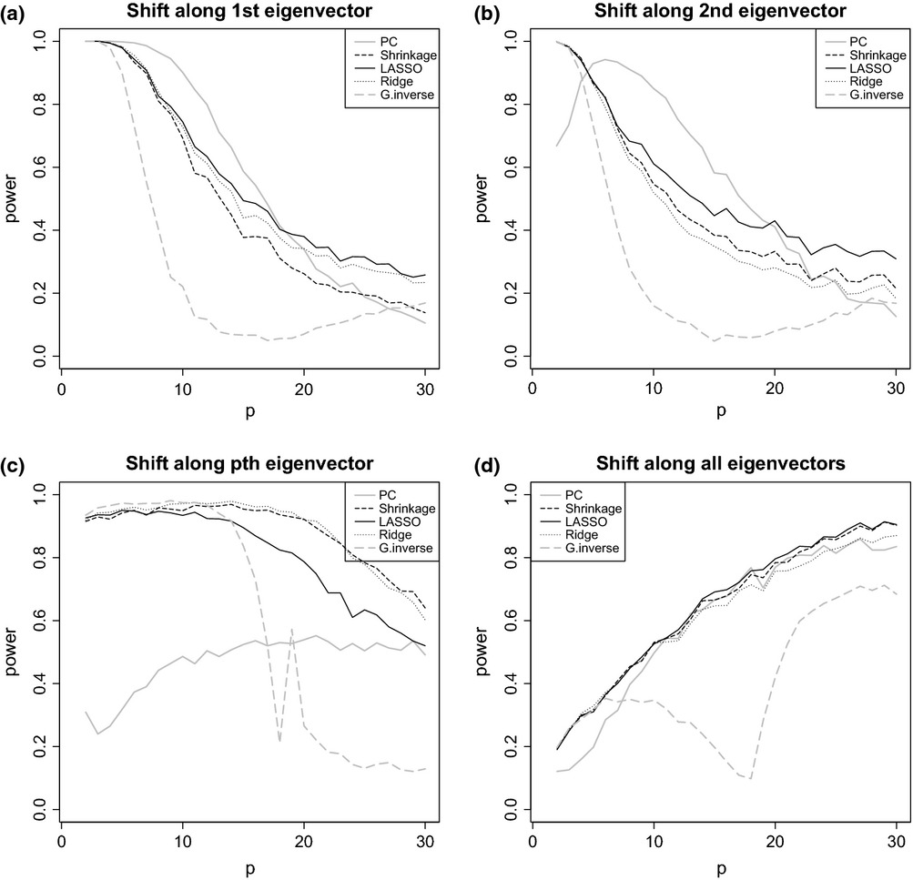
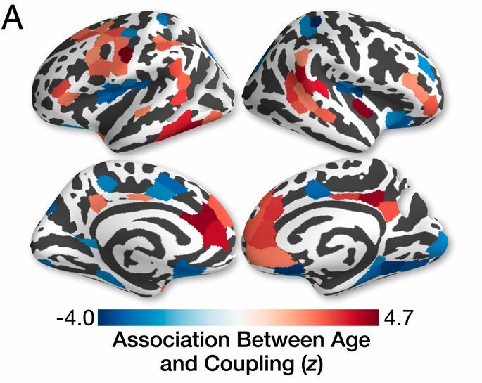

```{r setup, include=FALSE}
knitr::opts_chunk$set(
  echo = FALSE,
  dev = "png",
  fig.retina = 2,
  # dev.args=list(bg="transparent"), # transparent plot backgrounds
  fig.height = 7,
  fig.width = 7,
  out.width = "100%",
  cache = FALSE,
  warning = FALSE,
  message = FALSE
)

options("kableExtra.html.bsTable" = T)
options(knitr.kable.NA = '',
        digits = 3)

library(ggplot2)
library(patchwork)
library(MDMR)

load("results/explore_dists.Rdata")
load("results/sim_plots.Rdata")

fc_mdmr_p <- cbind(print(fc_mdmr_25), print(fc_mdmr))
sc_mdmr_p <- cbind(print(sc_mdmr_25), print(sc_mdmr))
```

```{r kable_setup, include=FALSE, cache=FALSE}
# Colored Kable function, uses PennSIVE colors
ccolors <- colorRampPalette(c("#011F5B", "#000000", "#990000"))(256)
color_kable <- function(x) {
  x[is.nan(x)] <- "NaN"
  colored <- as.data.frame(x) %>%
    mutate_if(is.numeric, function(y) {
      cell_spec(y, "html",
                color = ccolors[round(scales::rescale(y, to = c(1, 256), from = 0:1))])}
    )
  rownames(colored) <- rownames(x)
  knitr::kable(colored, "html", escape = FALSE, row.names = TRUE)
}
```

```{css}
.medium{font-size: 85%}
.small{font-size: 70%}
.tiny{font-size: 60%}
.bottomright {
  position: absolute;
  top: 66%;
  left: 61%;
}
```

## Multiple MDMR (working title)
Let $D_1, D_2, \ldots, D_m$ be $n \times n$ distance matrices obtained on the same subjects and $X$ be a full-rank $n \times p$ design matrix


1. First, use MDS to obtain $m$ sets of coordinates $Z_1, Z_2, \ldots, Z_m$
2. Then concatenate these into an $n \times mn$ matrix $Z = \begin{bmatrix} Z_1 & Z_2 & \cdots & Z_m \end{bmatrix}$
3. We then regress $Z$ on $X$ using multivariate multiple regression (MMR)
4. Inference can be achieved through the sums of squares and cross products (SSCP) error $\text{SSCP}_E = Z^T (I-H) Z$ and regression
$$\text{SSCP}_R = Z^T H Z = \begin{bmatrix} 
Z_1^T H Z_1 & Z_1^T H Z_2 & \cdots & Z_1^T H Z_m\\
Z_2^T H Z_1 & Z_2^T H Z_2 & \cdots & Z_2^T H Z_m\\
\vdots & \vdots & \ddots & \vdots\\
Z_m^T H Z_1 & Z_m^T H Z_2 & \cdots & Z_m^T H Z_m\\
\end{bmatrix}$$
5. Several test statistics including Pillai's trace are based on these SSCP matrices<sup>1</sup> and can be evaluated using permutation testing or possibly through $F$ approximations (requires derivation)

.footnote[
[<sup>1</sup>Lecture notes by Helwig, 2017](http://users.stat.umn.edu/~helwig/notes/mvlr-Notes.pdf)
]
---

## Issue with current formulation
.footnote[
[<sup>1</sup>Abdi et al., 2005](https://doi.org/10.1109/CVPR.2005.445)
]

- Denote $\hat{E}$ as the SSCP error matrix and $\hat{H}$ as the hypothesis SSCP matrix. In classical MMR, the standard test statistics are:  
    - Wilk's lambda: $\lvert \hat{E} \rvert/\lvert \hat{E} + \hat{H} \rvert$
    - Pillai's trace: $\DeclareMathOperator{\tr}{tr} \tr(\hat{H}(\hat{E}+\hat{H})^{-1})$
    - Lawley-Hotelling trace: $\DeclareMathOperator{\tr}{tr} \tr(\hat{H}\hat{E}^{-1})$
    

- If the error df is less than the number of MDS axes $n-p-1 < nm$, $\hat{E}$ is not full-rank and standard test statistics cannot be calculated

--


- We will explore several potential solutions
    1. Discard lower $q$ MDS axes from each of the $m$ sets of MDS axes to yield $(n-q)m$ total axes
--
    2. Find common axes via PCA and keep the top $n-p-1$ axes
        - Similar to how DISTATIS computes a compromise matrix from multiple distance matrices<sup>1</sup>
--
    3. Analogous to MDMR, ignore certain sums of cross products (e.g. replace $Z_1^T H Z_1$ with $\DeclareMathOperator{\tr}{tr} \tr(Z_1^T H Z_1)$ and $Z_1^T H Z_2$ with a chosen summary measure)

---

## High-dimensional MMR
- For high dimensional settings where $\hat{E}$ is not necessarily invertible, many solutions have been proposed and generally fall into four major categories:


- **Alternative test statistics**
    - Dempster's trace<sup>1</sup>: $\DeclareMathOperator{\tr}{tr} \tr(\hat{H})/\tr(\hat{E})$
    - Schott's test statistic<sup>2</sup>: $\DeclareMathOperator{\tr}{tr} \sqrt{n-1} [\tr(\hat{H})/p - \tr(\hat{E})/(n-p-1)]$
- **PCA regression**<sup>3</sup>
- **Generalized inverse**<sup>4</sup>
    - Take Moore-Penrose inverse instead of matrix inverse
- **Regularization**
    - Both ridge<sup>5</sup> and LASSO<sup>6</sup> have been used to obtain regularized estimates $\tilde{E}$
    
.footnote[
[<sup>1</sup>Fujikoshi et al., 2004](https://doi.org/10.14490/jjss.34.19)
&emsp; [<sup>2</sup>Schott, 2007](https://doi.org/10.1016/j.jmva.2006.11.007)
&emsp; [<sup>3</sup>Tomfohr et al., 2005](https://doi.org/10.1186/1471-2105-6-225)
&emsp; [<sup>4</sup>Srivastava and Fujikoshi, 2006](https://doi.org/10.1016/j.jmva.2005.08.010)
&emsp; [<sup>5</sup>Warton, 2008](https://doi.org/10.1198/016214508000000021)
&emsp; [<sup>6</sup>Ullah and Jones, 2015](https://doi.org/10.1109/CVPR.2005.445)
]
---
.center[
  
.small[Fig. 2, AR(1) covariance structure, $n = 20$]
]

.footnote[
[Ullah and Jones, 2015](https://doi.org/10.1111/anzs.12126)
]
---
.center[
  
.small[Fig. 3, exchangable covariance structure, $n = 20$]
]

.footnote[
[Ullah and Jones, 2015](https://doi.org/10.1111/anzs.12126)
]
---

## Proposed test statistics
- Denote $\hat{E} = Z(I-H)Z$ as the SSCP error matrix and $\hat{H}$ as the hypothesis SSCP matrix
- After applying PCA to obtain the $n \times (n-p-1)$ score matrix, denote $\hat{E}_{PC}$ and $\hat{H}_{PC}$ the associated SSCP error matrix and hypothesis SSCP matrix
    - PCA is applied after dividing the Gower's matrices $G_1, G_2, \ldots, G_m$ by their top eigenvalue<sup>1</sup>


| Statistic            | Equation
|:---------------------|----------
| Psuedo-F (Dempster's)| $\DeclareMathOperator{\tr}{tr} \tr(\hat{H})/\tr(\hat{E})$
| Top PCs              | $\DeclareMathOperator{\tr}{tr} \tr(\hat{H}_{PC}(\hat{E}_{PC}+\hat{H}_{PC})^{-1})$
| Generalized inverse  | $\DeclareMathOperator{\tr}{tr} \tr(\hat{H}(\hat{E}+\hat{H})^+)$

.footnote[
[<sup>1</sup>Abdi et al., 2005](https://doi.org/10.1109/CVPR.2005.445)
]
---

## Simulation design
.footnote[
[<sup>1</sup>Warton, 2008](https://doi.org/10.1198/016214508000000021)
&emsp; [<sup>2</sup>Ullah and Jones, 2015](https://doi.org/10.1109/CVPR.2005.445)
]

- Following previous simulations<sup>1,2</sup>, we generate data from multivariate normal (MVN) distributions with exchangeable correlation structures $\Sigma$
    - Covariate effect simulated by shift in PC directions


- We start by comparing four methods
    - Traditional MMR (for $nq \leq n-2$)
    - Separate MDMRs
    - Psuedo-F statistic (Dempster's trace)
    - Pillai's trace using top PCs
    - Pillai's trace using generalized inverse
    

- We hypothesize that simultaneous multiple MDMR test statistics should outperform in settings with higher correlation between feature sets
    - Separate MDMRs likely perform similar or better in lower correlation settings
- In lower-dimensional settings, traditional MMR would likely have reasonably high power
---

## Simulation settings
- Let $n$ be the number of subjects, $m$ be the number of feature sets, and $q$ be the number of features within each set
    - To generate separate feature sets with dependencies, we simulate $m\times q$ dimensional features $Y \sim N(0, \Sigma)$, then split them evenly into $Y_1, Y_2, \ldots, Y_m$
    - A simple binary covariate $x \sim \text{Bernoulli}\,(1/2)$ induces shifts along PC axes of $\Sigma$, $\sum_{k \in K} \gamma\boldsymbol{\phi}_k$, where $K$ is selected depending on the setting
--


- We fix the following:
    - $1000$ simulations per setting
    - $999$ permutations to compute $p$-values
    - $n = 25$: small sample size
    - $\gamma = 3$ for first PC shift, $\gamma = 1/2$ for all PC shift
- We vary the following parameters:
    - $\rho = 0.25, 0.75$: low or high correlation of $\Sigma$
    - $K$: selected PC axes shifted by $\gamma$
    - $m = 2, 3, 5, 10$: varying number of feature sets
    - $q = 5, 10, 50, 100$: potentially high dimensional features
---

## $m = 2$ results
```{r, fig.width=10, fig.height=6.5, fig.align="center", out.width="80%"}
(plots$`25_low_corr`$`2_1` + labs(title = "Low Correlation, First PC") + 
   plots$`25_high_corr`$`2_1` + labs(title = "High Correlation, First PC")) /
  (plots$`25_low_corr`$`2_all` + labs(title = "Low Correlation, All PCs") +
     plots$`25_high_corr`$`2_all` + labs(title = "High Correlation, All PCs")) + 
  plot_layout(guides = "collect") & theme(legend.position = 'bottom')
```
---

## $m = 3$ results
```{r, fig.width=10, fig.height=6.5, fig.align="center", out.width="80%"}
(plots$`25_low_corr`$`3_1` + labs(title = "Low Correlation, First PC") + 
   plots$`25_high_corr`$`3_1` + labs(title = "High Correlation, First PC")) /
  (plots$`25_low_corr`$`3_all` + labs(title = "Low Correlation, All PCs") +
     plots$`25_high_corr`$`3_all` + labs(title = "High Correlation, All PCs")) + 
  plot_layout(guides = "collect") & theme(legend.position = 'bottom')
```
---

## $m = 5$ results
```{r, fig.width=10, fig.height=6.5, fig.align="center", out.width="80%"}
(plots$`25_low_corr`$`5_1` + labs(title = "Low Correlation, First PC") + 
   plots$`25_high_corr`$`5_1` + labs(title = "High Correlation, First PC")) /
  (plots$`25_low_corr`$`5_all` + labs(title = "Low Correlation, All PCs") +
     plots$`25_high_corr`$`5_all` + labs(title = "High Correlation, All PCs")) + 
  plot_layout(guides = "collect") & theme(legend.position = 'bottom')
```
---
class: center, middle, divider
# Proposed real data example
---

## Philadelphia Neurodevelopmental Cohort sample
- Sample of 727 youths aged 8 to 23 years with structural connectivity (SC) measurements and functional connectivity (FC) measurements (during an *n*-back working memory task)

- Analyzed in recent work on structure-function coupling which identified connections with age, controlling for sex and motion
&nbsp;

.center[
[](https://www.pnas.org/content/117/1/771.full#sec-9)  
.small[[Fig. 3 from Baum et al., 2020](https://doi.org/10.1073/pnas.1912034117)]
]

.footnote[
Data provided by Ted Satterthwaite and Azeez Adebimpe
]
---

## Distances exploration
```{r, fig.show = "hold", out.width = "100%", fig.width = 12, fig.height = 4}
library(patchwork)

load("results/sample_demo.Rdata")
demo <- as.data.frame(design)

# plot MDS axes colored by age
ggplot(data.frame(fc_Z[,1:2], age = demo$age), aes(x = X1, y = X2, color = age)) +
  geom_point() +
  labs(x = "FC axis 1", y = "FC axis 2", color = "Age (years)", title = "Functional connectivity MDS") +
  theme_minimal() +
ggplot(data.frame(sc_Z[,1:2], age = demo$age), aes(x = X1, y = X2, color = age)) +
  geom_point() +
  labs(x = "SC axis 1", y = "SC axis 2", color = "Age (years)", title = "Structural connectivity MDS") +
  theme_minimal() +
ggplot(data.frame(cbind(sc_Z[,1], fc_Z[,1]), age = demo$age), aes(x = X1, y = X2, color = age)) +
  geom_point() +
  labs(x = "SC axis 1", y = "FC axis 1", color = "Age (years)", title = "FC and SC MDS") +
  theme_minimal() +
plot_layout(guides = "collect")
```

- Mantel test suggests no significant correlation between the distance matrices $(p = `r mantel_res$signif`)$
---

## Initial MDMR power tests
- Repeatedly subsampled subjects from the full PNC sample
- Each connectivity observation contains 79800 distinct elements

.center[Structural connectivity MDMR]
```{r, message = FALSE, fig.align="center", out.width = "80%", fig.width = 10, fig.height = 4}
load("results/coupling_plots.Rdata")

plots$`m=2` + labs(title = "n-back and SC") + 
  plots$`m=3` + labs(title = "n-back, rsFC, and SC") +
  plot_layout(guides = "collect") & theme(legend.position = 'bottom')
```