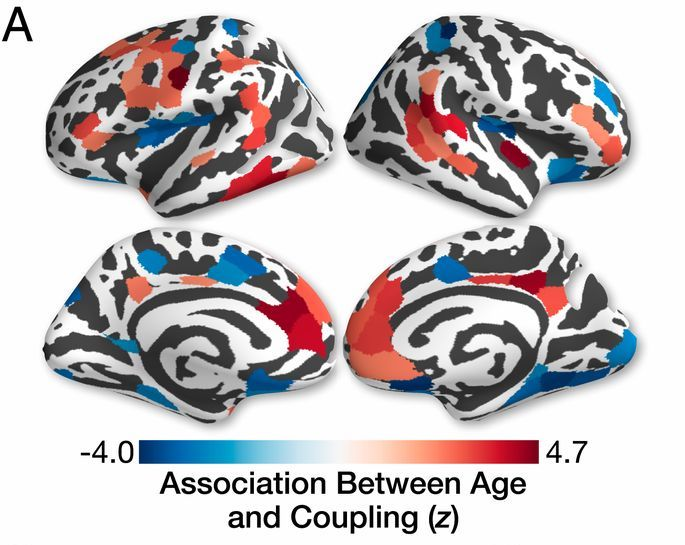

```{r setup, include=FALSE}
knitr::opts_chunk$set(
  echo = FALSE,
  dev = "png",
  fig.retina = 2,
  # dev.args=list(bg="transparent"), # transparent plot backgrounds
  fig.height = 7,
  fig.width = 7,
  out.width = "100%",
  cache = TRUE,
  warning = FALSE,
  message = FALSE
)

options("kableExtra.html.bsTable" = T)
options(knitr.kable.NA = '',
        digits = 3)

library(ggplot2)
library(patchwork)
library(MDMR)
library(reshape2)
```

```{r plot_fx, include=FALSE, cache=FALSE}
wong_colors <- c("#E69F00", "#56B4E9", "#009E73", "#F0E442", "#0072B2", "#D55E00", "#CC79A7")
plot_mat <- function(cov, lims = c(-max(abs(cov_melt$value)), max(abs(cov_melt$value)))) {
  cov_melt <- melt(cov)
  ggplot(data = cov_melt, aes(x=Var1, y=Var2, fill=value)) + 
    geom_tile() + 
    scale_fill_gradientn(
      colours = c(wong_colors[6], "white", wong_colors[5]), 
      limits = lims) +
    labs(fill = "") + 
    theme_classic() +
    theme(axis.line = element_blank(),
          axis.ticks = element_blank(),
          axis.text.x = element_blank(),
          axis.text.y = element_blank(),
          axis.title.x = element_blank(),
          axis.title.y = element_blank())
}

gghist <- function(input) {
  df <- data.frame(x = c(input))
  ggplot(df, aes(x = x)) + geom_histogram(color = "black", fill = "white") + theme_minimal()
}
```

```{css}
.medium{font-size: 85%}
.small{font-size: 70%}
.tiny{font-size: 60%}
.bottomright {
  position: absolute;
  top: 66%;
  left: 61%;
}
```

## Multiple MDMR (working title)
Let $D_1, D_2, \ldots, D_m$ be $n \times n$ distance matrices obtained on the same subjects and $X$ be a full-rank $n \times p$ design matrix


1. First, use MDS to obtain $m$ sets of coordinates $Z_1, Z_2, \ldots, Z_m$
2. Then concatenate these into an $n \times mn$ matrix $Z = \begin{bmatrix} Z_1 & Z_2 & \cdots & Z_m \end{bmatrix}$
3. We then regress $Z$ on $X$ using multivariate multiple regression (MMR)
4. Inference can be achieved through the sums of squares and cross products (SSCP) error $\text{SSCP}_E = Z^T (I-H) Z$ and regression
$$\text{SSCP}_R = Z^T H Z = \begin{bmatrix} 
Z_1^T H Z_1 & Z_1^T H Z_2 & \cdots & Z_1^T H Z_m\\
Z_2^T H Z_1 & Z_2^T H Z_2 & \cdots & Z_2^T H Z_m\\
\vdots & \vdots & \ddots & \vdots\\
Z_m^T H Z_1 & Z_m^T H Z_2 & \cdots & Z_m^T H Z_m\\
\end{bmatrix}$$
5. Several test statistics including Pillai's trace are based on these SSCP matrices<sup>1</sup> and can be evaluated using permutation testing or possibly through $F$ approximations (requires derivation)

.footnote[
[<sup>1</sup>Lecture notes by Helwig, 2017](http://users.stat.umn.edu/~helwig/notes/mvlr-Notes.pdf)
]
---

## High-dimensional MMR
- For high dimensional settings where $\hat{E}$ is not necessarily invertible, many solutions have been proposed and generally fall into four major categories:


- **Alternative test statistics**
    - Dempster's trace<sup>1</sup>: $\DeclareMathOperator{\tr}{tr} \tr(\hat{H})/\tr(\hat{E})$
    - Schott's test statistic<sup>2</sup>: $\DeclareMathOperator{\tr}{tr} \sqrt{n-1} [\tr(\hat{H})/p - \tr(\hat{E})/(n-p-1)]$
- **PCA regression**<sup>3</sup>
- **Generalized inverse**<sup>4</sup>
    - Take Moore-Penrose inverse instead of matrix inverse
- **Regularization**
    - Both ridge<sup>5</sup> and LASSO<sup>6</sup> have been used to obtain regularized estimates $\tilde{E}$
    
.footnote[
[<sup>1</sup>Fujikoshi et al., 2004](https://doi.org/10.14490/jjss.34.19)
&emsp; [<sup>2</sup>Schott, 2007](https://doi.org/10.1016/j.jmva.2006.11.007)
&emsp; [<sup>3</sup>Tomfohr et al., 2005](https://doi.org/10.1186/1471-2105-6-225)
&emsp; [<sup>4</sup>Srivastava and Fujikoshi, 2006](https://doi.org/10.1016/j.jmva.2005.08.010)
&emsp; [<sup>5</sup>Warton, 2008](https://doi.org/10.1198/016214508000000021)
&emsp; [<sup>6</sup>Ullah and Jones, 2015](https://doi.org/10.1109/CVPR.2005.445)
]
---
class: center, middle, divider
# Dempster's trace
---
## Dempster's trace
- Similar in spirit to the original MDMR method
$$\DeclareMathOperator{\tr}{tr} F_{\text{MDMR}} = \frac{\tr(Z_1^THZ_1)}{\tr[Z_1^T(I-H)Z_1]}$$
- Applying Dempster's trace to this regression setting yields a Psuedo-F statistic
$$\DeclareMathOperator{\tr}{tr} F_{\text{D}} = \frac{\tr(Z^THZ)}{\tr[Z^T(I-H)Z]} = \frac{\sum_{j=1}^m \tr(Z_j^THZ_j)}{\sum_{j=1}^m \tr[Z_j^T(I-H)Z_j]}$$
---

## Asymptotic property investigation
- McArtor et al. (2017) derived the asymptotic null distribution for $F_{\text{MDMR}}$ in several steps:
    1. Eigendecomposed $G = \sum_{k=1}^n \lambda_k \phi_k\phi_k^T$ and noted that $\phi_k$ are "asymptotically normally distributed because they are linear combinations of the elements of $G$, which are *iid* if the rows of $Y$ are *iid*"
        - This result has not been validated in any other papers
        - Li et al. (2019) prove that the MDS points are asymptotically normally distributed for Euclidean distances under certain error models (unpublished results)
    2. Regressed the $k$ eigenvectors (treating each of the $n$ elements as samples) on $X$ to yield the fitted values $u_k = H\phi_k$ and residuals $r_k = (I-H)\phi_k$
    3. Rewrote the test statistic as
    $$F_{\text{MDMR}} = \frac{\tr(HGH)}{\tr[(I-H)G(I-H)]}=\frac{\sum_{k=1}^n \lambda_k u_k^T u_k}{\sum_{k=1}^n \lambda_k r_k^T r_k}$$
    4. Since $u_k^T u_k \xrightarrow{d} \chi^2_p$ and $r_k^T r_k \xrightarrow{d} \chi^2_{n-p-1}$ and all $u_k$ and $r_k$ are pairwise independent, $F_{\text{MDMR}}$ is "asymptotically distributed as a weighted sum of $n$ independent $\chi^2(p)$ variables divided by a weighted sum of n independent $\chi^2(n-p-1)$ variables"


.footnote[
[McArtor et al., 2017](https://doi.org/10.1007/s11336-016-9527-8) &emsp;
[Li et al., 2019](http://arxiv.org/abs/1804.00631)
]
---

## Dempster's trace challenges
- The test statistic and asymptotic distribution both depend on eigenvalues of each dissimilarity matrix $G_j$ and can be dominated by matrices with a larger trace
    - Still remains an open question of how to optimally rescale these matrices
- Several possible solutions
    1. Divide each $G_j$ by their top eigenvalue $\lambda_{j1}$
    2. Scale by the sum of eigenvalues $\DeclareMathOperator{\tr}{tr} \tr G_j$
    3. Set the sample distance variance $V = \frac{1}{n^2} \sum_{k,l} G_{k,l}^2$ of each $G_j$ equal to 1
    
    
--

- Asymptotically, we now have chi-squared random variables that are not necessarily independent of one another
    - Sum of weighted dependent $\chi^2$ has been investigated with some approximations derived<sup>1</sup>
    - Also depends on the relative magnitude of eigenvalues from each $G_j$

.footnote[
[<sup>1</sup>Chuang and Shih, 2012](https://doi.org/10.1016/j.jspi.2011.08.004)
]
---

## Proposed test statistics
- Denote $\hat{E} = Z(I-H)Z$ as the SSCP error matrix and $\hat{H}$ as the hypothesis SSCP matrix
- After applying PCA to obtain the $n \times (n-p-1)$ score matrix, denote $\hat{E}_{PC}$ and $\hat{H}_{PC}$ the associated SSCP error matrix and hypothesis SSCP matrix
    - PCA is applied after dividing the Gower's matrices $G_1, G_2, \ldots, G_m$ by their top eigenvalue<sup>1</sup>


| Statistic            | Equation
|:---------------------|----------
| Psuedo-F (Dempster's)| $\DeclareMathOperator{\tr}{tr} \tr(\hat{H})/\tr(\hat{E})$
| Top PCs              | $\DeclareMathOperator{\tr}{tr} \tr(\hat{H}_{PC}(\hat{E}_{PC}+\hat{H}_{PC})^{-1})$
| Generalized inverse  | $\DeclareMathOperator{\tr}{tr} \tr(\hat{H}(\hat{E}+\hat{H})^+)$

.footnote[
[<sup>1</sup>Abdi et al., 2005](https://doi.org/10.1109/CVPR.2005.445)
]

---
class: center, middle, divider
# Simulation results
---

## Proposed simulation settings
- Let $n$ be the number of subjects, $m$ be the number of feature sets, and $q_j$ be the number of features within each set indexed by $j$
    - We generate separate feature sets via $Y_j \sim N(0, \Sigma_j)$, where $\Sigma_j$ may vary to simulate feature sets with different scales and covariance structures
    - Simple continuous and binary covariates can induce mean/variance shifts
    
    
- Potential simulation settings could vary across the following
    - Magnitude of covariate-induced shifts in mean/variance
    - Differences in variability within feature sets
    - Dependence among feature sets (possibly not as important)
    
    
- We now compare three methods
    - Traditional MMR (for $nq \leq n-2$)
    - Separate MDMRs
    - Psuedo-F statistic (Dempster's trace)
        - With various scaling options
---

## Previous simulation settings
- Let $n$ be the number of subjects, $m$ be the number of feature sets, and $q$ be the number of features within each set
    - To generate separate feature sets with dependencies, we simulate $m\times q$ dimensional features $Y \sim N(0, \Sigma)$, then split them evenly into $Y_1, Y_2, \ldots, Y_m$
    - A simple binary covariate $x \sim \text{Bernoulli}\,(1/2)$ induces shifts along PC axes of $\Sigma$, $\sum_{k \in K} \gamma\boldsymbol{\phi}_k$, where $K$ is selected depending on the setting
--


- For each simulation settings, we conduct 1000 simulations
    - $999$ permutations to compute $p$-values
    - $\rho = 0.25, 0.75$: low or high correlation of $\Sigma$
    - AR(1) or between correlations, other structures for $\Sigma$
    - $m = 2, 3, 10$: varying number of feature sets
    - $q = 5, 10, 15, 20, 25, 50, 100, 200$: potentially high dimensional features
--
- **Simple effects**
    - $K = 1$ and $\gamma = 3$
    - 25% of PCs and $\gamma = 0.7$
- **Complex effects**
    - 50% of PCs and $\gamma = 0.5$
    - $K = mq$ and $\gamma = 0.15$
---

## 2 Feature sets, type I error
```{r, fig.width=10, fig.height=6.5, fig.align="center", out.width="80%"}
load("results/plots/sims.Rdata")

(plots$low_corr$`2_none` + labs(title = "Low Correlation") + 
   plots$high_corr$`2_none` + labs(title = "High Correlation")) /
  (plots$ar1$`2_none` + labs(title = "AR(1)") +
     plots$only_betw$`2_none` + labs(title = "Correlated only between")) /
  plot_layout(guides = "collect") & theme(legend.position = 'bottom') & labs(y = "Rejection rate")
```
---

## 2 Feature sets, exchangeable correlation
```{r, fig.width=10, fig.height=6.5, fig.align="center", out.width="80%"}
load("results/plots/sims.Rdata")

(plots$low_corr$`2_1` + labs(title = "Low Correlation, First PC") + 
   plots$high_corr$`2_1` + labs(title = "High Correlation, First PC")) /
  (plots$low_corr$`2_25` + labs(title = "Low Correlation, 25% PCs") +
     plots$high_corr$`2_25` + labs(title = "High Correlation, 25% PCs")) /
  plot_layout(guides = "collect") & theme(legend.position = 'bottom')
```
---

## 2 Feature sets, exchangeable correlation
```{r, fig.width=10, fig.height=6.5, fig.align="center", out.width="80%"}
load("results/plots/sims.Rdata")

(plots$low_corr$`2_50` + labs(title = "Low Correlation, 50% PC") + 
   plots$high_corr$`2_50` + labs(title = "High Correlation, 50% PC")) /
  (plots$low_corr$`2_all` + labs(title = "Low Correlation, All PCs") +
     plots$high_corr$`2_all` + labs(title = "High Correlation, All PCs")) /
  plot_layout(guides = "collect") & theme(legend.position = 'bottom')
```
---

## 2 Feature sets, other structures
```{r, fig.width=10, fig.height=6.5, fig.align="center", out.width="80%"}
load("results/plots/sims.Rdata")

(plots$ar1$`2_1` + labs(title = "AR(1), First PC") + 
   plots$only_betw$`2_1` + labs(title = "Correlated only between sets, First PC")) /
  (plots$ar1$`2_25` + labs(title = "AR(1), 25% PCs") +
     plots$only_betw$`2_25` + labs(title = "Correlated only between sets, 25% PCs")) /
  plot_layout(guides = "collect") & theme(legend.position = 'bottom')
```
---

## 2 Feature sets, other structures
```{r, fig.width=10, fig.height=6.5, fig.align="center", out.width="80%"}
load("results/plots/sims.Rdata")

(plots$ar1$`2_50` + labs(title = "AR(1), 50% PC") + 
   plots$only_betw$`2_50` + labs(title = "Correlated only between sets, 50% PC")) /
  (plots$ar1$`2_all` + labs(title = "AR(1), All PCs") +
     plots$only_betw$`2_all` + labs(title = "Correlated only between sets, All PCs")) /
  plot_layout(guides = "collect") & theme(legend.position = 'bottom')
```
---

## 3 Feature sets, exchangeable correlation
```{r, fig.width=10, fig.height=6.5, fig.align="center", out.width="80%"}
load("results/plots/sims.Rdata")

(plots$low_corr$`3_1` + labs(title = "Low Correlation, First PC") + 
   plots$high_corr$`3_1` + labs(title = "High Correlation, First PC")) /
  (plots$low_corr$`3_25` + labs(title = "Low Correlation, 25% PCs") +
     plots$high_corr$`3_25` + labs(title = "High Correlation, 25% PCs")) /
  plot_layout(guides = "collect") & theme(legend.position = 'bottom')
```
---

## 3 Feature sets, exchangeable correlation
```{r, fig.width=10, fig.height=6.5, fig.align="center", out.width="80%"}
load("results/plots/sims.Rdata")

(plots$low_corr$`3_50` + labs(title = "Low Correlation, 50% PC") + 
   plots$high_corr$`3_50` + labs(title = "High Correlation, 50% PC")) /
  (plots$low_corr$`3_all` + labs(title = "Low Correlation, All PCs") +
     plots$high_corr$`3_all` + labs(title = "High Correlation, All PCs")) /
  plot_layout(guides = "collect") & theme(legend.position = 'bottom')
```
---

## 3 Feature sets, other structures
```{r, fig.width=10, fig.height=6.5, fig.align="center", out.width="80%"}
load("results/plots/sims.Rdata")

(plots$ar1$`3_1` + labs(title = "AR(1), First PC") + 
   plots$only_betw$`3_1` + labs(title = "Correlated only between sets, First PC")) /
  (plots$ar1$`3_25` + labs(title = "AR(1), 25% PCs") +
     plots$only_betw$`3_25` + labs(title = "Correlated only between sets, 25% PCs")) /
  plot_layout(guides = "collect") & theme(legend.position = 'bottom')
```
---

## 3 Feature sets, other structures
```{r, fig.width=10, fig.height=6.5, fig.align="center", out.width="80%"}
load("results/plots/sims.Rdata")

(plots$ar1$`3_50` + labs(title = "AR(1), 50% PC") + 
   plots$only_betw$`3_50` + labs(title = "Correlated only between sets, 50% PC")) /
  (plots$ar1$`3_all` + labs(title = "AR(1), All PCs") +
     plots$only_betw$`3_all` + labs(title = "Correlated only between sets, All PCs")) /
  plot_layout(guides = "collect") & theme(legend.position = 'bottom')
```
---

## 10 Feature sets, exchangeable correlation
```{r, fig.width=10, fig.height=6.5, fig.align="center", out.width="80%"}
load("results/plots/sims.Rdata")

(plots$low_corr$`10_1` + labs(title = "Low Correlation, First PC") + 
   plots$high_corr$`10_1` + labs(title = "High Correlation, First PC")) /
  (plots$low_corr$`10_25` + labs(title = "Low Correlation, 25% PCs") +
     plots$high_corr$`10_25` + labs(title = "High Correlation, 25% PCs")) /
  plot_layout(guides = "collect") & theme(legend.position = 'bottom')
```
---

## 10 Feature sets, exchangeable correlation
```{r, fig.width=10, fig.height=6.5, fig.align="center", out.width="80%"}
load("results/plots/sims.Rdata")

(plots$low_corr$`10_50` + labs(title = "Low Correlation, 50% PC") + 
   plots$high_corr$`10_50` + labs(title = "High Correlation, 50% PC")) /
  (plots$low_corr$`10_all` + labs(title = "Low Correlation, All PCs") +
     plots$high_corr$`10_all` + labs(title = "High Correlation, All PCs")) /
  plot_layout(guides = "collect") & theme(legend.position = 'bottom')
```

---
class: center, middle, divider
# Real data examples
---

## Philadelphia Neurodevelopmental Cohort connectivity sample
- Sample of 727 youths aged 8 to 23 years with structural connectivity (SC) measurements and functional connectivity (FC) measurements
- Repeatedly subsampled subjects from the full PNC sample
- Each connectivity observation contains 79800 distinct elements

.center[
[](https://www.pnas.org/content/117/1/771.full#sec-9)  
.small[[Fig. 3 from Baum et al., 2020](https://doi.org/10.1073/pnas.1912034117)]
]

.footnote[
Data provided by Ted Satterthwaite and Azeez Adebimpe
]
---

## Testing association with age
- In each model, we control for relevant quality metrics and sex

```{r fig.align="center", fig.height=, fig.width=10, message=FALSE, out.width="100%"}
load("results/plots/coupling.Rdata")

plots$`m=2,age` + labs(title = "n-backFC and SC on age") +
  plots$`m=4,age` + labs(title = "n-backFC and rsFC on age") +
  plots$`m=3,age` + labs(title = "n-backFC, rsFC, and SC on age") +
  plot_layout(guides = "collect") & theme(legend.position = 'bottom')
```

---

## Testing association with sex
- In each model, we control for relevant quality metrics and age

```{r, message = FALSE, fig.align="center", out.width = "100%", fig.width = 10, fig.height = 4.5}
load("results/plots/coupling.Rdata")

plots$`m=2,sex` + labs(title = "n-back FC and SC on sex") +
  plots$`m=4,sex` + labs(title = "n-back FC and rsFC on sex") +
  plots$`m=3,sex` + labs(title = "n-back FC, rsFC, and SC on sex") +
  plot_layout(guides = "collect") & theme(legend.position = 'bottom')
```
---

## Psuedo type I error evaluation
- For each analysis, we do not expect associations with irrelevant quality metrics
    - e.g. regressing n-back FC and SC on rsfMRI scan motion

```{r, message = FALSE, fig.align="center", out.width = "70%", fig.width = 7, fig.height = 4}
load("results/plots/coupling.Rdata")

plots$`m=2,restRelMeanRMSMotion` + labs(title = "n-back FC and SC on rsfMRI motion") +
  plots$`m=4,dti64MeanRelRMS` + labs(title = "n-back FC and rsFC on DTI motion") +
  plot_layout(guides = "collect") & theme(legend.position = 'bottom') & labs(y = "Rejection rate")
```
---

## PNC cortical thickness and sulcal depth
- Sample of 912 youths aged 8 to 22 years with cortical thickness and sulcal depth measurements on 20486 ROIs (10243 in each hemisphere)

- Correlation among these features across subjects is lower than expected

```{r, message = FALSE, fig.align="center", out.width = "50%", fig.width = 5, fig.height = 3}
load("results/cort_sulc_subj_corr.Rdata")

gghist(subj_corr) + 
  labs(title = "Cortical thickness and sulcal depth", x = "Correlation", y = "") +
  plot_layout(guides = "collect") & theme(legend.position = 'bottom')
```

.footnote[
Data provided by Ted Satterthwaite and Sarah Weinstein
]
---

## Cortical thickness and sulcal depth power test
- We regress on age and sex while controlling for the other

```{r, message = FALSE, fig.align="center", out.width = "80%", fig.width = 7, fig.height = 4}
load("results/plots/cort_sulc.Rdata")

plots$age + labs(title = "Association with age") +
  plots$sex + labs(title = "Association with sex") +
  plot_layout(guides = "collect") & theme(legend.position = 'bottom')
```

---
class: center, middle, divider
# Model selection ideas
---

## Potential data-driven approaches
.footnote[
[<sup>1</sup>Cai and Jiang, 2011](https://doi.org/10.1214/11-AOS879)
&emsp; [<sup>2</sup>Lan et al., 2015](https://doi.org/10.1080/07350015.2014.923317)
]

- To decide on Dempster's trace versus PC test statistics, could use existing tests for diagonality<sup>1,2</sup>
    - Initial trials suggest that these tests are too sensitive due to independence of MDS axes


--
- In other methods, number of PCs often selected via inspection of the scree plot
- Could design a simple metric such as variation explained per additional parameter
- Methods repeatedly testing each additional PC may suffer from multiple comparisons issues
---

## Low correlation simulation
```{r, fig.width=12, fig.height=6.5, fig.align="center", out.width="100%"}
load("results/plots/sims.Rdata")
load("results/plots/sims_evs.Rdata")

(plots$low_corr$`2_50` + labs(title = "2 Feature sets, Low correlation, 50% PC") + 
   ev_plots$low_corr$`2_50`) & theme(legend.position = 'bottom')
```
---

## AR(1) simulation
```{r, fig.width=12, fig.height=6.5, fig.align="center", out.width="100%"}
load("results/plots/sims.Rdata")
load("results/plots/sims_evs.Rdata")

(plots$ar1$`3_50` + labs(title = "2 Feature sets, Low correlation, 50% PC") + 
   ev_plots$ar1$`3_50`) & theme(legend.position = 'bottom')
```
---

## PNC nback FC and SC
```{r, fig.width=12, fig.height=6.5, fig.align="center", out.width="100%"}
load("results/plots/coupling.Rdata")
load("results/plots/coupling_evs.Rdata")

plots$`m=2,sex` + labs(title = "n-backFC and SC on age") +
  ev_plots$`m=2,sex` & theme(legend.position = 'bottom')
```
---

## PNC cortical thickness and sulcal depth
```{r, fig.width=12, fig.height=6.5, fig.align="center", out.width="100%"}
load("results/plots/cort_sulc.Rdata")
load("results/plots/cort_sulc_evs.Rdata")

plots$age + labs(title = "Association with age") +
  ev_plots$age & theme(legend.position = 'bottom')
```


